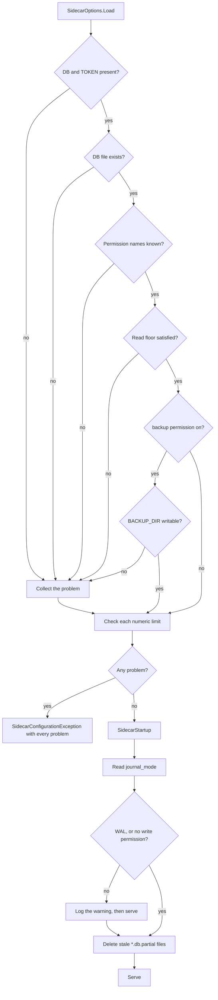

# Configuration and startup validation

All configuration comes from environment variables with the `SQLITE_SIDECAR_` prefix. One process
binds one `SidecarOptions` instance and treats it as immutable. There is no reconfiguration at
runtime, because a permission change must be a visible deployment change.

Code: `src/Xakpc.SQLiteMCPSidecar/Configuration/SidecarOptions.cs`,
`src/Xakpc.SQLiteMCPSidecar/Configuration/SidecarStartup.cs`.

## Required

```text
SQLITE_SIDECAR_DB=/data/app.db
SQLITE_SIDECAR_TOKEN=<secret>
```

Startup fails when one of these values is absent. The sidecar does not start in a degraded state
and it does not fall back to read-only, because a silent fallback hides a deployment mistake.

## Optional

```text
SQLITE_SIDECAR_PERMISSIONS=schema,read     # the default
SQLITE_SIDECAR_BACKUP_DIR=/backups

SQLITE_SIDECAR_MAX_ROWS=1000
SQLITE_SIDECAR_MAX_RESULT_BYTES=4194304
SQLITE_SIDECAR_MAX_SQL_BYTES=32768

SQLITE_SIDECAR_QUERY_TIMEOUT_SECONDS=10
SQLITE_SIDECAR_BUSY_TIMEOUT_SECONDS=3

SQLITE_SIDECAR_MAX_CONCURRENCY=4
SQLITE_SIDECAR_MAX_REQUESTS_PER_MINUTE=120

SQLITE_SIDECAR_MAX_WRITE_ROWS=100
SQLITE_SIDECAR_MAX_WRITE_ROWS_PER_MINUTE=500
```

`MAX_CONCURRENCY`, `BUSY_TIMEOUT_SECONDS` and `MAX_REQUESTS_PER_MINUTE` are active. The other limits
are bound and validated, and the code that applies them arrives with the write tools.

`MAX_REQUESTS_PER_MINUTE` is the whole request budget of the process. It needs one number only,
because the window is a constant minute. See
[../security/public-endpoint.md](../security/public-endpoint.md).

There is no backup timeout variable and no idempotency variable. Those values are constants.

## Why the read is explicit and not a binder call

`SidecarOptions.Load(IConfiguration)` reads each key by name.

```csharp
builder.Configuration.AddEnvironmentVariables("SQLITE_SIDECAR_");
```

The provider removes the prefix and keeps a single underscore, thus the key is `MAX_ROWS` and the
configuration binder never matches it to the `MaxRows` property. `PERMISSIONS=schema,read` also
needs a conversion to `PermissionSet`. The binder therefore needs
`[ConfigurationKeyName]` on each property and a type converter, and the validation stays bespoke in
any case. An explicit read is less machinery for the same result, and its message can name the
variable that the operator set:

```text
SQLITE_SIDECAR_MAX_CONCURRENCY is 0. It must be between 1 and 1024.
```

**Lesson.** The read is deferred to the first resolve of the singleton and it does not run on
`builder.Configuration` directly.

```csharp
builder.Services.AddSingleton(services => SidecarOptions.Load(services.GetRequiredService<IConfiguration>()));
```

A read on `builder.Configuration` happens before `builder.Build()`, thus a configuration source
that the host adds later is invisible. The test host adds its source that way. The first resolve
happens in `SidecarStartup` before the first request, thus startup still fails early. See
[../testing/e2e-harness.md](../testing/e2e-harness.md).

`IOptions<T>` is not used. One instance and constructor injection agree with
[../practices.md](../practices.md), and no code needs the value during service registration.

## Validation



**Invariant.** `SidecarConfigurationException` reports **every** problem at one time, thus an
operator repairs one deployment and not one variable.

The database file must exist. The sidecar never creates it: creation hides a wrong path and makes
an empty database next to the correct one.

The writable test of the backup directory is a probe file. A permission bit check is not portable.

## Journal mode warning

`SidecarStartup` reads `journal_mode` one time. It never writes the value: the owning application
owns that setting.

A database that is not in WAL mode blocks all readers of the owning application during a sidecar
write. The sidecar therefore logs a prominent warning when the database is not in WAL mode **and**
the deployment has `write` or `danger-raw-write`. It still serves. The journal mode is a property
of the database of another application, not a mistake in the sidecar configuration, and a refusal
to start would make the sidecar unusable with many correct deployments.

## ASP.NET Core settings

```text
ASPNETCORE_URLS=http://0.0.0.0:8080
```

`appsettings.json` sets **no** `AllowedHosts` value. `CreateSlimBuilder` adds no host-filtering
middleware, thus the key would read as a control that does not run. The reverse proxy is the host
gate. A comment in the file records this, because the removal is the surprising part. See
[../security/public-endpoint.md](../security/public-endpoint.md).

## Related

- [../security/permissions.md](../security/permissions.md) — the read floor
- [../security/authentication.md](../security/authentication.md) — the token
- [../database/connections.md](../database/connections.md)
- [../plans/design/container-and-deployment.md](../plans/design/container-and-deployment.md)
