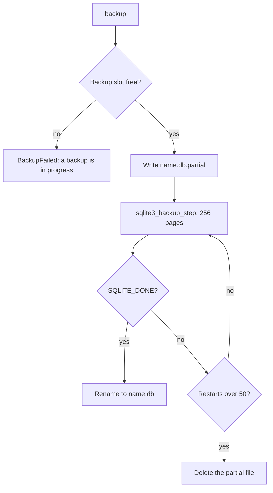

# Backups

The `backup` tool copies the live database with the SQLite Online Backup API, so the owning
application keeps writing while the copy runs.

Code: `src/Xakpc.SQLiteMCPSidecar/Database/BackupService.cs`, the `backup` tool in
`src/Xakpc.SQLiteMCPSidecar/Mcp/SqliteTools.cs`, the startup sweep in
`src/Xakpc.SQLiteMCPSidecar/Configuration/SidecarStartup.cs`.

Requires the `backup` permission and `SQLITE_SIDECAR_BACKUP_DIR`. Startup fails when the permission
is on and the directory is absent or not writable.

## The call answers with a task

`backup` is the **one task-mode tool** of the sidecar. `tools/call` answers with a task, and the
client polls for the outcome. See [../mcp/tool-catalog.md](../mcp/tool-catalog.md) for the mechanism
and [../decisions/0007-tasks-over-a-status-tool.md](../decisions/0007-tasks-over-a-status-tool.md)
for why there is no `backup_status` tool.

```json
{ "label": "before-cleanup" }
```

```text
name: app-20260928T034150Z-before-cleanup.db
bytes: 18468864
restarts: 2
```

**A client that does not implement the tasks extension cannot call `backup` at all.** It receives
JSON-RPC error `-32021`, which names the required capability. That is deliberate: the alternative
is an inline call that a reverse proxy cuts at its read timeout, and the agent then reads a false
failure while the backup continues and succeeds.

## The step loop

The copy is a loop of `sqlite3_backup_step(backup, 256)` calls and **not**
`SqliteConnection.BackupDatabase`.

```csharp
var backup = raw.sqlite3_backup_init(destinationHandle, "main", sourceHandle, "main");
while (true)
{
    cancellationToken.ThrowIfCancellationRequested();
    var code = raw.sqlite3_backup_step(backup, PagesPerStep);
    if (code == raw.SQLITE_DONE) { return restarts; }
    // ... busy handling, restart detection
}
```

**Invariant. The loop exists to protect the owning application.** SQLite states that "every call to
sqlite3_backup_step() obtains a shared lock on the source database that lasts for the duration of
the sqlite3_backup_step() call". `BackupDatabase` issues one `sqlite3_backup_step(backup, -1)`, thus
it holds that lock for the whole copy and blocks every writer of the owning application on a
rollback-journal database. `PagesPerStep = 256`, about 1 MiB, releases the lock between steps.

**Cancellation is a token check between steps, never `sqlite3_interrupt`.** `sqlite3_backup_step`
documents `SQLITE_OK`, `SQLITE_DONE`, `SQLITE_READONLY`, `SQLITE_NOMEM`, `SQLITE_BUSY`,
`SQLITE_LOCKED` and `SQLITE_IOERR_*`, and the page never mentions `sqlite3_interrupt`. The
cancellation latency is one step, not one backup.

## Restarts and the runaway cap

The price of releasing the lock is in the same SQLite page: "the source database may be modified
mid-way through the backup process ... the backup will be automatically restarted by the next call
to sqlite3_backup_step()". A rising `sqlite3_backup_remaining` is the restart signal, because the
value only falls while the copy makes progress.

**The cap counts restarts and not seconds.** `MaxRestarts = 50`, a hardcoded constant. A
`SQLITE_BUSY` or `SQLITE_LOCKED` step spends the same budget, because it means the same thing. See
[../decisions/0006-backup-restart-cap.md](../decisions/0006-backup-restart-cap.md).

Measured on an 18 MiB database on a local SSD, with one committed write to the source at the stated
interval:

| Writes to the source | Outcome | Restarts | Duration |
| --- | --- | --- | --- |
| ~500 / second | `AbandonedAfterRestarts` | 50 | 823 ms |
| ~40 / second | Succeeded | 2 | 188 ms |
| ~10 / second | Succeeded | 1 | 98 ms |
| ~2.5 / second | Succeeded | 0 | 79 ms |

**Lesson.** The cap only fires under sustained extreme write load, and it fires in under a second
instead of spinning. Read the numbers as a ratio and not as an absolute: restart exposure grows with
database size multiplied by write rate, because a larger database needs more steps and every step is
another chance for a writer to land. A very large and very busy database is therefore not backupable
this way, and that limit belongs to the Online Backup API and not to this code.

## Partial files

**Invariant.** A file with the `.db` suffix in the backup directory is always a complete copy.

The copy writes `<name>.db.partial` and renames it to `<name>.db` only after `SQLITE_DONE`. A rename
inside one directory is atomic. SQLite confirms that an unfinished backup leaves nothing usable: "If
sqlite3_backup_step() has not yet returned SQLITE_DONE, then any active write-transaction on the
destination database is rolled back."

Every abandon path deletes the partial file, and the destination handle closes before the rename or
the delete: an open handle keeps the file locked on Windows.



`SidecarStartup` deletes stale `*.db.partial` files at every launch. A process that stops during a
backup leaves one, and an operator must never mistake it for a usable backup. The suffix comes from
`BackupService.PartialSuffix`, thus the sweep and the writer cannot disagree.

## Path safety

**Invariant.** A remote caller never supplies a path. It supplies a label and the server builds
`{databaseStem}-{utcTimestamp}-{label}.db` under `SQLITE_SIDECAR_BACKUP_DIR`.

The label is untrusted input. `Sanitize` keeps `A-Z a-z 0-9 . _ -` only, bounds the length to 40 and
trims leading and trailing dots. It is an allowlist and not a denylist, because a denylist over path
syntax is a defect waiting for a platform difference. `Contain` then proves with `Path.GetFullPath`
that the result still sits inside the configured directory: redundant while `Sanitize` holds, and
kept as the assertion that no later change to the name builder can escape.

Verified live: `../escape` gives `escape.db`, `/etc/passwd` gives `etcpasswd.db`, `sub/dir/name`
gives `subdirname.db`, and a label of only rejected characters is `BackupFailed`.

The timestamp has one-second resolution and keeps names unique, thus a repeated label never
overwrites an earlier backup.

## Connections and the backup slot

| Connection | Mode | Sandbox |
| --- | --- | --- |
| Source | `ReadOnly`, `PRAGMA query_only=ON` | Baseline applied, no authorizer |
| Destination | `ReadWriteCreate`, pooling off | None: no caller SQL reaches it |

**Invariant.** The source opens read-only. The Online Backup API reads the source and writes the
destination, thus a deployment with `schema,read,backup` never opens a write handle to the live
database. `BackupToolTests` uses exactly that permission set to hold the rule.

`ReadWriteCreate` on the destination is the one place the sidecar creates a file. The rule that the
sidecar never creates a database is about the live database and stays on the `ReadWrite` connection.

**Invariant.** A backup takes the backup slot and **no request slot**. It runs outside the request
that started it, and holding one of `MAX_CONCURRENCY` slots for the length of a copy would starve
every read.

**Invariant.** The backup slot never waits. `TryAcquireBackupSlot` uses a zero timeout, unlike the
write slot which waits for the busy timeout. A second `backup` returns `BackupFailed` at once and is
never queued: a queue lets an agent plan unbounded disk use, and this product has no scheduler.

## Related

- [connections.md](connections.md) — the other connections and the semaphore table
- [diagnostics.md](diagnostics.md) — the other Phase 5 tool
- [../mcp/tool-catalog.md](../mcp/tool-catalog.md) — the task-mode registration
- [../decisions/0006-backup-restart-cap.md](../decisions/0006-backup-restart-cap.md)
- [../decisions/0007-tasks-over-a-status-tool.md](../decisions/0007-tasks-over-a-status-tool.md)
- [../decisions/0001-no-undo-in-mvp.md](../decisions/0001-no-undo-in-mvp.md) — why backups matter
