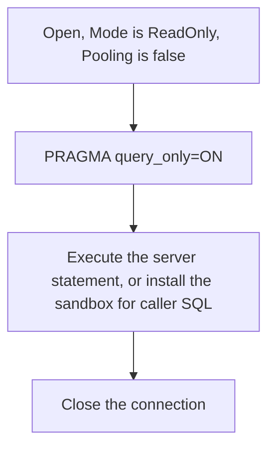

# Connections

The sidecar opens a connection with the least privilege that the operation needs. Only the read-only
connection has code today. The write connection, the transaction rules and the backup connection
arrive with their tools, and their design is in
[../plans/design/connection-policy.md](../plans/design/connection-policy.md).

Code: `src/Xakpc.SQLiteMCPSidecar/Database/SqliteService.cs`.

## The read-only connection

```csharp
public string ReadOnlyConnectionString =>
    new SqliteConnectionStringBuilder
    {
        DataSource = _options.DatabasePath,
        Mode = SqliteOpenMode.ReadOnly,
        Pooling = false,
        DefaultTimeout = _options.BusyTimeoutSeconds,
    }.ConnectionString;
```

`OpenReadOnlyAsync` opens the connection and then runs `PRAGMA query_only=ON`.



**Invariant.** A read connection opens read-only also when the deployment has write permissions.
Read access never becomes write access through a shared connection.

**Invariant.** `PRAGMA query_only=ON` stays together with the read-only open mode. The two
mechanisms fail in different ways, thus both are present.

Never use `ReadWriteCreate`. The database must exist already. Creation hides a wrong
`SQLITE_SIDECAR_DB` path and makes an empty database next to the correct one.

## Pooling is off

A pooled handle keeps its state, including an authorizer from an earlier operation. That is a
privilege-escalation path: a read connection could inherit a write authorizer. `Pooling=false`
removes the whole class of residual-state defects. Record a measured cost before any change.

## The sandbox on this connection

`OpenReadOnlyAsync` calls `SqliteSecurity.ApplyBaseline` immediately after `Open`: defensive mode,
trusted schema off, the runtime limits and no attached databases. The baseline applies to every
connection, also to the one that `schema` uses, because these settings live on the handle.

The authorizer and the interrupt are **not** installed here. `ReadJournalModeAsync` and
`ReadSchemaDdlAsync` are server-authored, and the read policy rejects `PRAGMA`. The caller that runs
caller SQL installs them, which is `QueryAsync`. See [sqlite-sandbox.md](sqlite-sandbox.md).

## Concurrency

```csharp
using var slot = await database.AcquireRequestSlotAsync(cancellationToken);
```

| Semaphore | Default | Scope | State |
| --- | --- | --- | --- |
| Request | `MAX_CONCURRENCY`, 4 | Each MCP operation | Active |
| Write | 1 | Structured and raw writes | Phase 4 |
| Backup | 1 | The background backup | Phase 5 |

Three semaphores, and no scheduler framework.

## Filesystem constraints

A read-only connection to a WAL database still needs filesystem write access to the `-wal` and
`-shm` files. SQLite opens the shared-memory file read-write also for a read-only database
connection. A container that mounts the database directory read-only therefore fails on a WAL
database, and the failure looks like a permission problem and not like a configuration problem.

The database file must stay on a local filesystem. NFS and SMB are outside the supported deployment
model, because SQLite advisory locking is unreliable there and it can damage the database.

## Settings that the sidecar never changes

```text
journal_mode   synchronous   locking_mode   checkpoint configuration
```

The owning application owns these settings. The sidecar reads `journal_mode` at startup and never
writes it. See [../configuration/options.md](../configuration/options.md).

## Related

- [../plans/design/connection-policy.md](../plans/design/connection-policy.md) — the write paths
- [sqlite-sandbox.md](sqlite-sandbox.md)
- [../mcp/tool-catalog.md](../mcp/tool-catalog.md)
