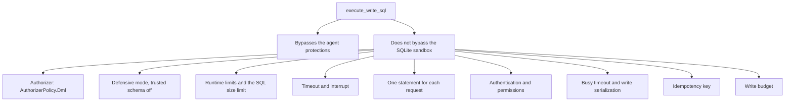
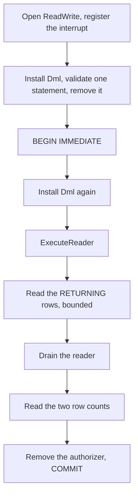

# Raw writes

The `danger-raw-write` permission gives one tool, `execute_write_sql`. It accepts a caller-supplied
DML statement. Some operators need normal SQL write semantics, and this permission separates that
need from the agent-safe structured interface.

Code: `Mcp/SqliteTools.ExecuteWriteSqlAsync`, `Database/SqliteService.ExecuteWriteSqlAsync`,
`AuthorizerPolicy.Dml` in `Database/SqliteSecurity.cs`. Tests: `RawWriteToolTests`, and the second
list of `SandboxBoundaryTests`.

**Read floor.** `danger-raw-write` is only valid together with `schema` and `read`. Startup enforces
it. See [../security/permissions.md](../security/permissions.md).

## The tool

```csharp
public async Task<CallToolResult> ExecuteWriteSqlAsync(
    string? requestId = null, string? sql = null, CancellationToken cancellationToken = default)
```

```json
{
  "requestId": "a3f1c5",
  "sql": "UPDATE jobs SET retry = retry + 1 WHERE status = 'failed' RETURNING id, retry"
}
```

**There is no parameter list.** The caller writes literal values into the statement, exactly as the
`query` tool asks it to. A caller that holds this permission already writes the whole statement, thus
a parameter map would add an argument, a validation path and a second value model with no security
gain. `requestId` is mandatory, and both arguments carry `= null` for the binder reason in
[../mcp/write-tool-arguments.md](../mcp/write-tool-arguments.md).

Permitted statement categories:

```text
INSERT
UPDATE
DELETE
```

Normal SQLite features of those statements are available where the authorizer permits them: CTEs,
`RETURNING`, subqueries, expressions and conflict clauses.

**A plain `SELECT` is rejected**, with `QueryRejected` and text that names the query tool. It used to
run and hold the **write lock** for its whole duration. See [statement-check.md](statement-check.md).

## What the permission bypasses

```text
the structured filter model
the mandatory structured WHERE
the caller maxRows requirement
the bounded pre-count
the row-limit rollback
SQLITE_SIDECAR_MAX_WRITE_ROWS
server-generated SQL
```

This statement is therefore valid:

```sql
DELETE FROM jobs;
```

This is intentional. An operator that enables `danger-raw-write` selects standard raw SQLite DML
semantics. Do not add a partial safety net that makes the behaviour difficult to predict.

## What the permission does not bypass



Always rejected, also with `danger-raw-write`:

```text
ATTACH, DETACH
CREATE, DROP, ALTER
load_extension
dangerous PRAGMAs
transaction-control statements
DML against an sqlite_% object
```

```text
danger-raw-write  !=  unrestricted SQLite
danger-raw-write  ==  raw INSERT / UPDATE / DELETE in the sandbox
```

`AuthorizerPolicy.Dml` is the write policy plus one rule: for a DML action the first callback
argument is the table name, and a name that starts with `sqlite_` is denied. `UPDATE sqlite_sequence`
would change the autoincrement behaviour of the owning application, which is not manipulation of the
caller's own data. `StructuredWriteBuilder` refuses such a target by name, thus the raw path gets the
same boundary one layer lower. `SandboxBoundaryTests` proves it, and `events` in `sample-db.sql` uses
`AUTOINCREMENT` so that `sqlite_sequence` exists to aim at.

**`VACUUM` and `VACUUM INTO` fail through the transaction and not through the authorizer.** SQLite
runs no authorizer callback for them, thus the statement prepares; it then fails with `cannot VACUUM
from within a transaction`, because every raw write runs inside `BEGIN IMMEDIATE`. The code is
`DatabaseError`. The fact that matters is asserted: no file appears. See
[sqlite-sandbox.md](sqlite-sandbox.md).

## The order of the steps

`SqliteService.ExecuteWriteSqlAsync` owns it, and one step is ordered differently from a structured
write.



**The statement is validated before `BEGIN IMMEDIATE`.** A statement that the sandbox refuses
therefore never takes the write lock and never holds the owning application. A structured write cannot
do the same, because its pre-count must read inside the transaction that then writes.

**The authorizer is installed two times.** The first scope covers the preparation that proves one
statement; the second covers the execution, which prepares the statement again. `BEGIN IMMEDIATE` and
`COMMIT` run between them with no authorizer, because every policy denies `SQLITE_TRANSACTION`.

**Invariant. The reader is drained before the commit.**

```csharp
if (reader.FieldCount > 0)
{
    rows = await QueryResult.ReadAsync(reader, _options, token).ConfigureAwait(false);
    while (await reader.ReadAsync(token).ConfigureAwait(false))
    {
    }
}
```

A `RETURNING` clause produces its rows while the write progresses. A reader abandoned at the row limit
leaves the write half applied and nothing reports it.
`RawWriteToolTests.ATruncatedReturningResultStillAppliesTheWholeWrite` is the test: `MAX_ROWS=1`, a
`DELETE ... RETURNING id` over three rows, one row in the answer and zero rows left in the table.

## Results

A plain write returns the affected row count:

```text
rowsAffected: 17
```

A statement with `RETURNING` adds the TOON block of the read path, with the same row limit and byte
limit:

```text
rowsAffected: 2

rows[2]{id,retry}:
  41,3
  52,2

truncated: false
```

**`rowsAffected` only, never `rowsChanged`.** A raw write has no `maxRows` to bound a cascade against,
thus the second number would be a fact with no action attached to it. The sidecar still computes it,
because the write budget counts it.

`rowsAffected` comes from `SqliteSecurity.Changes` (`sqlite3_changes`) and not from
`ExecuteNonQuery`: the statement runs through a reader, because `RETURNING` produces rows.

**Invariant. The result size never fails a committed raw write.** `ResultTooLarge` is a read-path code
and it is unreachable here. See
[../decisions/0008-a-committed-raw-write-never-fails-on-result-size.md](../decisions/0008-a-committed-raw-write-never-fails-on-result-size.md).

Everything in the right branch of that diagram still applies: the token, the permission policy, the
`requestId`, the write budget, the SQL size limit, the query timeout with the interrupt, the SQLite
runtime limits, the busy timeout and the shared write semaphore. The structured `maxRows` guarantee is
the one thing that does not, and `SECURITY.md` must state this.

## Idempotency and the write budget

The canonical payload is the statement itself, thus there is no key order to normalize:

```csharp
var canonical = $"{RawWriteToolName}\n{sql.Trim()}";
var sqlHash = WriteDeduplication.HashPayload(canonical);
```

The same `requestId` with the same statement returns the stored response, byte for byte. The same
`requestId` with a different statement is `InvalidWrite`. Only a committed outcome is stored. See
[../security/write-controls.md](../security/write-controls.md).

Raw writes count toward the write budget, and there is **one counter** for structured and raw writes.
One counter is easier to explain than two regimes, and the budget is a resource control on the
database.

**Invariant.** For a raw write the budget throttles the next operation and it does not prevent the
current one, because the row count is not available before execution. `SECURITY.md` must state the
throttle behaviour in these words.

## Logging

```text
Raw write completed. tool=execute_write_sql durationMs=171.35
    sqlHash=b98518fd41bc… rowsAffected=2 replayed=False outcome=ok
```

**The statement text never reaches a log line.** A raw statement holds caller-chosen literal values,
thus the text is row data. The hash correlates the calls of one retry, which is what an operator
needs, and `replayed=True` is the only record of a retry. The line carries no table field: the
statement names the tables and the server does not parse it.

## No remote transaction sessions

The MVP does not support `BEGIN` and `COMMIT` across MCP calls. Each operation is self-contained, and
raw transaction-control SQL is rejected.

This agrees with the stateless MCP HTTP transport. A transaction across calls needs server session
state, and it lets one caller hold a write lock against the owning application for an unbounded time.

## Documentation requirement

`SECURITY.md` must carry this statement:

> `danger-raw-write` permits caller-supplied raw INSERT, UPDATE and DELETE statements. It bypasses
> structured-write WHERE and row-limit protections. Enable it only for clients trusted with direct
> data-modification SQL.

## Related

- [structured-writes.md](structured-writes.md) — the safe interface that this one bypasses
- [sqlite-sandbox.md](sqlite-sandbox.md) — the three authorizer policies and the hard boundaries
- [connections.md](connections.md) — the write connection and the write semaphore
- [../security/write-controls.md](../security/write-controls.md), [../security/permissions.md](../security/permissions.md)
- [../mcp/error-model.md](../mcp/error-model.md), [../mcp/query-results.md](../mcp/query-results.md)
- [../decisions/0008-a-committed-raw-write-never-fails-on-result-size.md](../decisions/0008-a-committed-raw-write-never-fails-on-result-size.md)
