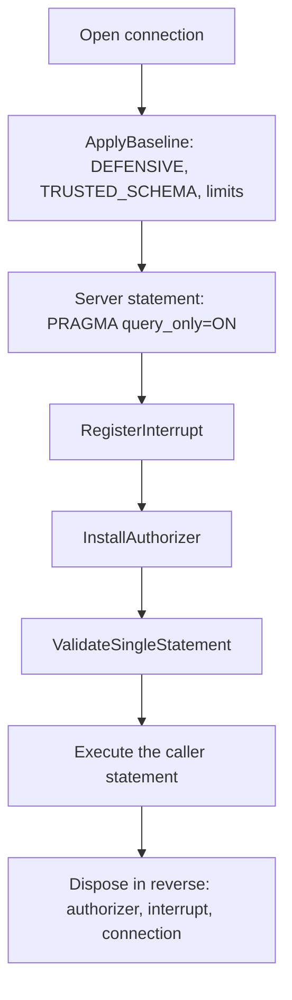
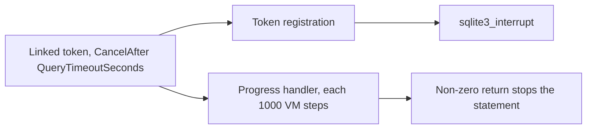

# SQLite sandbox

The innermost security layer. It is always on, it is not a feature flag, and no permission disables
any part of it. `danger-raw-write` will not weaken it.

Code: `src/Xakpc.SQLiteMCPSidecar/Database/SqliteSecurity.cs`.

## Where the API comes from

`Microsoft.Data.Sqlite` exposes none of these controls, but it exposes the raw handle, and
`SQLitePCLRaw.core` exposes the native functions. The transitive reference is sufficient.

```csharp
var connection = new SqliteConnection(ReadOnlyConnectionString);
connection.Open();
sqlite3 handle = connection.Handle!;   // public property, type SQLitePCL.sqlite3
```

Verified against `Microsoft.Data.Sqlite` 11.0.0-rc.1.26425.128 and `SQLitePCLRaw.core` 3.0.5. The
same surface exists on `SQLitePCLRaw.core` 2.1.12, thus the code does not depend on the version.

| Control | Native call |
| --- | --- |
| Defensive mode | `raw.sqlite3_db_config(h, raw.SQLITE_DBCONFIG_DEFENSIVE, 1, out _)` |
| Trusted schema off | `raw.sqlite3_db_config(h, raw.SQLITE_DBCONFIG_TRUSTED_SCHEMA, 0, out _)` |
| Authorizer | `raw.sqlite3_set_authorizer(h, callback, state)` |
| Runtime limit | `raw.sqlite3_limit(h, id, value)` |
| Statement count | `raw.sqlite3_prepare_v2(h, sql, out stmt, out tail)` |
| Cancellation | `raw.sqlite3_interrupt(h)`, `raw.sqlite3_progress_handler(...)` |
| Last inserted rowid | `raw.sqlite3_last_insert_rowid(h)` |

`Microsoft.Data.Sqlite` has no `LastInsertRowId` property: that member belongs to
`System.Data.SQLite`, which is a different library. The native call reads connection state and runs no
statement, thus it also works while an authorizer is installed.

## Three entry points

```csharp
SqliteSecurity.ApplyBaseline(connection, options);              // immediately after Open
using var interrupt  = SqliteSecurity.RegisterInterrupt(connection, token);
using var authorizer = SqliteSecurity.InstallAuthorizer(connection, AuthorizerPolicy.Read);
var check = SqliteSecurity.ValidateSingleStatement(connection, sql);
```

`AuthorizerPolicy` has two values, `Read` and `Write`. The DML policy of `execute_write_sql` arrives
with that tool in Phase 6. The policy comes from the tool that runs, never from the deployment
permission set.

| Policy | Accepts | Used by |
| --- | --- | --- |
| `Read` | `SELECT`, `READ`, `RECURSIVE`, `FUNCTION` by name | `query` |
| `Write` | the same, plus `INSERT`, `UPDATE`, `DELETE` | `insert` |

`SQLITE_SELECT` and `SQLITE_READ` in the write policy are necessary and they are not a weakness. The
bounded pre-count is a `SELECT`, a `CHECK` constraint reads the new row, and a foreign key reads the
referenced table. The statement is server-authored in each case, thus the write policy never sees
caller SQL.

`SQLITE_TRANSACTION` and `SQLITE_PRAGMA` stay denied in **both** policies. See the order below.

## Order



**Invariant.** Apply the baseline after every `Open`, never one time at startup. These settings live
on the connection handle and not on the process.

**Invariant.** Install the authorizer after every server-authored statement. Each policy rejects
`PRAGMA`, and the sidecar runs its own `PRAGMA query_only=ON` on a read and its own
`PRAGMA table_info` on a write.

**Invariant.** On the write path the authorizer also goes on **after** `BEGIN IMMEDIATE` and comes off
**before** `COMMIT` or `ROLLBACK`, because each policy denies transaction control. The server would
otherwise reject its own transaction. Declaration order does not give this: the write path calls
`Dispose()` explicitly before the commit and in the `catch`. See
[structured-writes.md](structured-writes.md).

**Invariant.** Remove the authorizer and the progress handler before the handle closes. On the read
path declaration order gives that for free: C# disposes in the reverse order.

**Lesson.** Connection pooling keeps handle state, including an authorizer from an earlier
operation. That is a privilege-escalation path: a read connection could inherit a write authorizer.
`Pooling=false` removes the whole class of residual-state defects. See
[connections.md](connections.md).

**Lesson.** The authorizer callback is a native callback. `AuthorizerScope` holds the delegate in a
field for the lifetime of the operation. A collected delegate causes a hard crash, not an exception.
The callback body also has a `catch` that returns `SQLITE_DENY`: an exception must never cross a
native callback boundary.

## The authorizer is an allowlist

The policy accepts a named few actions and rejects each other one.

```csharp
if (actionCode is SQLITE_SELECT or SQLITE_READ or SQLITE_RECURSIVE) return SQLITE_OK;
if (actionCode == SQLITE_FUNCTION) return IsDeniedFunction(name) ? SQLITE_DENY : SQLITE_OK;
return SQLITE_DENY;
```

Three reasons for an allowlist and not a denylist:

- SQLite has more than thirty action codes, with many `CREATE_*`, `DROP_*`, temporary and virtual
  table variants.
- A denylist admits with no message any action code that a later SQLite version adds.
- The action code of `VACUUM INTO` is not dependable. An allowlist rejects it with no need to name
  it.

`SQLITE_PRAGMA` is denied on the read path. No legitimate caller statement needs a pragma.

`SQLITE_FUNCTION` is allowed by default and denied by name, because a policy that rejected every
function would reject ordinary SQL. The denied names are `load_extension` and `fts3_tokenizer`.
`QueryToolTests.OrdinarySqlFunctionsStillWork` protects the default from becoming a rejection.

Do not inspect SQL with regular expressions or string matching. A regular expression does not see
comments, nested constructs or alternative spellings. The authorizer runs inside the parser and sees
the resolved action.

## Runtime limits

Only the SQL length comes from configuration, `SQLITE_SIDECAR_MAX_SQL_BYTES`. The others are
constants in `SqliteSecurity`: an operator has no reason to raise them, and a configuration value is
a way to weaken the sandbox by accident.

```text
SQLITE_LIMIT_ATTACHED             0        a second, independent block on ATTACH
SQLITE_LIMIT_SQL_LENGTH           MaxSqlBytes
SQLITE_LIMIT_COLUMN               512
SQLITE_LIMIT_EXPR_DEPTH           100
SQLITE_LIMIT_COMPOUND_SELECT      10
SQLITE_LIMIT_VARIABLE_NUMBER      100
SQLITE_LIMIT_LIKE_PATTERN_LENGTH  1000
SQLITE_LIMIT_VDBE_OP              100000
```

**Lesson.** `SQLITE_LIMIT_VDBE_OP` bounds the number of instructions in the prepared program. That
is statement complexity and not work done. A recursive CTE is a short program that runs for ever,
thus this limit does not stop a runaway query. The timeout with `sqlite3_interrupt` stops it, and
the progress handler is the second path.

The baseline does not call `sqlite3_busy_timeout`. The connection string carries `DefaultTimeout`,
and `Microsoft.Data.Sqlite` runs its own `SQLITE_BUSY` retry loop from that value. A second
mechanism on the same handle is a conflict and not defence in depth.

## Extension loading

Extension loading is never on. `ApplyBaseline` calls `connection.EnableExtensions(false)`, which is
also the default. Extension loading is arbitrary native code inside the sidecar process.

**Lesson.** `load_extension` therefore returns `InvalidQuery` and not `QueryRejected`: SQLite does
not register the function at all and reports an unknown name. The block is one layer below the
authorizer. The authorizer name rule stays as the second block.

## One statement for each request

`ValidateSingleStatement` prepares the text, reads the unconsumed `tail`, and finalizes the
statement. A non-empty tail is a second statement.

```sql
SELECT id FROM jobs                      -- Ok
SELECT 1; SELECT 2                       -- MultipleStatements -> InvalidQuery
DROP TABLE jobs                          -- Rejected -> QueryRejected
```

Count statements by preparation, never by counting semicolons: a semicolon appears inside a string
literal and inside a comment.

**Lesson.** The authorizer runs during preparation, thus it decides first. `UPDATE ...; DELETE ...`
is `QueryRejected` and not `InvalidQuery`, because the first statement is denied before the tail
check happens.

The check prepares the statement one time, and execution prepares it again through `SqliteCommand`.
The cost is one extra preparation. Execution wholly through `raw` would need hand-written column
typing and value extraction.

## Hard boundaries

The sidecar always rejects these actions, and `danger-raw-write` will not change it:

```text
ATTACH, DETACH
CREATE, DROP, ALTER
VACUUM INTO
load_extension
every PRAGMA
transaction control
more than one statement
```

`VACUUM INTO` writes a database copy to a caller-chosen path. It is a file exfiltration primitive,
thus it belongs with the DDL rejections and not with the backup feature.

```text
danger-raw-write  !=  unrestricted SQLite
danger-raw-write  ==  raw INSERT / UPDATE / DELETE inside this sandbox
```

`SandboxBoundaryTests` proves each item remotely through the `query` tool. Phase 6 runs the same
list again through `execute_write_sql`.

## Cancellation



Two stop paths. The registration fires on the token, and the progress handler reports the
cancellation from inside the virtual machine. SQLite then returns `SQLITE_INTERRUPT`, which the tool
maps to `QueryTimedOut`.

## Related

- [connections.md](connections.md) — the connection that this sandbox applies to
- [../mcp/error-model.md](../mcp/error-model.md) — the codes that a rejection produces
- [../mcp/query-results.md](../mcp/query-results.md) — the result pipeline
- [../plans/design/threat-model.md](../plans/design/threat-model.md)
- [../plans/design/raw-writes.md](../plans/design/raw-writes.md)
