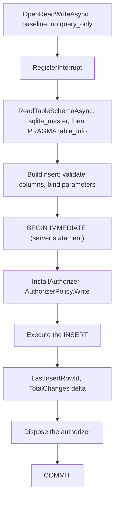
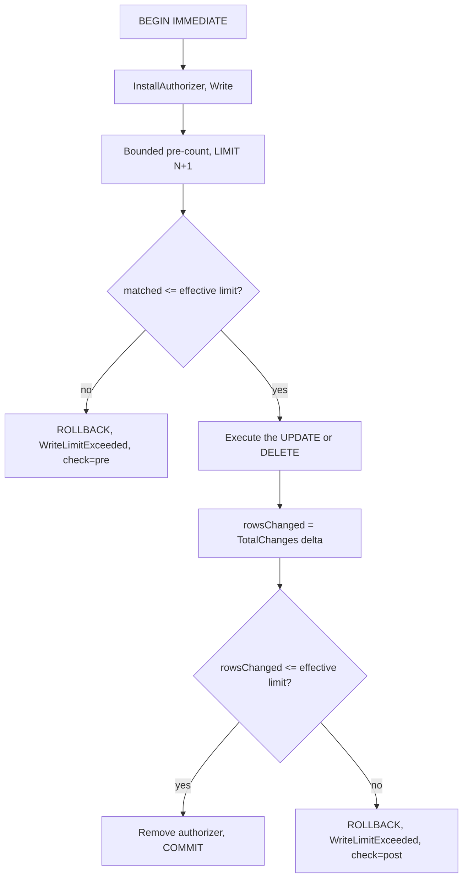

# Structured writes

Current state. `insert`, `update` and `delete` all exist. The `write` permission gives the three of
them.

Code: `src/Xakpc.SQLiteMCPSidecar/Database/StructuredWriteBuilder.cs`,
`src/Xakpc.SQLiteMCPSidecar/Database/SqliteService.cs`.

**Core contract.** The caller never supplies SQL. Caller SQL needs `danger-raw-write`, which is a
different permission. See [../plans/design/raw-writes.md](../plans/design/raw-writes.md).

## Why the server builds the statement

Parameterization is **not** the reason. A tool that took caller SQL inside the same sandbox gives the
same protection against injection, DDL, `ATTACH`, `VACUUM`, `PRAGMA` and a second statement. Two
reasons carry the load:

- `INSERT INTO logs SELECT ... FROM big_table` is one statement that writes millions of rows. No
  bounded pre-count can be derived from caller SQL. Structured `insert` writes one row **by
  construction**, and structured `update` and `delete` carry a filter that the server can count.
- `INSERT OR REPLACE` deletes the row that it replaces, and `ON DELETE CASCADE` then removes rows in
  each referencing table. A tool with the name `insert` that destroys data is a usual agent mistake.
  The MVP has no undo.

## The three tools

| Tool | `values` | `where` | `maxRows` | `requestId` |
| --- | --- | --- | --- | --- |
| `insert` | mandatory | — | — | mandatory |
| `update` | mandatory | mandatory | mandatory | mandatory |
| `delete` | — | mandatory | mandatory | mandatory |

**Invariant.** There is no structured equivalent of `DELETE FROM jobs;`. An absent `where`, an empty
`where`, an absent `maxRows` or a `maxRows` below 1 is `InvalidWrite`, and the rejection happens
before any database work.

Each argument is nullable with `= null` and is validated in the method body. See
[../mcp/tool-catalog.md](../mcp/tool-catalog.md).

## Filter model

The filter model is deliberately small. It is not a SQL expression language.

```text
eq   ne
lt   lte
gt   gte
is-null   is-not-null
```

The filter is a **flat list** and every condition joins with `AND`. There is no `or`, no `combine`
argument and no nesting. See
[../decisions/0005-and-only-filter.md](../decisions/0005-and-only-filter.md).

```json
{
  "where": [
    { "column": "status", "operator": "eq", "value": "failed" },
    { "column": "created_at", "operator": "lt", "value": "2026-01-01" }
  ]
}
```

The C# shape is one record, and every member is nullable:

```csharp
public sealed record WriteCondition(string? Column, string? Operator, JsonElement? Value = null);
```

`Operator` is a **string** and never an enum. An enum makes the binder of the SDK throw on an unknown
value, and the SDK then masks the message, thus the agent gets no error code. The default on `Value`
is what keeps it out of the `required` list of the generated schema, which `is-null` needs.

The generated schema is one array of objects:

```json
{"type":["array","null"],
 "items":{"type":["object","null"],
   "properties":{"column":{"type":["string","null"]},
                 "operator":{"type":["string","null"]},
                 "value":{"default":null}},
   "required":["column","operator"]}}
```

A condition is rejected with `InvalidWrite` when the operator is unknown, when a comparison carries
no value, when `is-null` or `is-not-null` carries a real value, or when a comparison carries a JSON
`null`. The last one matters: `col = NULL` is never true, thus the write would report
`rowsAffected: 0` and look correct.

Identifier validation, the canonical-name rule, parameterization, quoting and the 90-parameter cap
apply to a condition column exactly as they apply to a `values` column.

## Order of an insert



**Invariant.** The authorizer goes on **after** the validation and after `BEGIN IMMEDIATE`, and it
comes off **before** `COMMIT`. Every policy denies `PRAGMA` and transaction control, thus the server
would otherwise reject its own statements. `QueryAsync` gets this from declaration order; the write
path needs an explicit `Dispose()` before the commit and in the `catch`.

**Invariant.** `BEGIN IMMEDIATE`, also for an insert. A deferred transaction must upgrade a read lock,
and SQLite does not call the busy handler for a lock upgrade.

A failure path calls `ROLLBACK` and swallows a failure of the rollback itself. The original exception
is what the caller must see.

## Order of an update and a delete

`MutateAsync` holds the shared path. It is the insert order plus two checks.



The pre-count uses a bounded subquery, thus it stops after `N + 1` rows:

```sql
SELECT COUNT(*) FROM (SELECT 1 FROM "jobs" WHERE "status" = $p0 LIMIT 101);
```

The pre-count is a `SELECT` and it runs with the authorizer installed. `AuthorizerPolicy.Write`
permits `SQLITE_SELECT` and `SQLITE_READ` for exactly this reason.

**Invariant.** Both checks are necessary and they protect different things:

| Check | Protects | Failure mode without it |
| --- | --- | --- |
| Pre-count | Availability of the owning application | A broad filter writes millions of rows, holds the write lock and inflates the WAL, before the rollback reverts it. |
| Post-execution count | Data integrity | A cascade or a trigger widens the write past the limit, or the row count changes between the count and the write because the owning application also writes. |

A `LIMIT` clause on the write statement is not a substitute. A `LIMIT` writes a partial result
silently, which is worse for an agent than a clean rejection.

## Bounds

```text
effective limit = min(client maxRows, SQLITE_SIDECAR_MAX_WRITE_ROWS)
```

**Invariant.** `maxRows` bounds **every** row that the statement changes, not only the rows of the
target table. The post-execution check uses the `sqlite3_total_changes` delta across the statement,
thus a row that `ON DELETE CASCADE` removes and a row that a trigger writes both count.
`ExecuteNonQuery` reports the target table alone, so a `delete` with `maxRows: 1` would otherwise
destroy a whole subtree and report one row. See
[../decisions/0004-maxrows-bounds-total-changes.md](../decisions/0004-maxrows-bounds-total-changes.md).

The consequence reaches the agent: deleting one row that has three cascading children needs a
`maxRows` of at least 4. The tool description states this.

## Identifier validation

Validation is the security control. Quoting is the correctness control.

```sql
SELECT name, type FROM sqlite_master WHERE name = $table COLLATE NOCASE LIMIT 1;
PRAGMA table_info("<the name that sqlite_master returned>");
```

- The caller string is a **parameter**. It never reaches the SQL text.
- `COLLATE NOCASE`, because `sqlite_master` compares with `BINARY` and SQLite names are not
  case-sensitive.
- The text then uses the spelling that the **database** holds, not the spelling that the caller sent.
- The lookup does not filter on the type, thus the message names the real reason. "The database has no
  table X" is wrong and misleading when X is a view that does exist.
- A view, an index and an `sqlite_%` object are rejected. Only a table is a write target.
- The schema is never cached. The owning application can change it.

Every column of `values` and of `where` must exist in the table. `TableSchema.CanonicalColumn` returns
the database spelling or throws `InvalidWriteException`.

## Values

A value is a literal. It is never a SQL expression.

| JSON | SQLite |
| --- | --- |
| string | TEXT |
| number | INTEGER when it fits `long`, else REAL |
| `true` / `false` | 1 / 0 |
| `null` | NULL |
| object, array | `InvalidWrite` |

An object and an array are rejected and not converted to a JSON string: a silent conversion writes a
value that the agent did not ask for.

The parameter count is capped at 90, over the `values` and the `where` of one request together.
`SQLITE_LIMIT_VARIABLE_NUMBER` is 100, thus a larger request would fail at preparation with a message
that helps the agent less.

## Results

Plain text and never TOON: TOON is for row data only. There is no `RETURNING` on a structured write.
See [../plans/out-of-scope.md](../plans/out-of-scope.md).

```text
rowsAffected: 1      rowsAffected: 1
rowid: 78            rowsChanged: 4
```

`insert` answers the rowid, which comes from `SqliteSecurity.LastInsertRowId`.
`Microsoft.Data.Sqlite` exposes no such property, and `SELECT last_insert_rowid()` would cost one more
statement inside the transaction.

`update` and `delete` answer `rowsChanged` next to `rowsAffected`. `rowsAffected` is the target table
alone, which is what the agent asked about; `rowsChanged` is the true blast radius and is the number
that `maxRows` bounds and that the write budget counts. Both are always present: a field that appears
only sometimes is harder for an agent than a field that is always there.

## Rejection message

Both checks return `WriteLimitExceeded`. The exact count is not available, because the pre-count stops
at `N + 1`.

```text
WriteLimitExceeded: The write would change more rows than the limit of 100, counting every row
that a cascade or a trigger also changes. Nothing changed. Narrow the filter.
```

The log records which check rejected the operation, in a `check=pre|post` field of event 2005. The
agent does not receive that detail, because the correct next action is the same in both cases.

## Related

- [connections.md](connections.md) — the write connection and the write semaphore
- [sqlite-sandbox.md](sqlite-sandbox.md) — `AuthorizerPolicy.Write`, `TotalChanges`
- [../security/write-controls.md](../security/write-controls.md) — the budget and the idempotency cache
- [../mcp/tool-catalog.md](../mcp/tool-catalog.md) — the tool contract
- [../mcp/error-model.md](../mcp/error-model.md) — `InvalidWrite`, `WriteLimitExceeded`
- [../decisions/0004-maxrows-bounds-total-changes.md](../decisions/0004-maxrows-bounds-total-changes.md)
- [../decisions/0005-and-only-filter.md](../decisions/0005-and-only-filter.md)
