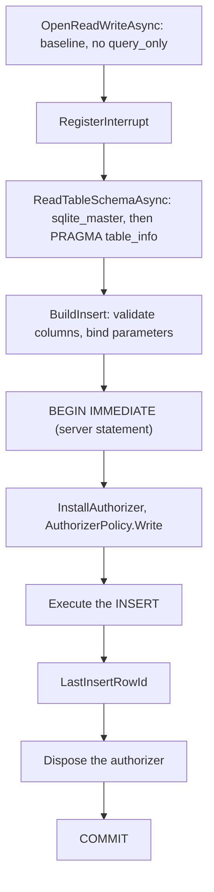

# Structured writes: the insert path

Current state. `insert` exists. `update` and `delete` arrive in Phase 4b, and their design stays in
[../plans/design/structured-writes.md](../plans/design/structured-writes.md) together with the filter
model, the bounded pre-count and the row-limit rollback.

Code: `src/Xakpc.SQLiteMCPSidecar/Database/StructuredWriteBuilder.cs`,
`src/Xakpc.SQLiteMCPSidecar/Database/SqliteService.cs`.

## Why the server builds the statement

Parameterization is **not** the reason. A tool that took caller SQL inside the same sandbox gives the
same protection against injection, DDL, `ATTACH`, `VACUUM`, `PRAGMA` and a second statement. Three
reasons are left, and two of them carry the load:

- `INSERT INTO logs SELECT ... FROM big_table` is one statement that writes millions of rows. No
  bounded pre-count can be derived from caller SQL. Structured `insert` writes one row **by
  construction**.
- `INSERT OR REPLACE` deletes the row that it replaces, and `ON DELETE CASCADE` then removes rows in
  each referencing table. A tool with the name `insert` that destroys data is a usual agent mistake.
  The MVP has no undo.

Full comparison: [../plans/design/structured-writes.md](../plans/design/structured-writes.md).

## Order of the operation



**Invariant.** The authorizer goes on **after** the validation and after `BEGIN IMMEDIATE`, and it
comes off **before** `COMMIT`. Every policy denies `PRAGMA` and transaction control, thus the server
would otherwise reject its own statements. `QueryAsync` gets this from declaration order; the write
path needs an explicit `Dispose()` before the commit and in the `catch`.

**Invariant.** `BEGIN IMMEDIATE`, also for an insert. A deferred transaction must upgrade a read lock,
and SQLite does not call the busy handler for a lock upgrade.

A failure path calls `ROLLBACK` and swallows a failure of the rollback itself. The original exception
is what the caller must see.

## Identifier validation

Validation is the security control. Quoting is the correctness control.

```sql
SELECT name, type FROM sqlite_master WHERE name = $table COLLATE NOCASE LIMIT 1;
PRAGMA table_info("<the name that sqlite_master returned>");
```

- The caller string is a **parameter**. It never reaches the SQL text.
- `COLLATE NOCASE`, because `sqlite_master` compares with `BINARY` and SQLite names are not
  case-sensitive.
- The text then uses the spelling that the **database** holds, not the spelling that the caller sent.
- The lookup does not filter on the type, thus the message names the real reason. "The database has no
  table X" is wrong and misleading when X is a view that does exist.
- A view, an index and an `sqlite_%` object are rejected. Only a table is a write target.
- The schema is never cached. The owning application can change it.

Every column of `values` must exist in the table. `TableSchema.CanonicalColumn` returns the database
spelling or throws `InvalidWriteException`.

## Values

A value is a literal. It is never a SQL expression.

| JSON | SQLite |
| --- | --- |
| string | TEXT |
| number | INTEGER when it fits `long`, else REAL |
| `true` / `false` | 1 / 0 |
| `null` | NULL |
| object, array | `InvalidWrite` |

An object and an array are rejected and not converted to a JSON string: a silent conversion writes a
value that the agent did not ask for.

The parameter count is capped at 90. `SQLITE_LIMIT_VARIABLE_NUMBER` is 100, thus a larger request
would fail at preparation with a message that helps the agent less.

## Result

```text
rowsAffected: 1
rowid: 78
```

Plain text and never TOON: TOON is for row data only. There is no `RETURNING` on a structured write.
See [../plans/out-of-scope.md](../plans/out-of-scope.md).

The rowid comes from `SqliteSecurity.LastInsertRowId`, which calls
`raw.sqlite3_last_insert_rowid`. `Microsoft.Data.Sqlite` exposes no such property, and
`SELECT last_insert_rowid()` would cost one more statement inside the transaction.

## Related

- [connections.md](connections.md) — the write connection and the write semaphore
- [sqlite-sandbox.md](sqlite-sandbox.md) — `AuthorizerPolicy.Write`
- [../security/write-controls.md](../security/write-controls.md) — the budget and the idempotency cache
- [../mcp/tool-catalog.md](../mcp/tool-catalog.md) — the tool contract
- [../mcp/error-model.md](../mcp/error-model.md) — `InvalidWrite`
