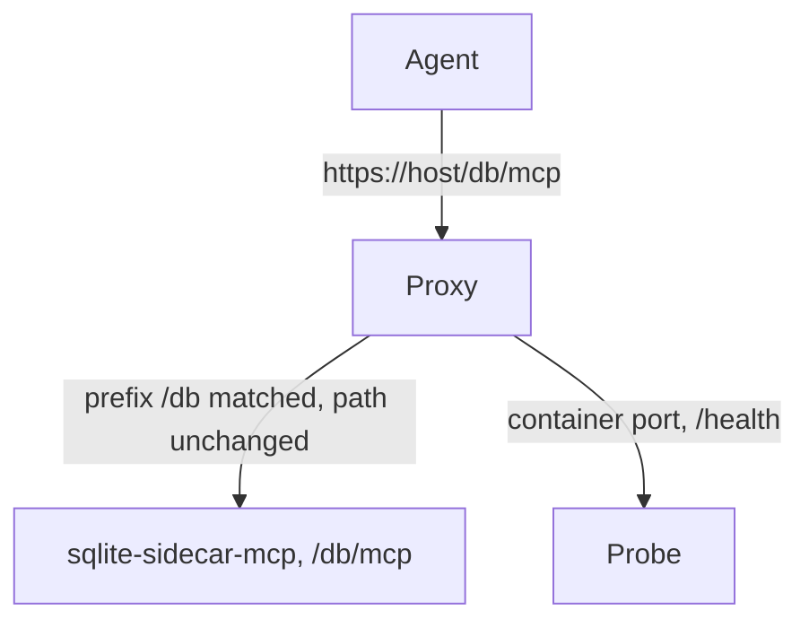

# Platform deployment

Four recipes: Kamal, Coolify, a plain VPS with systemd, and Fly.io. The container is identical on
each one. Only the domain and one proxy option change, and the image needs no platform variable.

**Every recipe is written out in the root `README.md`**, which is self-contained on purpose. This
file is the source. Keep the two in agreement.

The application behaviour that the recipes depend on is in
[../security/public-endpoint.md](../security/public-endpoint.md).

## The path contract



**Invariant.** The proxy forwards the path with no change. Kamal and Coolify both strip a matched
prefix by default, thus each of those recipes must **turn stripping off**. A hand-written Caddy or
nginx rule strips nothing unless it is told to, and Fly.io routes a whole host.

| Platform | Setting |
| --- | --- |
| Kamal | `path_prefix: /db` and `strip_path_prefix: false` |
| Coolify | A domain path `/db`, and "Strip Prefixes" off in the advanced settings |

A stripped prefix gives a `404`. That is the one failure that this contract prevents, and it is why
the application owns the full path. See
[../security/public-endpoint.md](../security/public-endpoint.md).

## Kamal

One service for one database, and one host. A sidecar reads a local file, thus it cannot follow a
multi-region role set: name the host that holds the database.

```yaml
service: sqlite-sidecar
image: ghcr.io/xakpc/sqlite-mcp-sidecar
servers:
  app:
    hosts: [<host that holds the database>]
    proxy:
      ssl: true
      host: <the public host name>
      path_prefix: /db
      strip_path_prefix: false
      app_port: 8080
      healthcheck:
        path: /health
volumes:
  - "<host data directory>:/data"     # the same directory that the owning application mounts
env:
  clear:
    SQLITE_SIDECAR_DB: /data/app.db
    SQLITE_SIDECAR_PERMISSIONS: schema,read
  secret:
    - SQLITE_SIDECAR_TOKEN            # .kamal/secrets
```

- The healthcheck path is necessary. kamal-proxy asks for `/up` by default, thus the deploy fails
  with the default value.
- kamal-proxy has **no** rate limiting. It gives buffering, body-size limits and forwarded headers
  only. The in-process request budget is therefore the only request limit on this platform.
- One container for each role, thus the one-process invariant holds with no extra setting.

## Coolify

Use a subdomain, for example `mcp.<domain>`, and not a path. Coolify makes Traefik labels for a
domain path, and the path plus strip-prefix combination has open defects. A subdomain costs nothing
and it removes that risk. The application path stays `/db/mcp` in both cases.

```text
Domain            https://mcp.<domain>
Strip Prefixes    off
Health check      /health
Replicas          1
Volume            <host data directory>:/data, writable
```

Coolify runs Traefik, thus a rate-limit middleware is available there. It is not necessary: the
in-process budget is active on each platform, and a second limit needs a second reason.

## A plain VPS with systemd

No orchestrator. A `docker run` under a unit file, with the port bound to loopback:

```text
-p 127.0.0.1:8080:8080      # only a proxy on the same host reaches it
--env-file /etc/sqlite-sidecar.env    # mode 0600, it holds the token
--read-only --tmpfs /tmp
--cap-drop=ALL --security-opt=no-new-privileges
```

`Restart=always` plus `ExecStartPre=-/usr/bin/docker rm -f` makes a restart idempotent after an
unclean stop. Caddy or nginx terminates TLS and forwards the path with no change.

## Fly.io

A Fly Volume attaches to exactly one machine, which suits this product: one file, one writer, one
sidecar.

```text
[[mounts]] source = "app_data", destination = "/data"
[http_service] internal_port = 8080, auto_stop_machines = false, min_machines_running = 1
[[http_service.checks]] path = "/health"
fly secrets set SQLITE_SIDECAR_TOKEN=...
```

**Invariant, and it is the one that fails quietly here.** The sidecar and the owning application
must run on the **same machine**. A volume attaches to one machine, thus two machines means two
different database files and each process serves its own copy. Keep `auto_stop_machines = false`
and do not scale the app.

## Common to each recipe

| Item | Value | Reason |
| --- | --- | --- |
| Replicas | 1 | The request budget, the write budget and the idempotency cache are in process memory. A second replica makes each guarantee weaker with no error message. |
| `/data` mount | Writable, also for `schema,read` | SQLite opens the `-shm` file read-write also for a read-only connection to a WAL database. |
| Container port | Never published to the internet | The proxy is the only path in, and it is the host gate. |
| `AllowedHosts` | Not set | The application does no host filtering. |
| TLS | The proxy terminates it | The sidecar manages no certificate. |

## The client must send a header

The sidecar has one static token and no OAuth. A client that expects OAuth discovery finds no
resource metadata on a `401` and it stops. The agent must therefore accept a custom header, which
Claude Code and an `mcp.json` entry do.

```json
{ "url": "https://<host>/db/mcp", "headers": { "Authorization": "Bearer <token>" } }
```

One configured agent is the expected consumer. See
[../plans/out-of-scope.md](../plans/out-of-scope.md) for the OAuth exclusion.

## Token rotation

The deployment has one token, it never expires, and the sidecar accepts no second value. A rotation
is a secret change and a restart, thus every client stops at the same time. This is accepted for the
MVP. A rotation window needs a list of valid tokens, and that is a new feature.

## Related

- [container.md](container.md) — the image, the volumes, the compose example
- [distribution.md](distribution.md) — the published image
- [summary.md](summary.md)
- [../security/public-endpoint.md](../security/public-endpoint.md) — the paths and the budget
- [../security/authentication.md](../security/authentication.md) — the token
- [../security/threat-model.md](../security/threat-model.md) — the public flood
