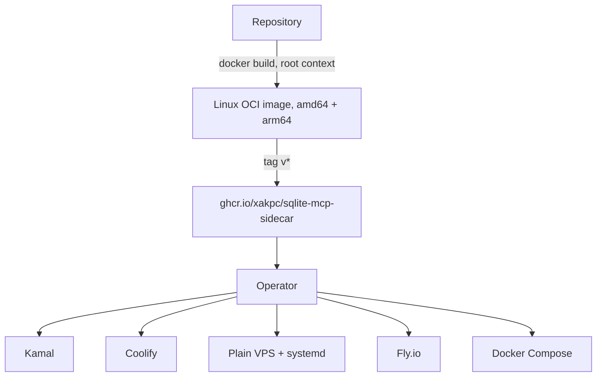

# Deployment summary

How the sidecar ships and how an operator runs it.

| Topic | File |
| --- | --- |
| The image, the build context, hardening, `compose.yaml` | [container.md](container.md) |
| The registry, the tag scheme, provenance | [distribution.md](distribution.md) |
| Kamal, Coolify, a plain VPS, Fly.io, the path contract | [platforms.md](platforms.md) |

## The three rules that every recipe repeats

1. **One replica.** The request budget, the write budget and the idempotency cache are process
   memory. A second replica makes all three weaker and reports nothing.
2. **`/data` writable**, also for the `schema,read` permission set. SQLite opens the `-shm` file
   read-write for a read-only connection to a WAL database.
3. **The container port never faces the internet.** The reverse proxy is the only path in, and the
   host gate lives there.

## Operator documentation

`README.md` and `SECURITY.md` at the repository root are the operator-facing copies of this
material. The README is **self-contained** on purpose: every recipe, every variable and every
security statement is inline, and it links to no other file in the repository. `SECURITY.md`
repeats the security half, because GitHub reads that file for the "Report a vulnerability" flow.

Keep all three in agreement when a control changes. The lode is the source, and both root files are
copies.

## Related

- [../summary.md](../summary.md)
- [../security/model.md](../security/model.md)
- [../security/public-endpoint.md](../security/public-endpoint.md)
- [../configuration/options.md](../configuration/options.md)
