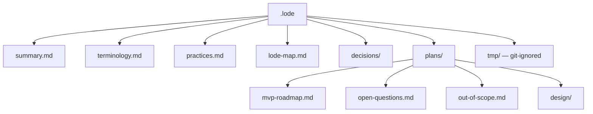

# Lode map

Index of each lode file. Read this file first in a new session, together with
[summary.md](summary.md) and [terminology.md](terminology.md).

## Structure

The project has no code except the template, thus there is no domain directory yet. The full
design is in `plans/design/`. When a phase lands, move its design file into a domain directory
such as `security/`, `database/`, `mcp/` or `ops/`, write it again as current state, and
update this map.

## Root

| File | Contents |
| --- | --- |
| [summary.md](summary.md) | What the product is, the capability split, the nine tools, implementation status, repository layout. |
| [terminology.md](terminology.md) | Domain language. Use these exact words in code and logs. |
| [practices.md](practices.md) | Active rules: design limits, code organization, security and logging practices, MCP SDK 2.x notes, dependency table, NativeAOT stance. |
| [lode-map.md](lode-map.md) | This index. |

## decisions/

Decisions that are difficult to reverse, surprising without context, and the result of a real
trade-off.

| File | Contents |
| --- | --- |
| [decisions/0001-no-undo-in-mvp.md](decisions/0001-no-undo-in-mvp.md) | The MVP has no undo for a delete. Why the automatic backup before delete is gone. |
| [decisions/0002-write-is-a-whole-database-grant.md](decisions/0002-write-is-a-whole-database-grant.md) | No table allowlist. A permission applies to each table. |
| [decisions/0003-mandatory-idempotency-key.md](decisions/0003-mandatory-idempotency-key.md) | Each write tool needs `requestId`. Why failures are not cached. |

## plans/

| File | Contents |
| --- | --- |
| [plans/mvp-roadmap.md](plans/mvp-roadmap.md) | Nine phases from template to MVP, the required security and functional test lists, the definition of done. |
| [plans/open-questions.md](plans/open-questions.md) | The NativeAOT pair, which needs a real publish run, and two verification tasks. |
| [plans/out-of-scope.md](plans/out-of-scope.md) | Excluded features and the reason for each exclusion. |

## plans/design/

Target design, one topic for each file. No code implements any of it yet.

| File | Contents |
| --- | --- |
| [security-model.md](plans/design/security-model.md) | The layered security model, the guarantees list, the non-guarantees list. Start here. |
| [permission-model.md](plans/design/permission-model.md) | The six permissions, the read floor, permission-to-tool mapping, documented risk levels. |
| [authentication-and-network.md](plans/design/authentication-and-network.md) | Bearer token contract, constant-time comparison, reverse proxy model, CORS off, health endpoint. |
| [sqlite-sandbox.md](plans/design/sqlite-sandbox.md) | The always-on SQLite controls, the verified native API surface, authorizer policy for each tool, runtime limits, hard boundaries, cancellation. |
| [threat-model.md](plans/design/threat-model.md) | Agent mistakes, mitigation map, the mistake that the MVP does not mitigate, attacker goals and blocks, logging and errors as leak surfaces. |
| [connection-policy.md](plans/design/connection-policy.md) | Read-only and read-write connections, the read-only backup source, lifecycle, pooling off, settings never changed, busy behavior, the three semaphores. |
| [structured-writes.md](plans/design/structured-writes.md) | `insert`, `update`, `delete`, the filter model, `BEGIN IMMEDIATE`, the bounded pre-count, the row-limit rollback, the write budget. |
| [write-idempotency.md](plans/design/write-idempotency.md) | The mandatory `requestId`, what the cache stores, why failures are not cached, the bounds. |
| [raw-writes.md](plans/design/raw-writes.md) | `execute_write_sql`, what the permission bypasses and what it does not, results, budget accounting, no remote transactions. |
| [backups.md](plans/design/backups.md) | The background backup, partial files, the runaway cap, `backup_status`, path safety, and the `diagnostics` tool. |
| [mcp-tool-catalog.md](plans/design/mcp-tool-catalog.md) | The nine tools, server registration, tool shape, permission gating, `schema` as DDL, `query`. |
| [toon-results.md](plans/design/toon-results.md) | The result pipeline, the `Toon.DotNet` serializer, output format, row and byte limits, truncation. |
| [error-model.md](plans/design/error-model.md) | The twelve error codes, a selection flowchart, disclosure rules. |
| [configuration.md](plans/design/configuration.md) | Every `SQLITE_SIDECAR_` variable, startup validation, the journal mode warning, the options shape. |
| [container-and-deployment.md](plans/design/container-and-deployment.md) | Deployment shape, compose example, filesystem access, image hardening, current Dockerfile gaps, build output. |

## tmp/

Session scraps. `.gitignore` ignores `.lode/tmp/`. Nothing here is permanent. Session handover
documents go here.

## Reading paths

| Task | Read |
| --- | --- |
| Start a session | `lode-map.md`, `terminology.md`, `summary.md` |
| Start implementation | `plans/mvp-roadmap.md`, `practices.md` |
| Touch SQLite access | `plans/design/sqlite-sandbox.md`, `plans/design/connection-policy.md` |
| Add or change a tool | `plans/design/mcp-tool-catalog.md`, `plans/design/permission-model.md` |
| Touch a write path | `plans/design/structured-writes.md`, `plans/design/write-idempotency.md`, `plans/design/raw-writes.md` |
| Write documentation | `plans/design/security-model.md`, `plans/design/permission-model.md`, `plans/design/raw-writes.md`, `decisions/` |
| Consider a new feature | `plans/out-of-scope.md`, `decisions/` |
