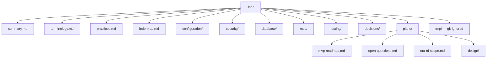

# Lode map

Index of each lode file. Read this file first in a new session, together with
[summary.md](summary.md) and [terminology.md](terminology.md).

## Structure

A domain directory holds current state. `plans/design/` holds the design of what has no code. A file
moves out of `plans/design/` when code implements it, and it is rewritten as current state.

## Root

| File | Contents |
| --- | --- |
| [summary.md](summary.md) | What the product is, the implementation status table, the repository layout, the capability split, the nine tools, how to run it. |
| [terminology.md](terminology.md) | Domain language. Use these exact words in code and logs. |
| [practices.md](practices.md) | Active rules: design limits, code organization, security and logging practices, MCP SDK notes, the dependency table, testing rules, the NativeAOT stance. |
| [lode-map.md](lode-map.md) | This index. |

## configuration/

| File | Contents |
| --- | --- |
| [configuration/options.md](configuration/options.md) | Every `SQLITE_SIDECAR_` variable, why the read is explicit and deferred, the validation flow, the journal mode warning, the ASP.NET Core settings. |

## security/

| File | Contents |
| --- | --- |
| [security/summary.md](security/summary.md) | The layers that have code today. |
| [security/authentication.md](security/authentication.md) | The deployment token, the constant-time comparison, the permission claims, the identical 401, the health endpoint, the network model. |
| [security/permissions.md](security/permissions.md) | The six permissions, the read floor, the claim and policy mechanism, the two gating layers, the invariants, the risk table. |

## database/

| File | Contents |
| --- | --- |
| [database/connections.md](database/connections.md) | The read-only connection, `query_only`, pooling off, the Phase 2 sandbox seam, the request semaphore, the filesystem constraints. |

## mcp/

| File | Contents |
| --- | --- |
| [mcp/tool-catalog.md](mcp/tool-catalog.md) | The nine tools and which exist, server registration, the stateless transport and the removed handshake, tool shape, `schema`. |

## testing/

| File | Contents |
| --- | --- |
| [testing/e2e-harness.md](testing/e2e-harness.md) | The dual-target harness, the sample database, the dev script, the runner. Every later phase depends on it. |

## decisions/

Decisions that are difficult to reverse, surprising without context, and the result of a real
trade-off.

| File | Contents |
| --- | --- |
| [decisions/0001-no-undo-in-mvp.md](decisions/0001-no-undo-in-mvp.md) | The MVP has no undo for a delete. Why the automatic backup before delete is gone. |
| [decisions/0002-write-is-a-whole-database-grant.md](decisions/0002-write-is-a-whole-database-grant.md) | No table allowlist. A permission applies to each table. |
| [decisions/0003-mandatory-idempotency-key.md](decisions/0003-mandatory-idempotency-key.md) | Each write tool needs `requestId`. Why failures are not cached. |

## plans/

| File | Contents |
| --- | --- |
| [plans/mvp-roadmap.md](plans/mvp-roadmap.md) | The phases, which are done, the required security and functional test lists, the definition of done. |
| [plans/open-questions.md](plans/open-questions.md) | The NativeAOT pair, MCP Tasks for `backup`, and the remaining verification tasks. |
| [plans/out-of-scope.md](plans/out-of-scope.md) | Excluded features and the reason for each exclusion. |

## plans/design/

Target design for what has no code. One topic for each file.

| File | Contents |
| --- | --- |
| [security-model.md](plans/design/security-model.md) | The layered security model, the guarantees list, the non-guarantees list. Start here. |
| [sqlite-sandbox.md](plans/design/sqlite-sandbox.md) | The always-on SQLite controls, the verified native API surface, authorizer policy for each tool, runtime limits, hard boundaries, cancellation. |
| [threat-model.md](plans/design/threat-model.md) | Agent mistakes, mitigation map, the mistake that the MVP does not mitigate, attacker goals and blocks, logging and errors as leak surfaces. |
| [connection-policy.md](plans/design/connection-policy.md) | The write and backup connections, `BEGIN IMMEDIATE`, busy behaviour, the write and backup semaphores. |
| [structured-writes.md](plans/design/structured-writes.md) | `insert`, `update`, `delete`, the filter model, the bounded pre-count, the row-limit rollback, the write budget. |
| [write-idempotency.md](plans/design/write-idempotency.md) | The mandatory `requestId`, what the cache stores, why failures are not cached, the bounds. |
| [raw-writes.md](plans/design/raw-writes.md) | `execute_write_sql`, what the permission bypasses and what it does not, results, budget accounting, no remote transactions. |
| [backups.md](plans/design/backups.md) | The background backup, partial files, the runaway cap, `backup_status`, path safety, and the `diagnostics` tool. |
| [toon-results.md](plans/design/toon-results.md) | The result pipeline, the `Toon.DotNet` serializer, output format, row and byte limits, truncation. |
| [error-model.md](plans/design/error-model.md) | The twelve error codes, which reach a caller today, a selection flowchart, disclosure rules. |
| [container-and-deployment.md](plans/design/container-and-deployment.md) | Deployment shape, compose example, filesystem access, image hardening, current Dockerfile gaps, build output. |

## tmp/

Session scraps. `.gitignore` ignores `.lode/tmp/`. Nothing here is permanent. Session handover
documents go here.

## Reading paths

| Task | Read |
| --- | --- |
| Start a session | `lode-map.md`, `terminology.md`, `summary.md` |
| Continue implementation | `plans/mvp-roadmap.md`, `practices.md` |
| Write or run a test | `testing/e2e-harness.md` |
| Touch SQLite access | `database/connections.md`, `plans/design/sqlite-sandbox.md`, `plans/design/connection-policy.md` |
| Add or change a tool | `mcp/tool-catalog.md`, `security/permissions.md` |
| Touch authentication | `security/authentication.md`, `security/permissions.md` |
| Touch configuration | `configuration/options.md` |
| Touch a write path | `plans/design/structured-writes.md`, `plans/design/write-idempotency.md`, `plans/design/raw-writes.md` |
| Write documentation | `plans/design/security-model.md`, `security/permissions.md`, `plans/design/raw-writes.md`, `decisions/` |
| Consider a new feature | `plans/out-of-scope.md`, `decisions/` |
