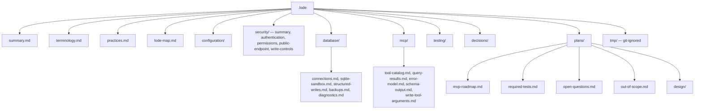

# Lode map

Index of each lode file. Read this file first in a new session, together with
[summary.md](summary.md) and [terminology.md](terminology.md).

## Structure

A domain directory holds current state. `plans/design/` holds the design of what has no code. A file
moves out of `plans/design/` when code implements it, and it is rewritten as current state.

## Root

| File | Contents |
| --- | --- |
| [summary.md](summary.md) | What the product is, the implementation status table, the repository layout, the capability split, the nine tools, how to run it. |
| [terminology.md](terminology.md) | Domain language. Use these exact words in code and logs. |
| [practices.md](practices.md) | Active rules: design limits, code organization, security and logging practices, MCP SDK notes, the dependency table, testing rules, the NativeAOT stance. |
| [lode-map.md](lode-map.md) | This index. |

## configuration/

| File | Contents |
| --- | --- |
| [configuration/options.md](configuration/options.md) | Every `SQLITE_SIDECAR_` variable, why the read is explicit and deferred, the validation flow, the journal mode warning, the ASP.NET Core settings. |

## security/

| File | Contents |
| --- | --- |
| [security/summary.md](security/summary.md) | The layers that have code today. |
| [security/authentication.md](security/authentication.md) | The deployment token, the constant-time comparison, the permission claims, the identical 401, the health endpoint, the network model. |
| [security/public-endpoint.md](security/public-endpoint.md) | The two paths and the path contract, the request budget, the middleware order, the absent host filtering, the forwarded address in a log. |
| [security/permissions.md](security/permissions.md) | The six permissions, the read floor, the claim and policy mechanism, the two gating layers, the invariants, the risk table. |
| [security/write-controls.md](security/write-controls.md) | The write budget, the idempotency cache, the order of the controls, the bounds, the process-state caveat. |

## database/

| File | Contents |
| --- | --- |
| [database/connections.md](database/connections.md) | The read-only connection, the write connection and `ForeignKeys`, `query_only`, pooling off, where the sandbox applies, the request and write semaphores, the filesystem constraints. |
| [database/sqlite-sandbox.md](database/sqlite-sandbox.md) | The always-on SQLite controls, the verified native API, the two allowlist policies, runtime limits, the one-statement rule, hard boundaries, cancellation. |
| [database/structured-writes.md](database/structured-writes.md) | Why the server builds the statement, the three tools, the flat filter model, the order of an insert and of a mutation, the two row-limit checks, identifier validation, the value table, the result shapes. |
| [database/backups.md](database/backups.md) | The task-mode call, the step loop and why it is not `BackupDatabase`, restarts and the restart cap with measured numbers, partial files, path safety, the backup slot. |
| [database/diagnostics.md](database/diagnostics.md) | The fixed value set, why the journal mode matters most, `quick_check` over `integrity_check`, the connection. |

## mcp/

| File | Contents |
| --- | --- |
| [mcp/tool-catalog.md](mcp/tool-catalog.md) | The eight tools and which exist, server registration, the one task-mode tool and the execution mode selector, the stateless transport and the removed handshake, tool shape. |
| [mcp/query-results.md](mcp/query-results.md) | The result pipeline, the `Toon.DotNet` serializer, output format, value handling, row and byte limits, truncation. |
| [mcp/error-model.md](mcp/error-model.md) | The twelve codes, how a code reaches the agent, which reach a caller today, a selection flowchart, disclosure rules. |
| [mcp/schema-output.md](mcp/schema-output.md) | Why `schema` returns DDL and not TOON, what is hidden, the one open verification task. |
| [mcp/write-tool-arguments.md](mcp/write-tool-arguments.md) | The write tool signatures, the mandatory-argument `= null` lesson, why the JSON schema marks nothing required, the shared write path. |

## testing/

| File | Contents |
| --- | --- |
| [testing/e2e-harness.md](testing/e2e-harness.md) | The dual-target harness, the sample database, the dev script, the runner. Every later phase depends on it. |

## decisions/

Decisions that are difficult to reverse, surprising without context, and the result of a real
trade-off.

| File | Contents |
| --- | --- |
| [decisions/0001-no-undo-in-mvp.md](decisions/0001-no-undo-in-mvp.md) | The MVP has no undo for a delete. Why the automatic backup before delete is gone. |
| [decisions/0002-write-is-a-whole-database-grant.md](decisions/0002-write-is-a-whole-database-grant.md) | No table allowlist. A permission applies to each table. |
| [decisions/0003-mandatory-idempotency-key.md](decisions/0003-mandatory-idempotency-key.md) | Each write tool needs `requestId`. Why failures are not cached. |
| [decisions/0004-maxrows-bounds-total-changes.md](decisions/0004-maxrows-bounds-total-changes.md) | `maxRows` counts a cascade and a trigger, not the target table alone. Why `ExecuteNonQuery` is the wrong count. |
| [decisions/0005-and-only-filter.md](decisions/0005-and-only-filter.md) | The structured filter joins with `AND` only. Why N calls bound tighter than one `or`. |
| [decisions/0006-backup-restart-cap.md](decisions/0006-backup-restart-cap.md) | The backup cap counts restarts, not seconds. The measured write rates. |
| [decisions/0007-tasks-over-a-status-tool.md](decisions/0007-tasks-over-a-status-tool.md) | MCP Tasks replaced `backup_status`. Why the execution mode selector is load-bearing. |

## plans/

| File | Contents |
| --- | --- |
| [plans/mvp-roadmap.md](plans/mvp-roadmap.md) | The phases, which are done, what each remaining one builds, the definition of done. |
| [plans/required-tests.md](plans/required-tests.md) | The mandatory test lists: hard boundaries, startup, structured writes, idempotency, raw writes, functional. |
| [plans/open-questions.md](plans/open-questions.md) | The NativeAOT pair, MCP Tasks for `backup`, and the remaining verification tasks. |
| [plans/out-of-scope.md](plans/out-of-scope.md) | Excluded features and the reason for each exclusion. |

## plans/design/

Target design for what has no code. One topic for each file.

| File | Contents |
| --- | --- |
| [security-model.md](plans/design/security-model.md) | The layered security model, the guarantees list, the non-guarantees list. Start here. |
| [threat-model.md](plans/design/threat-model.md) | Agent mistakes, mitigation map, the mistake that the MVP does not mitigate, attacker goals and blocks, logging and errors as leak surfaces. |
| [connection-policy.md](plans/design/connection-policy.md) | One row left: the `execute_write_sql` connection. Everything else is current state. |
| [write-idempotency.md](plans/design/write-idempotency.md) | Only the scope table: which tools take `requestId`. The rest is current state. |
| [raw-writes.md](plans/design/raw-writes.md) | `execute_write_sql`, what the permission bypasses and what it does not, results, budget accounting, no remote transactions. |
| [container-and-deployment.md](plans/design/container-and-deployment.md) | Deployment shape, compose example, filesystem access, image hardening, current Dockerfile gaps, build output. |
| [platform-deployment.md](plans/design/platform-deployment.md) | Kamal and Coolify recipes, the proxy path options, the healthcheck path, replicas, the client header, token rotation. |

## tmp/

Session scraps. `.gitignore` ignores `.lode/tmp/`. Nothing here is permanent. Session handover
documents go here.

## Reading paths

| Task | Read |
| --- | --- |
| Start a session | `lode-map.md`, `terminology.md`, `summary.md` |
| Continue implementation | `plans/mvp-roadmap.md`, `practices.md` |
| Write or run a test | `testing/e2e-harness.md`, `plans/required-tests.md` |
| Touch SQLite access | `database/sqlite-sandbox.md`, `database/connections.md` |
| Touch a backup | `database/backups.md`, `decisions/0006-backup-restart-cap.md`, `decisions/0007-tasks-over-a-status-tool.md` |
| Add or change a tool | `mcp/tool-catalog.md`, `security/permissions.md`, `mcp/error-model.md` |
| Touch authentication | `security/authentication.md`, `security/permissions.md` |
| Touch an endpoint, a path or a rate limit | `security/public-endpoint.md`, `plans/design/platform-deployment.md` |
| Touch configuration | `configuration/options.md` |
| Touch a write path | `database/structured-writes.md`, `security/write-controls.md`, `decisions/0004-maxrows-bounds-total-changes.md` |
| Write documentation | `plans/design/security-model.md`, `security/permissions.md`, `plans/design/raw-writes.md`, `decisions/` |
| Touch the container or the launch configuration | `plans/design/container-and-deployment.md`, `testing/e2e-harness.md` |
| Consider a new feature | `plans/out-of-scope.md`, `decisions/` |
