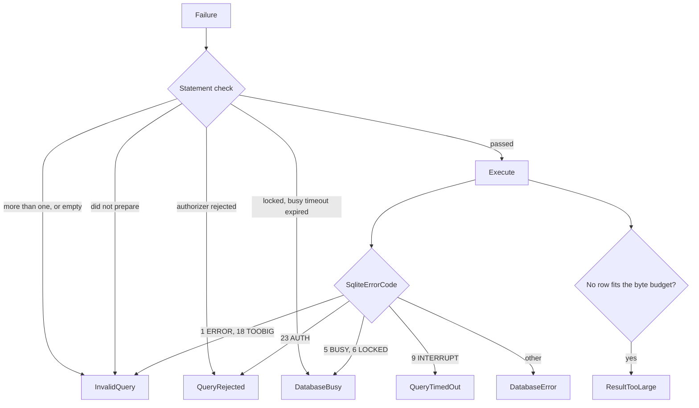
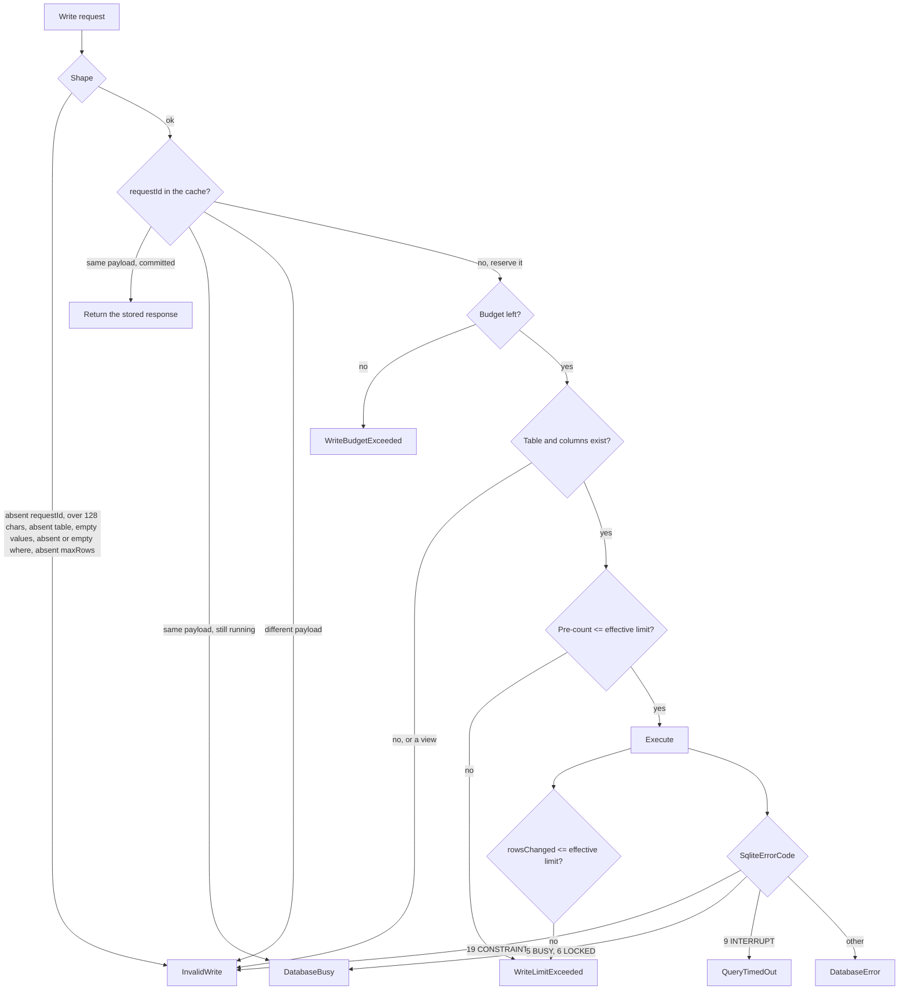

# Error model

The error model is small and closed. A small set keeps agent behaviour predictable, because an agent
selects its next action from the code.

Code: `src/Xakpc.SQLiteMCPSidecar/Mcp/SidecarError.cs`.

## How a code reaches the agent

**Invariant.** A tool returns a `CallToolResult` with `IsError` set. A tool never throws to report an
error from this model.

```csharp
return SidecarErrors.Failure(SidecarError.QueryRejected, "The requested action is not permitted.");
```

**Lesson.** The SDK catches an exception out of a tool and replaces the message with its own fixed
text, `"An error occurred invoking 'query'."`. That masking is right for an unexpected fault, and it
is wrong for this model: the agent gets no code to select from. A thrown exception therefore loses
every error code, and nothing in the build reports it. `SandboxBoundaryTests` and `QueryToolTests`
assert on the code text, thus a return to the throwing shape fails the suite.

On the wire:

```json
{"result":{"content":[{"type":"text",
  "text":"QueryRejected: The requested action is not permitted. Only read statements are available."}],
  "isError":true}}
```

**`PermissionDenied` is different.** The SDK authorization filter rejects an unpermitted
`tools/call` with its own message, `"Access forbidden: This tool requires authorization."`, and not
with this code. The outcome is the same and the agent must stop. See
[../security/permissions.md](../security/permissions.md).

## Codes

| Code | Cause | Agent must | Reaches a caller |
| --- | --- | --- | --- |
| `Unauthorized` | Missing or wrong bearer token. | Stop. | `401`, before a tool |
| `PermissionDenied` | The deployment does not have the permission. | Stop. Do not retry. | SDK message |
| `InvalidQuery` | Malformed SQL, an unknown name, more than one statement, an absent or empty statement, or a `query` argument of the wrong JSON type. | Correct the statement. | `query`, `execute_write_sql` |
| `QueryRejected` | The authorizer rejected an action. | Stop. The action is not available. | `query`, `execute_write_sql` |
| `QueryTimedOut` | Execution passed the query timeout. | Make the query smaller. | `query`, `schema`, every write tool |
| `ResultTooLarge` | One single row is larger than the byte budget. | Select fewer columns. | `query` only |
| `InvalidWrite` | An invalid `requestId`, an absent `sql`, an argument of the wrong JSON type, an unknown table or column, a value with no SQLite equivalent, a constraint violation, a missing or empty `where`, a missing `maxRows`, or a malformed condition. | Correct the request. | every write tool |
| `WriteLimitExceeded` | The write would change more rows than the effective limit, counting a cascade and a trigger. Nothing changed. | Narrow the filter. | `update`, `delete` |
| `WriteBudgetExceeded` | The per-minute write budget is empty. | Wait, then retry with the same `requestId`. | every write tool |
| `DatabaseBusy` | The busy timeout expired, the write slot did not free, or the same `requestId` is already running on another call. | Retry later with the same `requestId`. | `query`, and every write tool |
| `DatabaseError` | Any other SQLite failure. | Report to the operator. | `query`, `schema`, and every write tool |
| `BackupFailed` | The label is invalid, a backup is in progress, or the copy failed. | Report to the operator. | `backup` |

**`ResultTooLarge` is a read-path code and `execute_write_sql` never returns it**, although a
`RETURNING` clause meets the same condition. The write has already committed when the rows are read,
thus a failure code would tell the agent that its request did not happen. See
[../decisions/0008-a-committed-raw-write-never-fails-on-result-size.md](../decisions/0008-a-committed-raw-write-never-fails-on-result-size.md).

**`WriteLimitExceeded` is impossible on the raw path.** There is no `maxRows`, no pre-count and no
rollback: that is what the permission buys.

## Selection on the read path



Separate `QueryRejected` from `InvalidQuery`. A rejection means that the sandbox refused a valid
statement, thus a retry has no value. A malformed statement is worth one correction.

Separate `DatabaseBusy` from `DatabaseError`. `DatabaseBusy` is temporary and the agent can retry
it. `DatabaseError` is not.

**Lesson.** `load_extension` gives `InvalidQuery` and not `QueryRejected`. Extension loading is off
on the connection, thus SQLite never registers the function and reports an unknown name. Both codes
mean that the primitive is absent. See [../database/sqlite-sandbox.md](../database/sqlite-sandbox.md).

## Selection on the write path

`InvalidWrite` covers every request that the agent can correct. Four different origins reach it, and
the agent needs no distinction: the next action is to read the schema and send a corrected request.



**A raw constraint message never goes out.** `SQLITE_CONSTRAINT` carries text that often names the
database file, thus the agent gets fixed text that names the three constraint kinds. The detail goes to
the log.

**`execute_write_sql` adds the statement-shape branch of the read path to this one.** It is the only
write tool that carries caller SQL, thus `InvalidQuery` and `QueryRejected` are reachable from a write
request: the shared `RunWriteAsync` maps `StatementRejectedException` exactly as `query` does. See
[../database/raw-writes.md](../database/raw-writes.md).

**The write slot is a `DatabaseBusy` source and not only the SQLite busy timeout.** The wait for the
one write slot is bounded by `BUSY_TIMEOUT_SECONDS`. From the view of the agent the cause is the same:
another writer holds the lock, thus retry later. See
[../database/connections.md](../database/connections.md).

**A third `DatabaseBusy` source is statement preparation.** `SQLITE_BUSY` and `SQLITE_LOCKED` out of
`sqlite3_prepare_v2` become `StatementCheck.Busy`, which both switch sites map to `DatabaseBusy`.
The condition reached the agent as `InvalidQuery` before, which asks the agent to rewrite a correct
statement. See
[../decisions/0009-a-locked-database-is-not-a-caller-mistake.md](../decisions/0009-a-locked-database-is-not-a-caller-mistake.md).

## `WriteLimitExceeded` has one code for two checks

A structured `update` or `delete` can fail the bounded pre-count, or it can fail the count after
execution and roll back. Both give `WriteLimitExceeded`, because the next action of the agent is the
same and in both cases nothing changed.

The log records which check rejected the operation, in the `check=pre|post` field of event 2005. That
line is the only evidence an operator has, and the two mean different things: `pre` is a filter that
was wider than the agent expected, `post` is a cascade, a trigger, or the owning application writing
between the count and the write. See
[../database/structured-writes.md](../database/structured-writes.md).

## Errors and the idempotency cache

The sidecar caches a response only when the transaction committed. An error is never cached, thus
`DatabaseBusy` and `WriteBudgetExceeded` stay retryable with the same `requestId`. A cached error would
make the instruction "retry later" incorrect.
`WriteIdempotencyTests.ARequestIdThatFailedStaysUsable` proves it. See
[../security/write-controls.md](../security/write-controls.md).

## A malformed argument must reach this model

The model owns **every** failure that an agent can cause. Two mechanisms are needed, because an
argument can go wrong in two places and neither one is the tool body.

**An absent argument: `= null` plus validation in the method.** A nullable type alone is not enough:
the binder of the SDK treats a parameter with no default value as required and throws, and the SDK
then masks the message the same way it masks a thrown exception. The agent gets `"An error occurred
invoking 'insert'."` and no code. `query` was the last tool without the default and it has one now.
See [tool-catalog.md](tool-catalog.md).

**A wrong JSON type: the binding filter.** No default helps there, because the conversion itself is
what fails, and it fails before the method runs. `ArgumentBindingFilter` wraps `tools/call`, catches
the `JsonException` and answers `InvalidQuery` for `query` or `InvalidWrite` for a write tool. It
names the tool and not the argument, because the binder converts each argument on its own and the
exception carries the path `$`. See
[write-tool-arguments.md](write-tool-arguments.md).

**Lesson.** A corpus of malformed calls is what found the second half; no build warning reports it
and every hand-written test built correctly typed arguments through a helper, which silently
corrected the mistake. See [../testing/bad-agent-suite.md](../testing/bad-agent-suite.md).

A refusal that the protocol layer makes before either mechanism, an unknown tool name or the
authorization filter, carries no code of this model and says so in plain words: `Unknown tool:
'drop_database'` and `Access forbidden: This tool requires authorization.`

## Disclosure rules

**Invariant.** Never return these values to a remote caller:

```text
stack traces
the bearer token or any secret
absolute filesystem paths
raw SQLite internal messages that name a file
```

Return the code and a short, fixed explanation. Write the detail to the log, thus an operator can
correlate the two. A SQLite message often has the database path in the text, thus a provider message
never goes out without a change.

`SandboxBoundaryTests.ARejectionDisclosesNoPathAndNoToken` proves this for the read path.

## Related

- [../database/sqlite-sandbox.md](../database/sqlite-sandbox.md)
- [query-results.md](query-results.md)
- [../security/threat-model.md](../security/threat-model.md)
- [../database/structured-writes.md](../database/structured-writes.md)
- [../database/raw-writes.md](../database/raw-writes.md)
