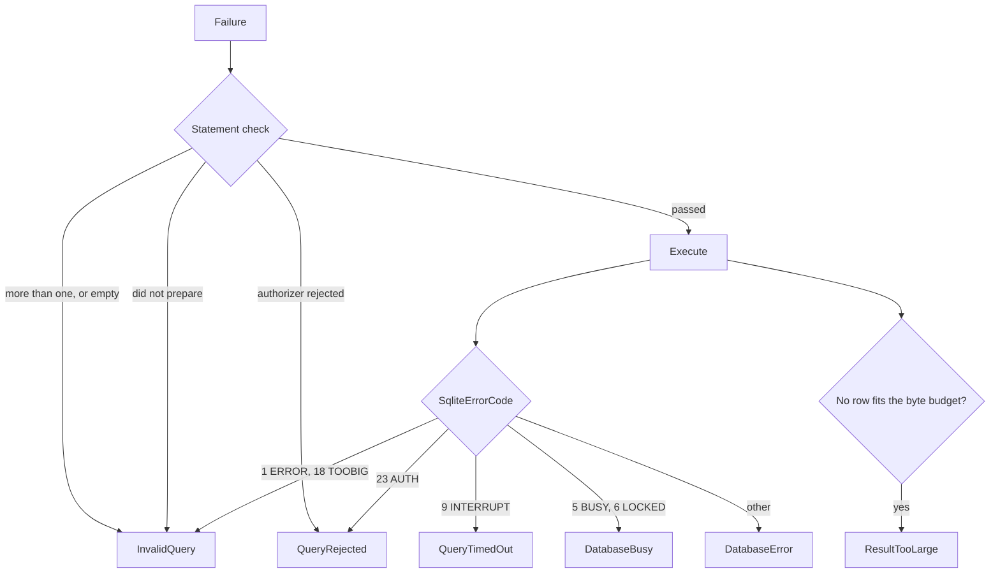

# Error model

The error model is small and closed. A small set keeps agent behaviour predictable, because an agent
selects its next action from the code.

Code: `src/Xakpc.SQLiteMCPSidecar/Mcp/SidecarError.cs`.

## How a code reaches the agent

**Invariant.** A tool returns a `CallToolResult` with `IsError` set. A tool never throws to report an
error from this model.

```csharp
return SidecarErrors.Failure(SidecarError.QueryRejected, "The requested action is not permitted.");
```

**Lesson.** The SDK catches an exception out of a tool and replaces the message with its own fixed
text, `"An error occurred invoking 'query'."`. That masking is right for an unexpected fault, and it
is wrong for this model: the agent gets no code to select from. A thrown exception therefore loses
every error code, and nothing in the build reports it. `SandboxBoundaryTests` and `QueryToolTests`
assert on the code text, thus a return to the throwing shape fails the suite.

On the wire:

```json
{"result":{"content":[{"type":"text",
  "text":"QueryRejected: The requested action is not permitted. Only read statements are available."}],
  "isError":true}}
```

**`PermissionDenied` is different.** The SDK authorization filter rejects an unpermitted
`tools/call` with its own message, `"Access forbidden: This tool requires authorization."`, and not
with this code. The outcome is the same and the agent must stop. See
[../security/permissions.md](../security/permissions.md).

## Codes

| Code | Cause | Agent must | Reaches a caller |
| --- | --- | --- | --- |
| `Unauthorized` | Missing or wrong bearer token. | Stop. | `401`, before a tool |
| `PermissionDenied` | The deployment does not have the permission. | Stop. Do not retry. | SDK message |
| `InvalidQuery` | Malformed SQL, an unknown name, more than one statement, or an absent statement. | Correct the statement. | `query` |
| `QueryRejected` | The authorizer rejected an action. | Stop. The action is not available. | `query` |
| `QueryTimedOut` | Execution passed the query timeout. | Make the query smaller. | `query`, `schema` |
| `ResultTooLarge` | One single row is larger than the byte budget. | Select fewer columns. | `query` |
| `InvalidWrite` | Missing `where`, missing `maxRows`, or an invalid `requestId`. | Correct the request. | Phase 4 |
| `WriteLimitExceeded` | The filter matched more rows than the effective limit. Nothing changed. | Narrow the filter. | Phase 4 |
| `WriteBudgetExceeded` | The per-minute write budget is empty. | Wait, then retry. | Phase 4 |
| `DatabaseBusy` | The busy timeout expired. Another writer holds the lock. | Retry later. | `query` |
| `DatabaseError` | Any other SQLite failure. | Report to the operator. | `query`, `schema` |
| `BackupFailed` | The label is invalid, a backup is in progress, or the copy failed. | Report to the operator. | Phase 5 |

## Selection on the read path



Separate `QueryRejected` from `InvalidQuery`. A rejection means that the sandbox refused a valid
statement, thus a retry has no value. A malformed statement is worth one correction.

Separate `DatabaseBusy` from `DatabaseError`. `DatabaseBusy` is temporary and the agent can retry
it. `DatabaseError` is not.

**Lesson.** `load_extension` gives `InvalidQuery` and not `QueryRejected`. Extension loading is off
on the connection, thus SQLite never registers the function and reports an unknown name. Both codes
mean that the primitive is absent. See [../database/sqlite-sandbox.md](../database/sqlite-sandbox.md).

## `WriteLimitExceeded` has one code for two checks

A structured `update` or `delete` can fail the bounded pre-count, or it can fail the count after
execution and roll back. Both give `WriteLimitExceeded`, because the next action of the agent is the
same and in both cases nothing changed. The log records which check rejected the operation. See
[../plans/design/structured-writes.md](../plans/design/structured-writes.md).

## Errors and the idempotency cache

The sidecar will cache a response only when the transaction committed. An error is never cached,
thus `DatabaseBusy` and `WriteBudgetExceeded` stay retryable with the same `requestId`. A cached
error would make the instruction "retry later" incorrect. See
[../plans/design/write-idempotency.md](../plans/design/write-idempotency.md).

## Disclosure rules

**Invariant.** Never return these values to a remote caller:

```text
stack traces
the bearer token or any secret
absolute filesystem paths
raw SQLite internal messages that name a file
```

Return the code and a short, fixed explanation. Write the detail to the log, thus an operator can
correlate the two. A SQLite message often has the database path in the text, thus a provider message
never goes out without a change.

`SandboxBoundaryTests.ARejectionDisclosesNoPathAndNoToken` proves this for the read path.

## Related

- [../database/sqlite-sandbox.md](../database/sqlite-sandbox.md)
- [query-results.md](query-results.md)
- [../plans/design/threat-model.md](../plans/design/threat-model.md)
- [../plans/design/structured-writes.md](../plans/design/structured-writes.md)
