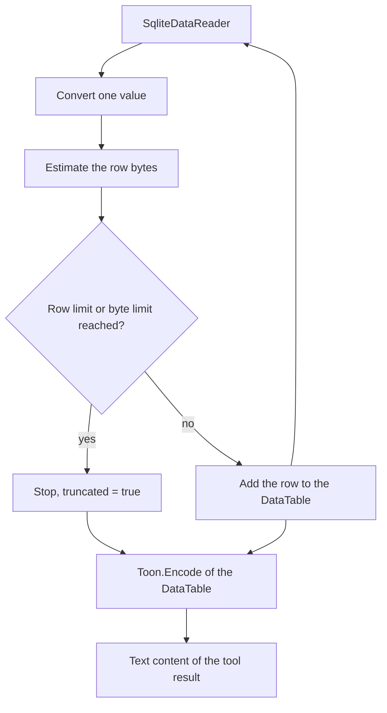

# Query results and limits

Row data goes to the agent as TOON. TOON is compact, thus it costs fewer tokens than JSON for row
data.

**TOON is for row data only.** The `schema` tool returns DDL text and no TOON. See
[tool-catalog.md](tool-catalog.md).

Code: `src/Xakpc.SQLiteMCPSidecar/Database/QueryResult.cs`.

## Pipeline



**Invariant.** Apply the limits during the read of the rows and not after it. The result is buffered
before serialization, and buffering is acceptable exactly because the bound exists first.

## Output format

```text
rows[2]{id,status}:
  41,failed
  52,failed

truncated: false
```

The header states the row count and the column names. The `truncated` flag is always present, thus
an agent never has to calculate completeness.

**Lesson.** `Toon.Encode(DataTable, ...)` writes a root-level tabular array, `[2]{id,status}:`, and
it ignores `DataTable.TableName`. The product format names the array, thus the code puts the key in
front of the encoded text. The alternative is `Toon.Encode(object, ...)` with a wrapper object, and
that overload reflects over the argument type, which is the NativeAOT hazard that the `DataTable`
overload avoids.

**Lesson.** The serializer writes `\n`. The code appends `\n` and not `Environment.NewLine`, thus one
document has one line ending on Windows and on Linux.

Do not write a custom TOON serializer. Replace the `Toon.DotNet` package only when it proves
unsuitable, and record the reason here.

## Values

Every buffer column is `object`, because SQLite is dynamically typed and one column can hold a
different type in each row.

| SQLite value | Output |
| --- | --- |
| Integer, real, text | The value. The serializer quotes and escapes it when necessary. |
| NULL | `null` |
| BLOB | `<blob: 1234 bytes>` |

**A BLOB becomes a placeholder that states its size.** The serializer writes the type name,
`System.Byte[]`, for a byte array, and raw bytes have no use inside an agent context: they cost
tokens, they do not survive a text format, and a large one empties the context window.

A repeated column name gets a suffix, `id` and `id_2`. A join returns a repeated name, and that is
an ordinary agent query and not a failure.

## Limits

Defaults:

```text
max SQL size:             32 KB
query timeout:            10 seconds
max returned rows:        1,000
max result size:          4 MB
max concurrent requests:  4
busy timeout:             3 seconds
```

**Invariant.** Client SQL never overrides a server-side limit. A `LIMIT` clause in caller SQL is the
caller preference, and the server limit is the ceiling.

The server counts two quantities independently during the read:

```text
rows
estimated serialized bytes
```

Two counters are necessary, because one wide row can pass the byte budget while the row count stays
low.

**Invariant.** The row limit and the byte limit both truncate. Return the rows that fit and set
`truncated: true`. A partial answer with an honest flag is more useful to an agent than an error.

`ResultTooLarge` has exactly one cause: no row fits, because one single row is larger than the byte
budget. There is no useful partial result then, because the sidecar cannot send a part of a row. The
agent must select fewer columns.

Unlimited result streaming into an agent context is not permitted. An unbounded result empties the
agent context window and the sidecar memory at the same time.

## Cancellation

The query timeout interrupts SQLite and does not only leave the caller. See
[../database/sqlite-sandbox.md](../database/sqlite-sandbox.md).

A timeout returns `QueryTimedOut` and no partial result, because a partial result looks the same as
normal truncation.

## Related

- [tool-catalog.md](tool-catalog.md)
- [error-model.md](error-model.md)
- [../configuration/options.md](../configuration/options.md)
- [../database/sqlite-sandbox.md](../database/sqlite-sandbox.md)
