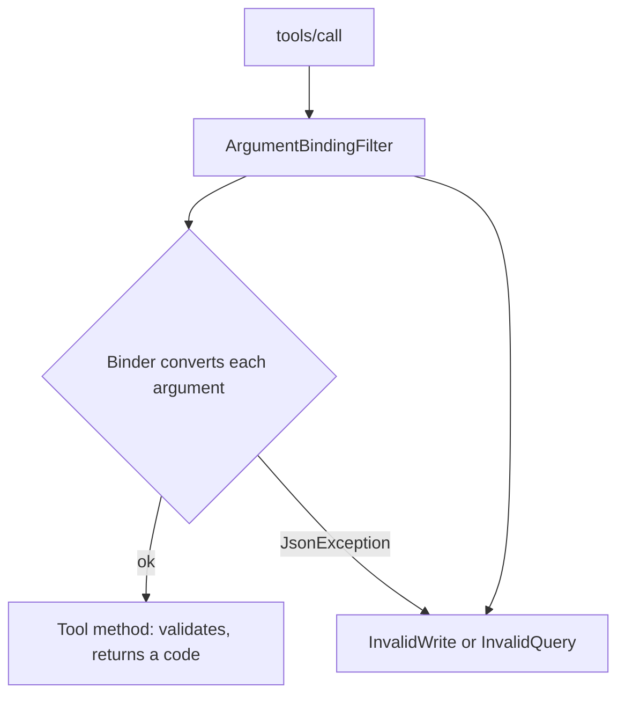

# The write tools: arguments and binding

How `insert`, `update` and `delete` declare their arguments, why the generated JSON schema marks
none of them required, and the one shared code path behind all three.

Code: `src/Xakpc.SQLiteMCPSidecar/Mcp/SqliteTools.cs`. The statement building is in
[../database/structured-writes.md](../database/structured-writes.md).

## `insert`

```csharp
public async Task<CallToolResult> InsertAsync(
    string? requestId = null,
    string? table = null,
    Dictionary<string, JsonElement>? values = null,
    CancellationToken cancellationToken = default)
```

Three arguments. The caller sends no SQL: the server builds one parameterized `INSERT` that adds
exactly one row. See [../database/structured-writes.md](../database/structured-writes.md).

```text
rowsAffected: 1
rowid: 78
```

**Lesson.** Each mandatory argument carries `= null` and is validated in the method body. A nullable
type alone is **not** enough: the binder of the SDK treats a parameter with no default value as
required and throws when the argument is absent, and the SDK then replaces the message with `"An error
occurred invoking 'insert'."`. The agent gets no code to select from, and the required case
"write without requestId -> `InvalidWrite`" cannot pass.
`WriteIdempotencyTests.AnAbsentRequestIdIsInvalidWrite` fails if the defaults are removed.

**`query` follows the same rule.** `string? sql = null` plus a required check in the method. It was
the one tool that did not, and an agent that forgot `sql` therefore got the masked message and no
code.

**The `= null` rule covers an absent argument and not a wrong type.** An argument of the wrong JSON
type fails inside the binder, where no default helps, and the SDK masks that message the same way.
`ArgumentBindingFilter` is what owns that half. See below.

The cost is that the generated JSON schema marks **no** argument as required:

```json
{"type":"object","properties":{
  "requestId":{"type":["string","null"],"default":null,"description":"..."},
  "table":{"type":["string","null"],"default":null,"description":"..."},
  "values":{"type":["object","null"],"default":null,"description":"..."}}}
```

The tool description carries the requirement instead. That trade is correct: a description that the
agent reads plus an actionable error beats a schema keyword plus an opaque failure.

The description must also state the three limits that the schema cannot show: a value is a literal and
never a SQL expression, one call adds one row, and there is no conflict clause.

## `update` and `delete`

```csharp
public async Task<CallToolResult> UpdateAsync(
    string? requestId = null,
    string? table = null,
    Dictionary<string, JsonElement>? values = null,
    List<WriteCondition>? where = null,
    int? maxRows = null,
    CancellationToken cancellationToken = default)
```

`delete` is the same without `values`. `where` and `maxRows` are mandatory and follow the same
`= null` rule as every other write argument. See
[../database/structured-writes.md](../database/structured-writes.md).

```text
rowsAffected: 1
rowsChanged: 4
```

The description of `maxRows` must state that the number counts every row the write touches, including
a row that `ON DELETE CASCADE` removes in another table. It is the surprising part of the contract:
deleting one row that has three cascading children needs a `maxRows` of at least 4. See
[../decisions/0004-maxrows-bounds-total-changes.md](../decisions/0004-maxrows-bounds-total-changes.md).

The description of `where` must name the eight operators. The generated schema types them as a plain
string, thus the text is the only place the agent can read the set.

**Every write tool shares one private path**, `RunWriteAsync`. It holds the order of the
controls — deduplication, budget, request slot, write slot, execute, charge, cache — thus the order
cannot drift between one tool and another. Each tool method owns only its own shape validation and its
result format.


## The binding filter owns the wrong-type half

Code: `src/Xakpc.SQLiteMCPSidecar/Mcp/ArgumentBindingFilter.cs`, registered in `Program.cs` with
`AddCallToolFilter`.

The binder runs **before** a tool method, thus an argument of the wrong JSON type never reaches one
and no `= null` default can help. The filter catches the `JsonException` and answers with
`InvalidWrite`, or with `InvalidQuery` for `query`.



**Only `JsonException`.** Every other exception belongs to the tool, which catches its own and
returns a code, thus catching more here would hide a real defect behind a caller-mistake code.

**Why a filter and not `JsonElement` arguments.** Declaring every argument as `JsonElement` and
converting by hand also returns a code, and it was built first and then discarded: it costs the JSON
schema. `where` stops describing the condition object, which is the one machine-readable account of
the shape the agent has to build, and
`UpdateToolTests.TheFilterArgumentHasAUsableSchema` is what caught the loss. The filter keeps the
rich schema for the agent that reads it and gives a code to the agent that ignored it, and it covers
each tool added later with no per-argument work.

The trade is that the message names the **tool** and not the argument: the binder converts each
argument on its own and the exception carries the path `$`. The description and the schema carry the
shape of each argument, thus the agent has what it needs to find the wrong one.

The exception message can quote the JSON that failed to convert, and a caller value is row data, thus
it reaches the log only and the caller gets fixed text.

## Related

- [tool-catalog.md](tool-catalog.md) — the catalog and the registration
- [../database/structured-writes.md](../database/structured-writes.md)
- [../security/write-controls.md](../security/write-controls.md)
- [../decisions/0004-maxrows-bounds-total-changes.md](../decisions/0004-maxrows-bounds-total-changes.md)
