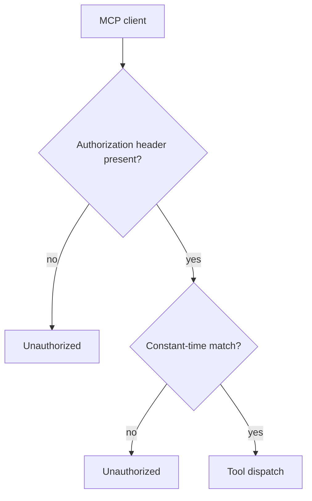
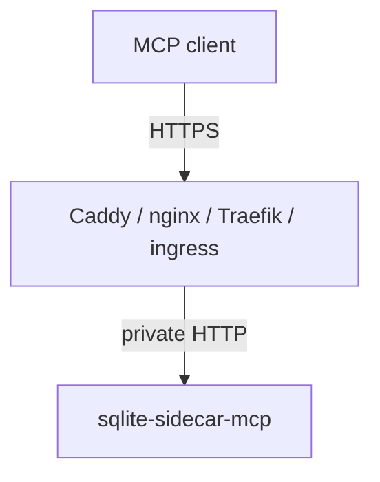

# Authentication and network

> **Status: planned.** This file records target design. No code implements it yet.
> Current state is in [../../summary.md](../../summary.md). Sequence is in [../mvp-roadmap.md](../mvp-roadmap.md).

## Token

The sidecar needs one high-entropy bearer token.

```text
SQLITE_SIDECAR_TOKEN=<secret>
```

Every request carries it:

```text
Authorization: Bearer <secret>
```

Token contract:

- Deployment infrastructure supplies the token.
- The sidecar never generates a token remotely.
- The sidecar never persists the token.
- The sidecar never returns the token after startup.
- The sidecar never logs the token.
- Startup fails when the token is absent.

Compare the token in constant time. A plain string comparison leaks length and prefix
information through timing.

```csharp
// Security/TokenAuthentication.cs
private static bool Matches(ReadOnlySpan<byte> presented, ReadOnlySpan<byte> expected)
    => CryptographicOperations.FixedTimeEquals(presented, expected);
```

## Request flow



Return `Unauthorized` for both a missing header and a wrong token. Do not explain which one
failed.

## Network model

The sidecar does not manage certificates. A reverse proxy terminates TLS.



Rules:

- Do not expose the sidecar directly to an untrusted network over plaintext HTTP.
- CORS is off. Browser access is not a product goal.
- Host validation uses the ASP.NET Core host filtering middleware.

Set `AllowedHosts` for the deployment. The template value `*` in
`src/Xakpc.SQLiteMCPSidecar/appsettings.json` is too wide for production and it needs a
change during implementation.

## Health endpoint

```text
GET /health
```

The health endpoint reports process health only. It needs no token.

Do not run a database integrity check from the health endpoint. Do not run a backup from
the health endpoint. A probe runs often, and an expensive probe becomes a denial-of-service
vector against the owning application.

## Related

- [security-model.md](security-model.md)
- [permission-model.md](permission-model.md)
- [./container-and-deployment.md](./container-and-deployment.md)
