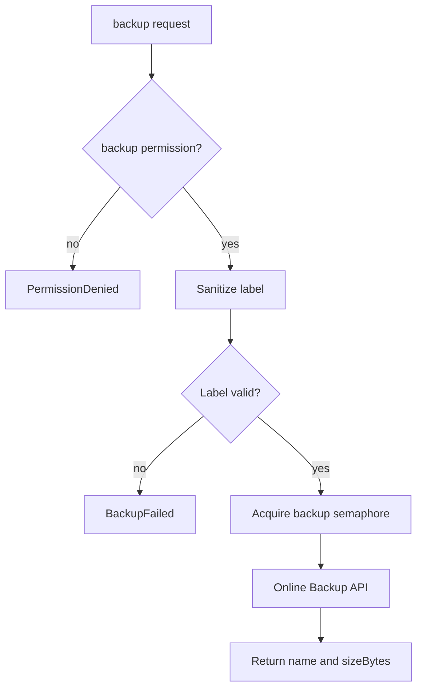

# Backups and diagnostics

> **Status: planned.** This file records target design. No code implements it yet.
> Current state is in [../../summary.md](../../summary.md). Sequence is in [../mvp-roadmap.md](../mvp-roadmap.md).

## `backup`

Requires the `backup` permission. Backups use the SQLite Online Backup API, which produces a
consistent copy while the owning application continues to write.

```csharp
// Database/BackupService.cs
using var source = new SqliteConnection(readWriteConnectionString);
using var destination = new SqliteConnection($"Data Source={targetPath}");
source.Open();
destination.Open();
source.BackupDatabase(destination);
```

`SqliteConnection.BackupDatabase` wraps the native backup API. Do not copy the file with a
filesystem copy, because a plain copy of a live database can produce a torn or unusable file.

Request:

```json
{ "name": "before-cleanup" }
```

Resulting file:

```text
app-20260926T120315Z-before-cleanup.db
```

Response:

```text
name: app-20260926T120315Z-before-cleanup.db
sizeBytes: 1835008
```

## Path safety

The destination directory comes from configuration only.

```text
SQLITE_SIDECAR_BACKUP_DIR=/backups
```

**Invariant.** A remote caller never supplies a path. The caller supplies a label, and the
server builds the filename.

Treat the `name` value as untrusted input:

- Allow a short, restricted character set. Reject a path separator, a `..` sequence, a null byte and a control character.
- Bound the length.
- Join the sanitized label to the configured directory, then verify that the resolved absolute path stays inside that directory.

The timestamp prefix keeps filenames unique, so a caller cannot overwrite an earlier backup
by repeating a label.



The backup semaphore has size 1. A concurrent backup doubles the disk and page-cache cost
with no benefit.

There is no restore tool in the MVP. Restore is an operator action on the host.

## Diagnostics

Requires the `diagnostics` permission. The tool reports a small, fixed set of values.

```text
SQLite version
journal mode
page size
page count
quick_check
```

Use `PRAGMA quick_check`, not `PRAGMA integrity_check`. `quick_check` skips the expensive
index content verification, so it does not stall the owning application.

Read these values over a read-only connection. See
[connection-policy.md](connection-policy.md).

**Invariant.** Diagnostics is read-only and it is a fixed value set. Do not turn it into a
general administration interface, and do not accept a caller-supplied `PRAGMA` name. A
caller-chosen `PRAGMA` is a write primitive and an information leak.

## Health endpoint

`GET /health` is separate from the `diagnostics` tool. It reports process health only, and it
touches no database. See
[authentication-and-network.md](authentication-and-network.md).

## Related

- [connection-policy.md](connection-policy.md)
- [structured-writes.md](structured-writes.md) for backup before delete
- [container-and-deployment.md](container-and-deployment.md) for volume layout
