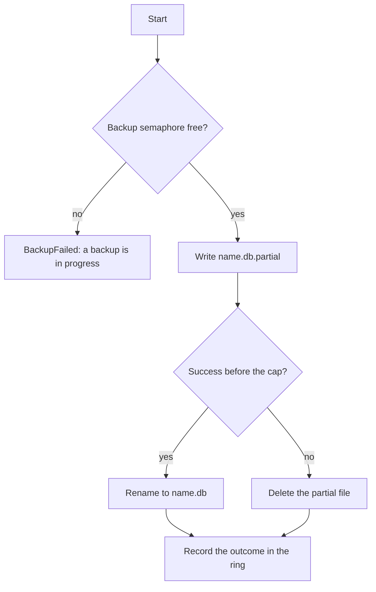

# Backups and diagnostics

> **Status: planned.** This file records target design. No code implements it yet.
> Current state is in [../../summary.md](../../summary.md). Sequence is in [../mvp-roadmap.md](../mvp-roadmap.md).

## `backup`

Requires the `backup` permission. A backup uses the SQLite Online Backup API, which makes a
consistent copy while the owning application continues to write.

**The call does not wait.** The tool starts the backup in the background and returns
immediately.

```json
{ "name": "before-cleanup" }
```

```text
name: app-20260926T120315Z-before-cleanup.db
status: started
```

The caller reads the result later with `backup_status`.

### Why the call does not wait

A backup is the longest operation in the product, and its duration follows the database size.
A synchronous call holds an HTTP connection for that time. A reverse proxy closes such a
connection first. The default `proxy_read_timeout` value of nginx is 60 seconds. The client
then sees a gateway timeout while the backup continues and succeeds, which is a false
failure report.

### Source connection

```csharp
// Database/BackupService.cs
using var source = new SqliteConnection(ReadOnlyConnectionString(databasePath));
using var destination = new SqliteConnection($"Data Source={partialPath}");
source.Open();
destination.Open();
source.BackupDatabase(destination);
```

**Invariant.** The source connection opens read-only. The Online Backup API reads the source
and writes the destination, thus the source needs no write access. A deployment with
`schema,read,backup` never opens a write handle to the live database.

Do not copy the file with a filesystem copy. A plain copy of a live database can give a torn
file.

## Path safety

The destination directory comes from configuration only.

```text
SQLITE_SIDECAR_BACKUP_DIR=/backups
```

**Invariant.** A remote caller never supplies a path. The caller supplies a label, and the
server builds the filename.

Treat the `name` value as untrusted input:

- Permit a short, restricted character set. Reject a path separator, a `..` sequence, a null byte and a control character.
- Bound the length.
- Join the clean label to the configured directory. Then make sure that the resolved absolute path stays in that directory.

The timestamp prefix keeps filenames unique, thus a caller cannot overwrite an earlier backup
with a repeated label.

## Partial files

**Invariant.** A file with the `.db` suffix in the backup directory is always complete.

The backup writes to `<name>.db.partial`. It renames the file to `<name>.db` only after
success. A rename in one directory is atomic.



The process deletes stale `.partial` files at startup. A process that stops during a backup
leaves such a file, and an operator must never mistake it for a usable backup.

## Concurrency and the runaway cap

**One backup at a time.** A second `backup` call while a backup runs returns `BackupFailed`.
The message states that a backup is in progress. Do not queue the request. A queue permits an
agent to plan unbounded disk use, and this product has no scheduler.

**Runaway cap: 10 minutes, hardcoded.** The Online Backup API restarts the copy when the
owning application writes to the source. A database with continuous writes can therefore make
no progress and still use read and write bandwidth. The cap stops that condition. The value
is a constant and not a configuration value, because no caller waits for the result and
therefore the cap needs no tuning.

`SqliteConnection.BackupDatabase` accepts no `CancellationToken`. The likely cancellation
mechanism is `sqlite3_interrupt` on the source connection from a timer. **Phase 5 must prove
this with a test.** If interrupt does not stop a backup step, remove the cap and document the
size limit instead.

## `backup_status`

Requires the `backup` permission.

```text
inProgress: app-20260926T120315Z-before-cleanup.db
recent:
  app-20260926T120315Z-before-cleanup.db  succeeded  1835008 bytes  41s
  app-20260926T094400Z-nightly.db         failed     disk full
```

The tool reads an in-memory ring of about 10 entries. The ring resets at restart. This is
process state of the same kind as the write budget.

**Why the tool exists.** The MVP has no automatic backup before a delete, and the
documentation tells an agent to make a backup first when it is not sure about a delete. That
instruction has no value when the agent cannot know that the backup succeeded. See
[../../decisions/0001-no-undo-in-mvp.md](../../decisions/0001-no-undo-in-mvp.md).

## Diagnostics

Requires the `diagnostics` permission. The tool reports a small, fixed set of values.

```text
SQLite version
journal mode
page size
page count
quick_check
```

The `journal mode` value is important. A database that is not in WAL mode blocks the readers
of the owning application during a sidecar write. See
[connection-policy.md](connection-policy.md).

Use `PRAGMA quick_check`, not `PRAGMA integrity_check`. `quick_check` does not verify index
content, thus it does not stall the owning application.

Read these values over a read-only connection.

**Invariant.** Diagnostics is read-only and it has a fixed value set. Do not make it a general
administration interface, and do not accept a caller-supplied `PRAGMA` name. A caller-chosen
`PRAGMA` is a write primitive and an information leak.

## Health endpoint

`GET /health` is separate from the `diagnostics` tool. It reports process health only, and it
touches no database. See [../../security/authentication.md](../../security/authentication.md).

## Related

- [connection-policy.md](connection-policy.md)
- [../../mcp/tool-catalog.md](../../mcp/tool-catalog.md)
- [container-and-deployment.md](container-and-deployment.md)
