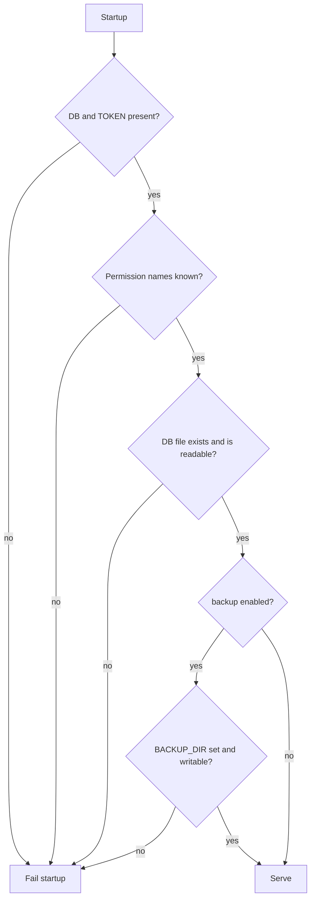

# Configuration

> **Status: planned.** This file records target design. No code implements it yet.
> Current state is in [../../summary.md](../../summary.md). Sequence is in [../mvp-roadmap.md](../mvp-roadmap.md).

All configuration arrives through environment variables with the `SQLITE_SIDECAR_` prefix.
One process binds one `SidecarOptions` instance at startup.

## Required

```text
SQLITE_SIDECAR_DB=/data/app.db
SQLITE_SIDECAR_TOKEN=<secret>
```

Startup fails when either value is absent. Do not start in a degraded or read-only fallback
state, because a silent fallback hides a deployment mistake.

## Permissions

```text
SQLITE_SIDECAR_PERMISSIONS=schema,read
```

The default is `schema,read`, which is read-only. Other examples:

```text
# normal agent deployment
SQLITE_SIDECAR_PERMISSIONS=schema,read,write,backup

# privileged deployment
SQLITE_SIDECAR_PERMISSIONS=schema,read,write,backup,diagnostics,danger-raw-write
```

Reject an unknown permission name at startup. A typo such as `reed` must fail loudly, because
a silently ignored name produces a deployment with fewer tools than the operator expects, or
a false sense of restriction.

## Optional

```text
SQLITE_SIDECAR_BACKUP_DIR=/backups

SQLITE_SIDECAR_MAX_ROWS=1000
SQLITE_SIDECAR_MAX_RESULT_BYTES=4194304
SQLITE_SIDECAR_MAX_SQL_BYTES=32768

SQLITE_SIDECAR_QUERY_TIMEOUT_SECONDS=10
SQLITE_SIDECAR_BUSY_TIMEOUT_SECONDS=3

SQLITE_SIDECAR_MAX_CONCURRENCY=4

SQLITE_SIDECAR_MAX_WRITE_ROWS=100
SQLITE_SIDECAR_MAX_WRITE_ROWS_PER_MINUTE=500

SQLITE_SIDECAR_BACKUP_BEFORE_DELETE=false
```

## Startup validation



Validate these conditions at startup:

- `SQLITE_SIDECAR_DB` exists and is readable. Do not create it.
- Every permission name is known.
- The `backup` permission comes with a writable `SQLITE_SIDECAR_BACKUP_DIR`.
- `SQLITE_SIDECAR_BACKUP_BEFORE_DELETE=true` comes with a usable backup directory.
- Every numeric limit is positive and inside a sane range.

A startup check is far better than a first-request failure, because a container orchestrator
sees a failed start and an operator sees it immediately.

## ASP.NET Core settings

```text
ASPNETCORE_URLS=http://0.0.0.0:8080
```

Set `AllowedHosts` for the deployment. The template value `*` in
`src/Xakpc.SQLiteMCPSidecar/appsettings.json` is too wide for production.

## Options shape

```csharp
// Configuration/SidecarOptions.cs
public sealed class SidecarOptions
{
    public required string DatabasePath { get; init; }
    public required string Token { get; init; }
    public required PermissionSet Permissions { get; init; }
    public string? BackupDirectory { get; init; }
    public int MaxRows { get; init; } = 1000;
    public int MaxResultBytes { get; init; } = 4 * 1024 * 1024;
    public int MaxSqlBytes { get; init; } = 32 * 1024;
    public int QueryTimeoutSeconds { get; init; } = 10;
    public int BusyTimeoutSeconds { get; init; } = 3;
    public int MaxConcurrency { get; init; } = 4;
    public int MaxWriteRows { get; init; } = 100;
    public int MaxWriteRowsPerMinute { get; init; } = 500;
    public bool BackupBeforeDelete { get; init; }
}
```

Bind once at startup and treat the instance as immutable. There is no runtime reconfiguration
in the MVP, because a permission change must be a visible deployment change.

## Related

- [permission-model.md](permission-model.md)
- [container-and-deployment.md](container-and-deployment.md)
- [toon-results.md](toon-results.md)
