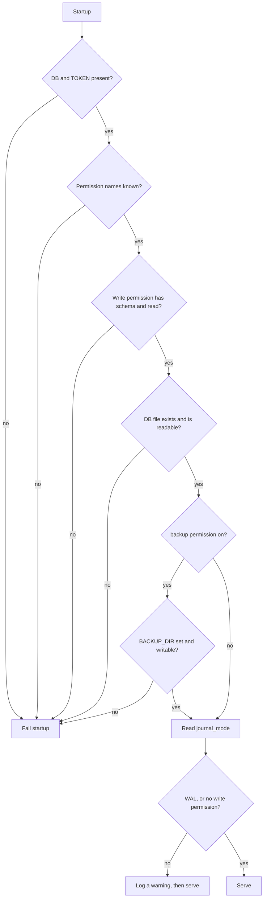

# Configuration

> **Status: planned.** This file records target design. No code implements it yet.
> Current state is in [../../summary.md](../../summary.md). Sequence is in [../mvp-roadmap.md](../mvp-roadmap.md).

All configuration comes from environment variables with the `SQLITE_SIDECAR_` prefix. One
process binds one `SidecarOptions` instance at startup.

## Required

```text
SQLITE_SIDECAR_DB=/data/app.db
SQLITE_SIDECAR_TOKEN=<secret>
```

Startup fails when one of these values is absent. Do not start in a degraded state and do not
fall back to read-only, because a silent fallback hides a deployment mistake.

## Permissions

```text
SQLITE_SIDECAR_PERMISSIONS=schema,read
```

The default is `schema,read`, which is read-only. Other examples:

```text
# normal agent deployment
SQLITE_SIDECAR_PERMISSIONS=schema,read,write,backup

# privileged deployment
SQLITE_SIDECAR_PERMISSIONS=schema,read,write,backup,diagnostics,danger-raw-write
```

Reject an unknown permission name at startup. A spelling mistake such as `reed` must fail
loudly, because an ignored name gives a deployment with fewer tools than the operator expects,
or a false sense of restriction.

Reject `write` or `danger-raw-write` without `schema` and `read`. See
[permission-model.md](permission-model.md).

## Optional

```text
SQLITE_SIDECAR_BACKUP_DIR=/backups

SQLITE_SIDECAR_MAX_ROWS=1000
SQLITE_SIDECAR_MAX_RESULT_BYTES=4194304
SQLITE_SIDECAR_MAX_SQL_BYTES=32768

SQLITE_SIDECAR_QUERY_TIMEOUT_SECONDS=10
SQLITE_SIDECAR_BUSY_TIMEOUT_SECONDS=3

SQLITE_SIDECAR_MAX_CONCURRENCY=4

SQLITE_SIDECAR_MAX_WRITE_ROWS=100
SQLITE_SIDECAR_MAX_WRITE_ROWS_PER_MINUTE=500
```

There is no backup timeout variable. The runaway cap of the background backup is a hardcoded
constant of 10 minutes. See [backups.md](backups.md).

There is no idempotency variable. The deduplication window and the entry count are constants.
See [write-idempotency.md](write-idempotency.md).

## Startup validation



Validate these conditions at startup:

- `SQLITE_SIDECAR_DB` exists and is readable. Do not create it.
- Each permission name is known.
- `write` and `danger-raw-write` have `schema` and `read`.
- The `backup` permission has a writable `SQLITE_SIDECAR_BACKUP_DIR`.
- Each numeric limit is positive and in a sensible range.

A startup check is much better than a failure at the first request, because a container
orchestrator sees a failed start and an operator sees it immediately.

## Journal mode warning

The sidecar reads `journal_mode` at startup. It never changes the value.

A database that is not in WAL mode blocks all readers of the owning application during a
sidecar write. The sidecar therefore logs a prominent warning when the database is not in WAL
mode and the deployment has `write` or `danger-raw-write`.

The sidecar still serves requests. The journal mode is a property of the database of another
application, not a mistake in the sidecar configuration. A refusal to start would make the
sidecar unusable with many correct deployments. The `diagnostics` tool reports the value, thus
an operator can see it at any time.

## Delete on startup

The process deletes stale `*.db.partial` files in the backup directory. See
[backups.md](backups.md).

## ASP.NET Core settings

```text
ASPNETCORE_URLS=http://0.0.0.0:8080
```

Set `AllowedHosts` for the deployment. The template value `*` in
`src/Xakpc.SQLiteMCPSidecar/appsettings.json` is too wide for production.

## Options shape

```csharp
// Configuration/SidecarOptions.cs
public sealed class SidecarOptions
{
    public required string DatabasePath { get; init; }
    public required string Token { get; init; }
    public required PermissionSet Permissions { get; init; }
    public string? BackupDirectory { get; init; }
    public int MaxRows { get; init; } = 1000;
    public int MaxResultBytes { get; init; } = 4 * 1024 * 1024;
    public int MaxSqlBytes { get; init; } = 32 * 1024;
    public int QueryTimeoutSeconds { get; init; } = 10;
    public int BusyTimeoutSeconds { get; init; } = 3;
    public int MaxConcurrency { get; init; } = 4;
    public int MaxWriteRows { get; init; } = 100;
    public int MaxWriteRowsPerMinute { get; init; } = 500;
}
```

Bind one time at startup and treat the instance as immutable. There is no reconfiguration at
runtime in the MVP, because a permission change must be a visible deployment change.

## Related

- [permission-model.md](permission-model.md)
- [container-and-deployment.md](container-and-deployment.md)
- [toon-results.md](toon-results.md)
