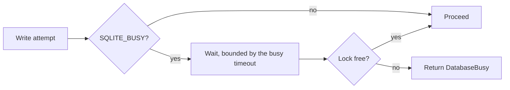

# Connection policy: the write and backup paths

> **Status: partly implemented.** The read-only connection, the pooling rule, the request semaphore
> and the filesystem constraints are current state in
> [../../database/connections.md](../../database/connections.md). This file records the design of the
> paths that have no code: the write connection, the transaction rules, the busy behaviour and the
> remaining two semaphores.

## Two connection kinds

| Operation | Open mode | Extra | State |
| --- | --- | --- | --- |
| `schema`, `query`, `diagnostics` | `SqliteOpenMode.ReadOnly` | `PRAGMA query_only=ON` | `schema` is implemented |
| `backup` source | `SqliteOpenMode.ReadOnly` | — | Phase 5 |
| `insert`, `update`, `delete`, `execute_write_sql` | `SqliteOpenMode.ReadWrite` | — | Phase 4 and Phase 6 |
| `backup` destination | new file | — | Phase 5 |

**Invariant.** The backup source connection opens read-only. The Online Backup API reads the source
and writes the destination, thus the source needs no write access. A deployment with
`schema,read,backup` therefore never opens a write handle to the live database. See
[backups.md](backups.md).

The sidecar makes a write connection only for a write operation.

## Write transactions

A structured `update` or `delete` uses `BEGIN IMMEDIATE`, never `BEGIN`. A deferred transaction must
upgrade its read lock to a write lock, and SQLite does not call the busy handler for a lock upgrade.
See [structured-writes.md](structured-writes.md).

## Busy behaviour

The owning application can hold the write lock. `SQLITE_BUSY` is a normal outcome, not an exception
case.

Use a finite busy timeout, default 3 seconds. Return `DatabaseBusy` and do not wait without a limit.
An unlimited wait holds a request slot and it starves the other callers.

`DefaultTimeout` on the connection string already carries the value. See
[../../database/connections.md](../../database/connections.md).

## The remaining semaphores

| Semaphore | Default | Scope | State |
| --- | --- | --- | --- |
| Request | 4 | Each MCP operation | Implemented |
| Write | 1 | Structured writes and `execute_write_sql` | Phase 4 |
| Backup | 1 | The background backup | Phase 5 |

**Invariant.** Structured writes and raw writes use the same write semaphore. One writer at a time
keeps the row-limit rollback meaningful and it lowers lock contention with the owning application.

**Invariant.** No operation holds the write semaphore and the backup semaphore at the same time. The
background backup runs outside the request that started it, thus it holds no request slot. A second
backup request fails immediately instead of a wait. See [backups.md](backups.md).

## Related

- [../../database/connections.md](../../database/connections.md) — current state
- [sqlite-sandbox.md](sqlite-sandbox.md)
- [structured-writes.md](structured-writes.md)
- [backups.md](backups.md)
