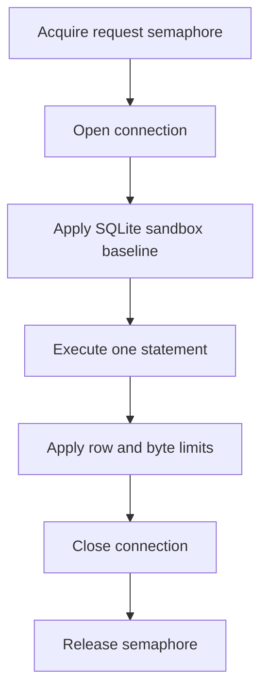

# Connection policy

> **Status: planned.** This file records target design. No code implements it yet.
> Current state is in [../../summary.md](../../summary.md). Sequence is in [../mvp-roadmap.md](../mvp-roadmap.md).

The sidecar opens a connection with the least privilege that the operation needs. It creates
a write connection only for a write operation.

## Two connection kinds

| Operation | Open mode | Extra |
| --- | --- | --- |
| `schema`, `query`, `diagnostics` | `SqliteOpenMode.ReadOnly` | `PRAGMA query_only=ON` |
| `insert`, `update`, `delete`, `execute_write_sql`, `backup` | `SqliteOpenMode.ReadWrite` | — |

**Invariant.** The `query` connection opens read-only even when the deployment also has
write permissions. Read access never escalates through a shared connection.

`PRAGMA query_only=ON` is a second, independent block. Keep it together with the read-only
open mode, because the two mechanisms fail differently.

Never use `ReadWriteCreate`. The database must already exist. Creation would hide a wrong
`SQLITE_SIDECAR_DB` path and produce an empty database next to the real one.

```csharp
// Database/SqliteService.cs
private static string ReadOnlyConnectionString(string path) =>
    new SqliteConnectionStringBuilder
    {
        DataSource = path,
        Mode = SqliteOpenMode.ReadOnly,
        Pooling = false,
        DefaultTimeout = busyTimeoutSeconds,
    }.ConnectionString;
```

## Lifecycle



The sandbox baseline is mandatory on every connection. See
[sqlite-sandbox.md](sqlite-sandbox.md).

Pooling is off. A pooled handle keeps its authorizer and its limits from the previous
operation, which is a privilege-escalation path.

## Settings the sidecar never changes

The owning application owns these settings. A change to any of them can break that
application or corrupt its expectations.

```text
journal_mode
synchronous
locking_mode
checkpoint configuration
```

The sidecar reads `journal_mode` for diagnostics. It never writes it. The sidecar works with
both a WAL database and a rollback-journal database.

## Busy behavior

The owning application can hold the write lock. `SQLITE_BUSY` is a normal outcome, not an
exception case.


Use a finite busy timeout, default 3 seconds. Return `DatabaseBusy` instead of an indefinite
wait. An indefinite wait holds a request slot and it starves the other callers.

## Concurrency

Three semaphores, and no scheduler framework.

| Semaphore | Default | Scope |
| --- | --- | --- |
| Request | 4 | Every MCP operation. |
| Write | 1 | Structured writes and `execute_write_sql`. |
| Backup | 1 | `backup`. |

**Invariant.** Structured writes and raw writes pass through the same write semaphore. One
writer at a time keeps the row-limit rollback meaningful and it reduces lock contention with
the owning application.

Acquire in a fixed order: request, then write or backup. A fixed order prevents deadlock.

## Filesystem constraint

The database file must live on a local filesystem. NFS and SMB are outside the supported
deployment model, because SQLite advisory locking is unreliable on them and it can corrupt
the database.

## Related

- [sqlite-sandbox.md](sqlite-sandbox.md)
- [structured-writes.md](structured-writes.md)
- [backups.md](backups.md)
