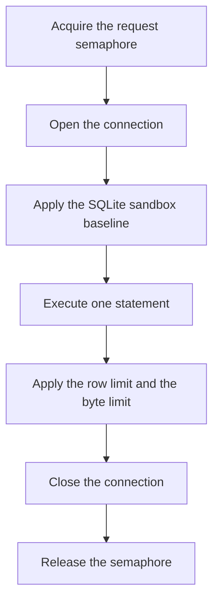
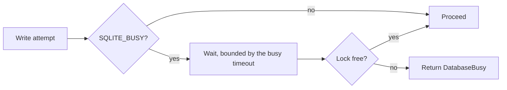

# Connection policy

> **Status: planned.** This file records target design. No code implements it yet.
> Current state is in [../../summary.md](../../summary.md). Sequence is in [../mvp-roadmap.md](../mvp-roadmap.md).

The sidecar opens a connection with the least privilege that the operation needs. It makes a
write connection only for a write operation.

## Two connection kinds

| Operation | Open mode | Extra |
| --- | --- | --- |
| `schema`, `query`, `diagnostics` | `SqliteOpenMode.ReadOnly` | `PRAGMA query_only=ON` |
| `backup` source | `SqliteOpenMode.ReadOnly` | — |
| `insert`, `update`, `delete`, `execute_write_sql` | `SqliteOpenMode.ReadWrite` | — |
| `backup` destination | new file | — |

**Invariant.** The `query` connection opens read-only also when the deployment has write
permissions. Read access never becomes write access through a shared connection.

**Invariant.** The backup source connection opens read-only. The Online Backup API reads the
source and writes the destination. A deployment with `schema,read,backup` therefore never
opens a write handle to the live database. See [backups.md](backups.md).

`PRAGMA query_only=ON` is a second, independent block. Keep it together with the read-only
open mode, because the two mechanisms fail in different ways.

Never use `ReadWriteCreate`. The database must exist already. Creation hides a wrong
`SQLITE_SIDECAR_DB` path and makes an empty database next to the correct one.

```csharp
// Database/SqliteService.cs
private static string ReadOnlyConnectionString(string path) =>
    new SqliteConnectionStringBuilder
    {
        DataSource = path,
        Mode = SqliteOpenMode.ReadOnly,
        Pooling = false,
        DefaultTimeout = busyTimeoutSeconds,
    }.ConnectionString;
```

A read-only connection to a WAL database still needs filesystem write access to the `-wal`
and `-shm` files. SQLite opens the shared-memory file read-write also for a read-only
database connection. A container that mounts the database directory read-only therefore fails
on a WAL database. See [container-and-deployment.md](container-and-deployment.md).

## Lifecycle



The sandbox baseline is mandatory on each connection. See
[sqlite-sandbox.md](sqlite-sandbox.md).

Pooling is off. A pooled handle keeps its authorizer and its limits from the last operation,
which is a privilege-escalation path.

## Write transactions

A structured `update` or `delete` uses `BEGIN IMMEDIATE`. A deferred transaction must upgrade
its read lock to a write lock, and SQLite does not call the busy handler for a lock upgrade.
See [structured-writes.md](structured-writes.md).

## Settings that the sidecar never changes

The owning application owns these settings. A change to one of them can break that
application or damage its expectations.

```text
journal_mode
synchronous
locking_mode
checkpoint configuration
```

The sidecar reads `journal_mode` at startup and for diagnostics. It never writes the value.
The sidecar operates with a WAL database and with a rollback-journal database, but a
rollback-journal database gets a startup warning when a write permission is on. See
[configuration.md](configuration.md).

## Busy behavior

The owning application can hold the write lock. `SQLITE_BUSY` is a normal outcome, not an
exception case.



Use a finite busy timeout, default 3 seconds. Return `DatabaseBusy` and do not wait without a
limit. An unlimited wait holds a request slot and it starves the other callers.

## Concurrency

Three semaphores, and no scheduler framework.

| Semaphore | Default | Scope |
| --- | --- | --- |
| Request | 4 | Each MCP operation. |
| Write | 1 | Structured writes and `execute_write_sql`. |
| Backup | 1 | The background backup. |

**Invariant.** Structured writes and raw writes use the same write semaphore. One writer at a
time keeps the row-limit rollback meaningful and it lowers lock contention with the owning
application.

**Invariant.** No operation holds the write semaphore and the backup semaphore at the same
time. The background backup runs outside the request that started it, thus it holds no request
slot. A second backup request fails immediately instead of a wait. See
[backups.md](backups.md).

## Filesystem constraint

The database file must be on a local filesystem. NFS and SMB are outside the supported
deployment model, because SQLite advisory locking is unreliable there and it can damage the
database.

## Related

- [sqlite-sandbox.md](sqlite-sandbox.md)
- [structured-writes.md](structured-writes.md)
- [backups.md](backups.md)
