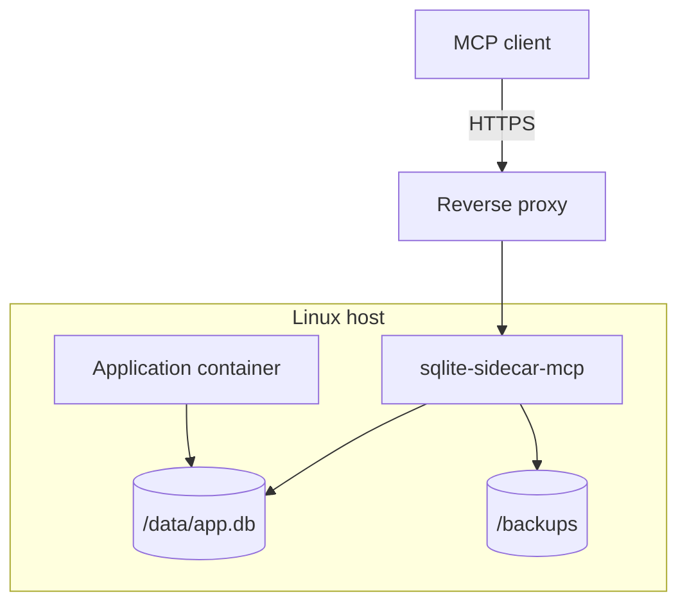

# Container and deployment

> **Status: planned.** This file records target design. No code implements it yet.
> Current state is in [../../summary.md](../../summary.md). Sequence is in [../mvp-roadmap.md](../mvp-roadmap.md).

The sidecar ships as a Linux OCI image. The target platform is Linux only.

## Deployment shape



Both containers mount the same local volume. The database file must stay on a local
filesystem. See [connection-policy.md](connection-policy.md).

The proxy may face the public internet. The Kamal and Coolify recipes, the path contract and the
proxy options are in [platform-deployment.md](platform-deployment.md).

**Invariant.** One sidecar process serves one database. The write budget and the idempotency
cache are in process memory, thus a second replica makes both guarantees weaker without an
error message. Do not scale the sidecar service. Nothing in the code enforces this rule.

## Compose example

```yaml
services:

  app:
    image: my-app
    volumes:
      - sqlite-data:/data

  sqlite-sidecar:
    image: ghcr.io/example/sqlite-sidecar-mcp:latest
    deploy:
      replicas: 1
    environment:
      SQLITE_SIDECAR_DB: /data/app.db
      SQLITE_SIDECAR_TOKEN: ${SQLITE_SIDECAR_TOKEN}
      SQLITE_SIDECAR_PERMISSIONS: schema,read,write,backup
      SQLITE_SIDECAR_BACKUP_DIR: /backups
      SQLITE_SIDECAR_MAX_WRITE_ROWS: 100
      SQLITE_SIDECAR_MAX_WRITE_ROWS_PER_MINUTE: 500
      ASPNETCORE_URLS: http://0.0.0.0:8080
    volumes:
      - sqlite-data:/data
      - sqlite-backups:/backups

volumes:
  sqlite-data:
  sqlite-backups:
```

`danger-raw-write` must be an explicit operator decision. Do not put it in an example that an
operator can copy without thought.

## Filesystem access

| Path | Access |
| --- | --- |
| root filesystem | read-only |
| `/data` | read and write, also for a read-only deployment |
| `/backups` | writable when the `backup` permission is on |
| `SQLITE_TMPDIR` | small writable `tmpfs` |

**A read-only deployment still needs write access to `/data`.** SQLite opens the `-shm`
shared-memory file read-write also for a read-only connection to a WAL database. A directory
that is mounted read-only therefore fails on a WAL database, and the failure looks like a
permission problem and not like a configuration problem. Mount `/data` writable and use the
`read` permission set to limit the sidecar.

A read-only root filesystem needs a writable temporary directory. SQLite can need scratch
space for a large sort or a spill. Mount a small `tmpfs` and point `SQLITE_TMPDIR` at it.

The process deletes stale `*.db.partial` files in the backup directory at startup. A file with
that suffix is an incomplete backup from a process that stopped. See [backups.md](backups.md).

## Image requirements

The official image must:

```text
run as non-root
drop all Linux capabilities
use no-new-privileges
use a minimal base image
contain no development toolchain
```

Recommended runtime flags:

```text
--cap-drop=ALL
--security-opt=no-new-privileges
```

## Current Dockerfile

`src/Xakpc.SQLiteMCPSidecar/Dockerfile` is the Visual Studio template. It has several stages
and it sets `USER $APP_UID` already, thus it does not run as root.

Changes that the target needs:

- Remove the HTTPS port. The reverse proxy terminates TLS, thus `EXPOSE 8081` is unnecessary.
- Change the final stage to a minimal base. The `aspnet` image has more than the sidecar needs.
- Make sure that the final stage has no SDK layer.
- Add `SQLITE_TMPDIR` when the root filesystem is read-only.

The base image choice depends on the NativeAOT result. See
[../open-questions.md](../open-questions.md).

The Dockerfile build context is the solution `src` directory, not the repository root. Remember
this when you add a file to the build.

## Container launch configuration

`src/Xakpc.SQLiteMCPSidecar/Properties/launchSettings.json` has **no** container profile. The
template one is gone, because it could not start the sidecar: it mounted no database, it set no
`SQLITE_SIDECAR_` variable, and it opened an HTTPS port that this product does not use. The project
profiles are current state in [../../testing/e2e-harness.md](../../testing/e2e-harness.md).

Phase 7 adds the container launch configuration back. It needs these parts:

```text
compose.yaml at the repository root, for a local run and for the e2e suite
a container launch profile, for F5 into the container
```

Requirements for both:

- Mount `build/dev/` at `/data`, **writable**. A read-only deployment still needs write access for the `-wal` and `-shm` files.
- Mount a writable backups directory when the profile carries the `backup` permission.
- Set `SQLITE_SIDECAR_DB=/data/app.db`, `SQLITE_SIDECAR_TOKEN`, `SQLITE_SIDECAR_PERMISSIONS` and `ASPNETCORE_URLS=http://0.0.0.0:8080`.
- Publish port 8080 only. Do not set `ASPNETCORE_HTTPS_PORTS` and do not set `useSSL`.
- Keep `danger-raw-write` out of the compose example. It must be an explicit operator decision, and an example that an operator can copy without thought is the wrong place for it.
- Run `scripts/seed-dev-db.ps1` first, because the sidecar never creates the database.

The local run must answer on the same port and token as the project profiles, thus
`src/Xakpc.SQLiteMCPSidecar/mcp.http` reaches the container with no change.

**Why this matters more than developer comfort.** The SQLite sandbox depends on the native SQLite
build, thus a Windows developer run does not prove the shipped behaviour. The container is the only
target that does. `SidecarHarness` already reads `SIDECAR_E2E_URL`, `SIDECAR_E2E_TOKEN` and
`SIDECAR_E2E_PERMISSIONS`, thus the whole suite runs against the container with no test change:

```powershell
$env:SIDECAR_E2E_URL = 'http://localhost:8080'
$env:SIDECAR_E2E_TOKEN = 'dev-token'
$env:SIDECAR_E2E_PERMISSIONS = 'schema,read'
dotnet test --solution Xakpc.SQLiteMCPSidecar.slnx
```

## Build output

`Directory.Build.props` sends build output to:

```text
build/bin/<project>/
build/obj/<project>/
```

The `.dockerignore` file excludes `**/bin` and `**/obj`. It does not exclude `build/`. The
repository-root `build/` directory is outside the current `src` build context, thus it has no
effect on the image today. Add `build/` to `.dockerignore` if the context moves to the
repository root.

## Related

- [platform-deployment.md](platform-deployment.md)
- [../../configuration/options.md](../../configuration/options.md)
- [../../security/authentication.md](../../security/authentication.md)
- [../../security/public-endpoint.md](../../security/public-endpoint.md)
- [../open-questions.md](../open-questions.md)
