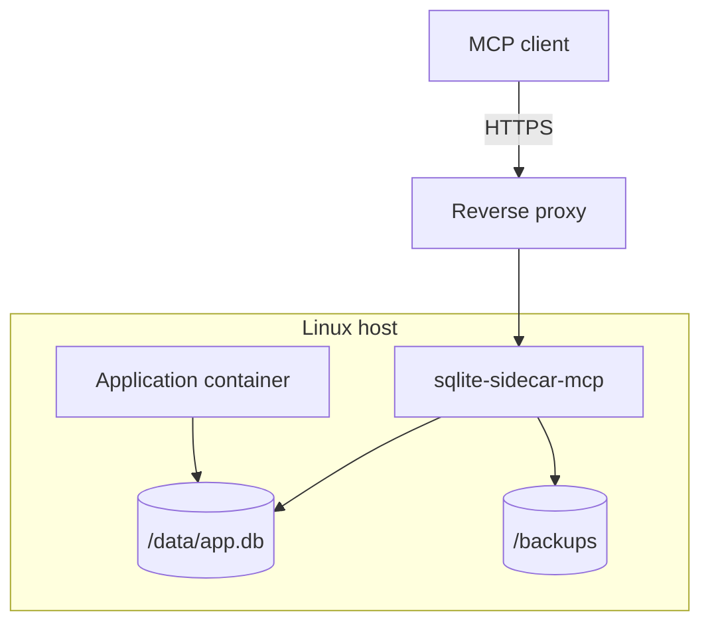

# Container and deployment

> **Status: planned.** This file records target design. No code implements it yet.
> Current state is in [../../summary.md](../../summary.md). Sequence is in [../mvp-roadmap.md](../mvp-roadmap.md).

The sidecar ships as a Linux OCI image. The target platform is Linux only.

## Deployment shape



Both containers mount the same local volume. The database file must stay on a local
filesystem. See [connection-policy.md](connection-policy.md).

## Compose example

```yaml
services:

  app:
    image: my-app
    volumes:
      - sqlite-data:/data

  sqlite-sidecar:
    image: ghcr.io/example/sqlite-sidecar-mcp:latest
    environment:
      SQLITE_SIDECAR_DB: /data/app.db
      SQLITE_SIDECAR_TOKEN: ${SQLITE_SIDECAR_TOKEN}
      SQLITE_SIDECAR_PERMISSIONS: schema,read,write,backup
      SQLITE_SIDECAR_BACKUP_DIR: /backups
      SQLITE_SIDECAR_MAX_WRITE_ROWS: 100
      SQLITE_SIDECAR_MAX_WRITE_ROWS_PER_MINUTE: 500
      ASPNETCORE_URLS: http://0.0.0.0:8080
    volumes:
      - sqlite-data:/data
      - sqlite-backups:/backups

volumes:
  sqlite-data:
  sqlite-backups:
```

`danger-raw-write` must be an explicit operator decision. Do not put it in an example that an
operator can copy without thought.

## Image requirements

The official image must:

```text
run as non-root
drop all Linux capabilities
use no-new-privileges
use a minimal base image
contain no development toolchain
```

Recommended runtime flags:

```text
--cap-drop=ALL
--security-opt=no-new-privileges
```

Ideal filesystem layout:

| Path | Access |
| --- | --- |
| root filesystem | read-only |
| `/data` | database access |
| `/backups` | writable only when the `backup` permission is on |

A read-only root filesystem needs a writable temporary directory. SQLite may need scratch
space for a large sort or a spill, so mount a small `tmpfs` and point `SQLITE_TMPDIR` at it.

## Current Dockerfile

`src/Xakpc.SQLiteMCPSidecar/Dockerfile` is the Visual Studio template. It has multiple stages
and it already sets `USER $APP_UID`, so it does not run as root.

Changes that the target requires:

- Remove the HTTPS port. The reverse proxy terminates TLS, so `EXPOSE 8081` is unnecessary.
- Switch the final stage to a minimal base. The `aspnet` image carries more than the sidecar needs.
- Confirm that the final stage contains no SDK layer.
- Add `SQLITE_TMPDIR` when the root filesystem is read-only.

The Dockerfile build context is the solution `src` directory, not the repository root. Keep
that in mind when adding a file to the build.

## Build output

`Directory.Build.props` redirects build output:

```text
build/bin/<project>/
build/obj/<project>/
```

The `.dockerignore` file excludes `**/bin` and `**/obj`. It does not exclude `build/`. The
repository-root `build/` directory is outside the current `src` build context, so it does not
affect the image today. Add `build/` to `.dockerignore` if the context ever moves to the
repository root.

## Related

- [configuration.md](configuration.md)
- [authentication-and-network.md](authentication-and-network.md)
- [../open-questions.md](../open-questions.md)
