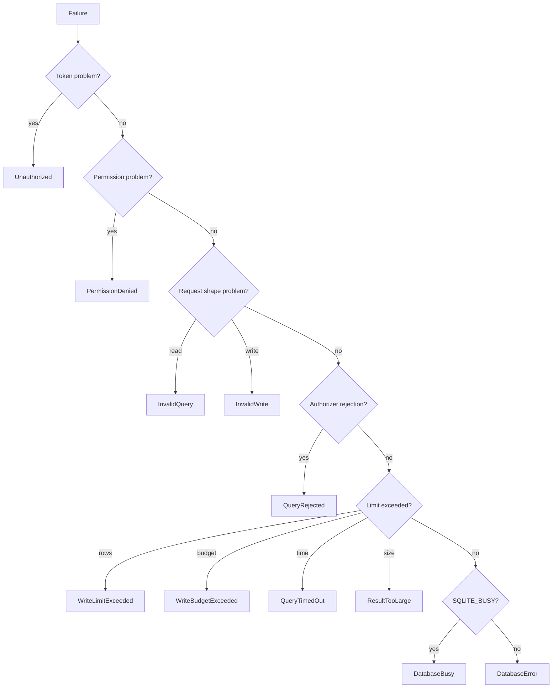

# Error model

> **Status: planned.** This file records target design. No code implements it yet.
> Current state is in [../../summary.md](../../summary.md). Sequence is in [../mvp-roadmap.md](../mvp-roadmap.md).

The error model is small and closed. A small set keeps agent behavior predictable, because an
agent chooses its next action from the code.

## Codes

| Code | Cause | Agent should |
| --- | --- | --- |
| `Unauthorized` | Missing or wrong bearer token. | Stop. |
| `PermissionDenied` | The deployment lacks the permission. | Stop. Do not retry. |
| `InvalidQuery` | Malformed SQL, or more than one statement. | Fix the statement. |
| `QueryRejected` | The authorizer rejected an action. | Stop. The action is not available. |
| `QueryTimedOut` | Execution exceeded the query timeout. | Narrow the query. |
| `ResultTooLarge` | The result cannot fit the byte budget. | Narrow the projection. |
| `InvalidWrite` | Missing `where`, missing `maxRows`, or an unknown table or column. | Fix the request. |
| `WriteLimitExceeded` | Affected rows exceeded the effective limit. The write rolled back. | Narrow the filter. |
| `WriteBudgetExceeded` | The per-minute write budget is exhausted. | Wait, then retry. |
| `DatabaseBusy` | The busy timeout expired. Another writer holds the lock. | Retry later. |
| `DatabaseError` | Any other SQLite failure. | Report to the operator. |
| `BackupFailed` | The backup did not complete, or the label is invalid. | Report to the operator. |

## Selection



Distinguish `QueryRejected` from `InvalidQuery`. A rejection means the sandbox refused a
valid statement, so a retry is pointless. A malformed statement is worth one correction
attempt.

Distinguish `DatabaseBusy` from `DatabaseError`. `DatabaseBusy` is transient and retryable.
`DatabaseError` is not.

## Disclosure rules

**Invariant.** Never return these values to a remote caller:

```text
stack traces
the bearer token or any secret
absolute filesystem paths
raw SQLite internal messages that name a file
```

Return the code and a short, fixed explanation. Write the detail to the log with the request
identifier, so an operator can correlate the two.

```csharp
logger.LogWarning("query rejected {RequestId} {Action}", requestId, action);
return McpError(nameof(QueryRejected), "The requested action is not permitted.");
```

A SQLite message often embeds the database path, so do not forward a provider message
unchanged.

## Related

- [threat-model.md](threat-model.md)
- [toon-results.md](toon-results.md)
- [structured-writes.md](structured-writes.md)
