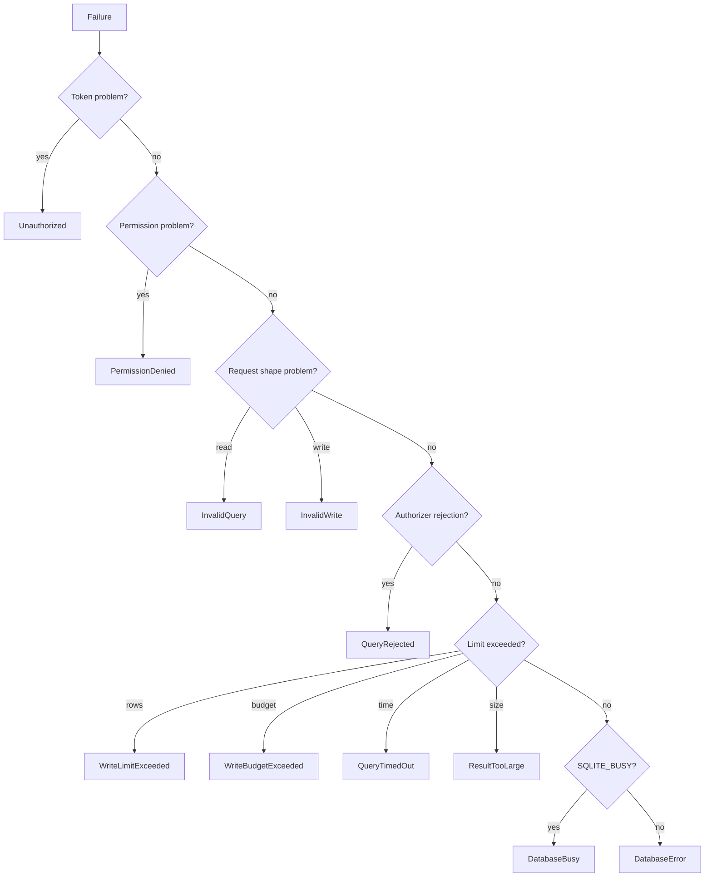

# Error model

> **Status: planned.** This file records target design. No code implements it yet.
> Current state is in [../../summary.md](../../summary.md). Sequence is in [../mvp-roadmap.md](../mvp-roadmap.md).

The error model is small and closed. A small set keeps agent behavior predictable, because an
agent selects its next action from the code.

## Codes

| Code | Cause | Agent must |
| --- | --- | --- |
| `Unauthorized` | Missing or wrong bearer token. | Stop. |
| `PermissionDenied` | The deployment does not have the permission. | Stop. Do not retry. |
| `InvalidQuery` | Malformed SQL, or more than one statement. | Correct the statement. |
| `QueryRejected` | The authorizer rejected an action. | Stop. The action is not available. |
| `QueryTimedOut` | Execution passed the query timeout. | Make the query smaller. |
| `ResultTooLarge` | One single row is larger than the byte budget. | Select fewer columns. |
| `InvalidWrite` | Missing `where`, missing `maxRows`, missing or invalid `requestId`, or an unknown table or column. | Correct the request. |
| `WriteLimitExceeded` | The filter matched more rows than the effective limit. Nothing changed. | Narrow the filter. |
| `WriteBudgetExceeded` | The per-minute write budget is empty. | Wait, then retry. |
| `DatabaseBusy` | The busy timeout expired. Another writer holds the lock. | Retry later. |
| `DatabaseError` | Any other SQLite failure. | Report to the operator. |
| `BackupFailed` | The label is invalid, a backup is in progress, or the backup did not complete. | Report to the operator. |

## Selection



Separate `QueryRejected` from `InvalidQuery`. A rejection means that the sandbox refused a
valid statement, thus a retry has no value. A malformed statement is worth one correction.

Separate `DatabaseBusy` from `DatabaseError`. `DatabaseBusy` is temporary and the agent can
retry it. `DatabaseError` is not.

## `WriteLimitExceeded` has one code for two checks

A structured `update` or `delete` can fail the bounded pre-count, or it can fail the count
after execution and roll back. Both give `WriteLimitExceeded`.

```text
WriteLimitExceeded: the filter matched more than 100 rows. Narrow the filter.
```

One code is correct here, because the next action of the agent is the same in both cases, and
in both cases nothing changed in the database. The log records which check rejected the
operation, thus an operator can still see the difference. See
[structured-writes.md](structured-writes.md).

The message states the effective limit. It does not state the true match count, because the
pre-count stops after `N + 1` rows.

## Errors and the idempotency cache

The sidecar caches a response only when the transaction committed. An error is never cached,
thus `DatabaseBusy` and `WriteBudgetExceeded` stay retryable with the same `requestId`. A
cached error would make the instruction "retry later" incorrect. See
[write-idempotency.md](write-idempotency.md).

A repeated `requestId` with a different payload is `InvalidWrite`.

## Errors of the background backup

The `backup` tool returns before the copy is complete. The call therefore reports only the
errors that it can know immediately:

```text
PermissionDenied     the deployment has no backup permission
BackupFailed         the label is invalid, or a backup is in progress
```

A failure during the copy cannot reach that response. It goes to the log and to the ring that
`backup_status` reports. See [backups.md](backups.md).

## Disclosure rules

**Invariant.** Never return these values to a remote caller:

```text
stack traces
the bearer token or any secret
absolute filesystem paths
raw SQLite internal messages that name a file
```

Return the code and a short, fixed explanation. Write the detail to the log with the request
identifier, thus an operator can correlate the two.

```csharp
logger.LogWarning("query rejected {RequestId} {Action}", requestId, action);
return McpError(nameof(QueryRejected), "The requested action is not permitted.");
```

A SQLite message often has the database path in the text. Do not send a provider message
without a change.

## Related

- [threat-model.md](threat-model.md)
- [toon-results.md](toon-results.md)
- [structured-writes.md](structured-writes.md)
