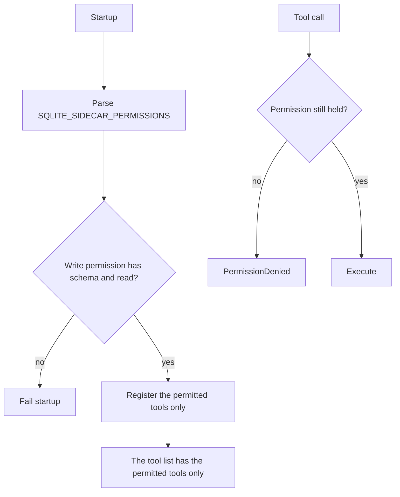

# MCP tool catalog

> **Status: planned.** This file records target design. No code implements it yet.
> Current state is in [../../summary.md](../../summary.md). Sequence is in [../mvp-roadmap.md](../mvp-roadmap.md).

The sidecar has one MCP endpoint over Streamable HTTP. It has nine tools at most. The
deployment permission set decides which of them exist.

| Tool | Permission | Caller supplies SQL | `requestId` |
| --- | --- | --- | --- |
| `schema` | `schema` | no | no |
| `query` | `read` | yes, read-only | no |
| `insert` | `write` | no | mandatory |
| `update` | `write` | no | mandatory |
| `delete` | `write` | no | mandatory |
| `backup` | `backup` | no | no |
| `backup_status` | `backup` | no | no |
| `diagnostics` | `diagnostics` | no | no |
| `execute_write_sql` | `danger-raw-write` | yes, DML | mandatory |

## Server registration

```csharp
// Program.cs
builder.Services
    .AddMcpServer()
    .WithHttpTransport(o => o.Stateless = true)
    .WithTools<SqliteTools>();

app.MapMcp("/mcp");
```

Keep the transport stateless. Each operation is self-contained, which agrees with the
no-remote-transaction rule in [raw-writes.md](raw-writes.md).

Register tools explicitly. Do not use `WithToolsFromAssembly`, because assembly scanning
blocks NativeAOT and it removes permission control of the exposed surface.

## Tool shape

```csharp
// Mcp/SqliteTools.cs
[McpServerToolType]
public sealed class SqliteTools(SqliteService db, SidecarOptions options)
{
    [McpServerTool(Name = "query")]
    [Description("Run one read-only SQL statement and return the rows as TOON.")]
    public async Task<string> QueryAsync(
        [Description("One SQLite SELECT statement. Use named parameters such as $status.")]
        string sql,
        [Description("Named parameter values, keyed by parameter name with the $ prefix.")]
        Dictionary<string, object?>? parameters,
        CancellationToken cancellationToken) { /* ... */ }
}
```

Each tool and each parameter needs a `[Description]` attribute. That text is the only
description that the agent reads, and a vague description is the main reason that an agent
misuses a tool. Name the constraints in the description. Examples: `maxRows` is mandatory,
and `requestId` must stay the same for a retry of the same write.

## Permission gating



Gate in two places. Registration is the primary control, thus an absent tool never appears in
the tool list. The test in the tool is the backstop, thus a registration mistake cannot open
access.

## `schema`

Requires `schema`. The tool returns the DDL text from the SQLite catalog.

```sql
SELECT type, name, sql FROM sqlite_master
WHERE sql IS NOT NULL AND name NOT LIKE 'sqlite_%';
```

```text
CREATE TABLE jobs (
  id INTEGER PRIMARY KEY,
  status TEXT NOT NULL DEFAULT 'pending',
  retry INTEGER NOT NULL DEFAULT 0,
  owner_id INTEGER REFERENCES users(id)
);
CREATE INDEX idx_jobs_status ON jobs(status);
```

**The schema tool returns no TOON.** TOON is for row data only. A `CREATE TABLE` statement
states the columns, the types, the nullability, the defaults, the primary key, the foreign
keys and the constraints in one string. A set of TOON tables holds the same facts in a shape
that the agent must assemble again, and it costs more tokens.

Read the catalog over a read-only connection.

This choice is cheap to reverse. Phase 3 must test it with a real agent, because readability
for the agent is the only criterion.

## `query`

Requires `read`. It runs exactly one read-only statement.

```json
{
  "sql": "SELECT id, status FROM jobs WHERE status = $status",
  "parameters": { "$status": "failed" }
}
```

```text
rows[2]{id,status}:
  41,failed
  52,failed

truncated: false
```

Arbitrary `SELECT` is permitted in the sandbox. The connection opens read-only also when the
deployment has write permissions. See [connection-policy.md](connection-policy.md).

## Write tools

`insert`, `update` and `delete` accept no SQL. Each one needs `requestId`. See
[structured-writes.md](structured-writes.md) and
[write-idempotency.md](write-idempotency.md).

`execute_write_sql` accepts DML. See [raw-writes.md](raw-writes.md).

## Backup and diagnostics

`backup` starts a background copy and returns immediately. `backup_status` reports the
result. See [backups.md](backups.md).

## Related

- [permission-model.md](permission-model.md)
- [toon-results.md](toon-results.md)
- [error-model.md](error-model.md)
