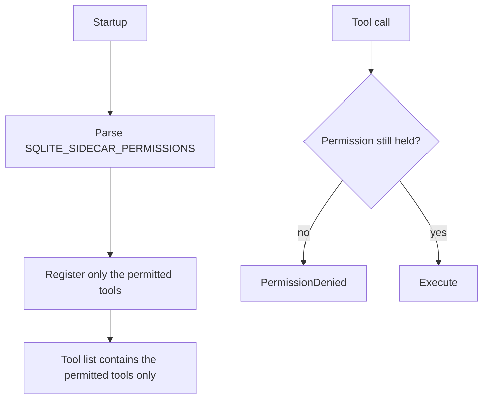

# MCP tool catalog

> **Status: planned.** This file records target design. No code implements it yet.
> Current state is in [../../summary.md](../../summary.md). Sequence is in [../mvp-roadmap.md](../mvp-roadmap.md).

The sidecar exposes one MCP endpoint over Streamable HTTP. It has eight tools at most. The
deployment permission set decides which of them exist.

| Tool | Permission | Caller supplies SQL |
| --- | --- | --- |
| `schema` | `schema` | no |
| `query` | `read` | yes, read-only |
| `insert` | `write` | no |
| `update` | `write` | no |
| `delete` | `write` | no |
| `backup` | `backup` | no |
| `diagnostics` | `diagnostics` | no |
| `execute_write_sql` | `danger-raw-write` | yes, DML |

## Server registration

```csharp
// Program.cs
builder.Services
    .AddMcpServer()
    .WithHttpTransport(o => o.Stateless = true)
    .WithTools<SqliteTools>();

app.MapMcp("/mcp");
```

Keep the transport stateless. Every operation is self-contained, which matches the
no-remote-transaction rule in [raw-writes.md](raw-writes.md).

Register tools explicitly. Do not use `WithToolsFromAssembly`, because assembly scanning
blocks NativeAOT and it removes permission control over the exposed surface.

## Tool shape

```csharp
// Mcp/SqliteTools.cs
[McpServerToolType]
public sealed class SqliteTools(SqliteService db, SidecarOptions options)
{
    [McpServerTool(Name = "query")]
    [Description("Run one read-only SQL statement and return the rows as TOON.")]
    public async Task<string> QueryAsync(
        [Description("One SQLite SELECT statement. Use named parameters such as $status.")]
        string sql,
        [Description("Named parameter values, keyed by parameter name including the $ prefix.")]
        Dictionary<string, object?>? parameters,
        CancellationToken cancellationToken) { /* ... */ }
}
```

Every tool and every parameter needs a `[Description]` attribute. That text is the only
description the agent reads, and a vague description is the main reason an agent misuses a
tool. Name the constraints in the description, for example that `maxRows` is mandatory.

## Permission gating



Gate in two places. Registration is the primary control, so an absent tool never appears in
the tool list. The in-tool check is the backstop, so a registration mistake cannot open
access.

## `schema`

Requires `schema`. It returns enough metadata for an agent to understand the database.

```text
tables
views
columns
types
nullability
primary keys
foreign keys
```

Return the tabular parts as TOON. Read the metadata from the SQLite catalog over a read-only
connection.

## `query`

Requires `read`. It runs exactly one read-only statement.

```json
{
  "sql": "SELECT id, status FROM jobs WHERE status = $status",
  "parameters": { "$status": "failed" }
}
```

```text
rows[2]{id,status}:
  41,failed
  52,failed

truncated: false
```

Arbitrary `SELECT` is allowed inside the sandbox. The connection opens read-only even when
the deployment also has write permissions. See
[connection-policy.md](connection-policy.md).

## Write tools

`insert`, `update` and `delete` accept no SQL. See
[structured-writes.md](structured-writes.md).

`execute_write_sql` accepts DML. See [raw-writes.md](raw-writes.md).

## Backup and diagnostics

See [backups.md](backups.md).

## Related

- [permission-model.md](permission-model.md)
- [toon-results.md](toon-results.md)
- [error-model.md](error-model.md)
