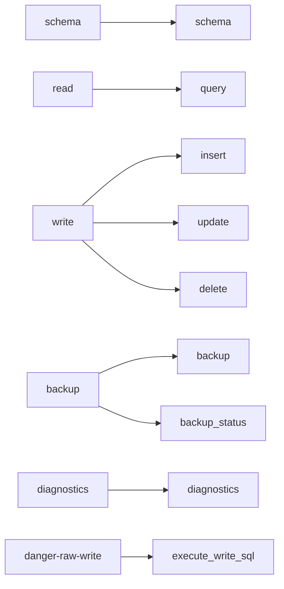

# Permission model

> **Status: planned.** This file records target design. No code implements it yet.
> Current state is in [../../summary.md](../../summary.md). Sequence is in [../mvp-roadmap.md](../mvp-roadmap.md).

Permissions are a property of the deployment, not of a user. One deployment has one token and
one permission set.

## The six permissions

```text
schema
read
write
backup
diagnostics
danger-raw-write
```

Configuration:

```text
SQLITE_SIDECAR_PERMISSIONS=schema,read,write,backup
```

Default:

```text
schema,read
```

## The read floor

**Invariant.** `write` and `danger-raw-write` are only valid together with `schema` and
`read`. Startup fails when a write permission has no read floor, and the message names the
missing permission.

```text
SQLITE_SIDECAR_PERMISSIONS=write
-> startup fails: "write requires schema and read"
```

Two reasons:

- A structured write validates each table name and each column name against the live schema. An agent that cannot call `schema` must guess a column name. A wrong guess is `InvalidWrite`, and `insert` has no filter that could show the correct name.
- A write-only deployment is not a supported product shape. A caller that changes data must be able to see the data.

The sidecar does not add the missing permissions automatically. A silent addition makes
`SQLITE_SIDECAR_PERMISSIONS` an incorrect record of the deployment.

## Permission to tool mapping

A permission controls which MCP tools **exist**. A tool that the permission set does not
cover is absent from the tool list. It does not appear and then fail.



Examples:

| Permissions | Exposed tools |
| --- | --- |
| `schema,read` | `schema`, `query` |
| `schema,read,write,backup` | `schema`, `query`, `insert`, `update`, `delete`, `backup`, `backup_status` |
| `schema,read,write,backup,danger-raw-write` | the above plus `execute_write_sql` |

## Invariants

- No permission grants another permission. `read` does not grant `write`.
- `write` and `danger-raw-write` **require** `schema` and `read`. Startup enforces this.
- `write` never accepts caller-supplied SQL. Only `danger-raw-write` does.
- A permission applies to all tables in the database. There is no table allowlist and no column allowlist. See [../../decisions/0002-write-is-a-whole-database-grant.md](../../decisions/0002-write-is-a-whole-database-grant.md).
- Absence of a tool is the primary enforcement. Also test the permission in the tool, thus a registration mistake cannot open access.
- `danger-raw-write` is independent of `write`. It is its own capability.

## Why the name `danger-raw-write`

The name is deliberately alarming. A neutral name such as `sql-write` hides the cost. An
operator must understand immediately that this permission removes the agent-safe protections.
Do not change the name.

## Why deployment-level permissions

The MVP has one authentication identity. With one identity there is no reason to build users,
roles, groups, token ACLs or a permission database. Separate trust levels use separate
deployments, which keeps the trust boundary visible in the deployment configuration.

```text
sqlite-sidecar-readonly   token=A   permissions=schema,read
sqlite-sidecar-agent      token=B   permissions=schema,read,write,backup
sqlite-sidecar-admin      token=C   permissions=schema,read,write,backup,danger-raw-write
```

## Documented risk levels

The README must describe risk in prose. This is documentation, not a runtime ranking.

| Permission | Risk | Reason |
| --- | --- | --- |
| `schema` | Low | Metadata only. |
| `read` | Sensitive | It can read all data in the database. |
| `write` | Higher | Constrained data modification in **all** tables of the database. |
| `backup` | Sensitive | It can make database copies. |
| `diagnostics` | Low to moderate | Metadata and health values. |
| `danger-raw-write` | High | Arbitrary `INSERT`, `UPDATE` and `DELETE` SQL in all tables. |

The README must state that `write` is a whole-database grant. An operator that must protect
one table uses a second database or accepts the risk.

## Related

- [security-model.md](security-model.md)
- [mcp-tool-catalog.md](mcp-tool-catalog.md)
- [configuration.md](configuration.md)
