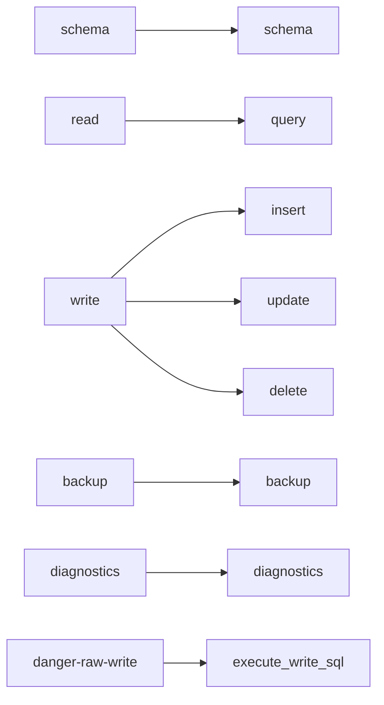

# Permission model

> **Status: planned.** This file records target design. No code implements it yet.
> Current state is in [../../summary.md](../../summary.md). Sequence is in [../mvp-roadmap.md](../mvp-roadmap.md).

Permissions are a property of the deployment, not of a user. One deployment has one token
and one permission set.

## The six permissions

```text
schema
read
write
backup
diagnostics
danger-raw-write
```

Configuration:

```text
SQLITE_SIDECAR_PERMISSIONS=schema,read,write,backup
```

Default:

```text
schema,read
```

## Permission to tool mapping

A permission controls which MCP tools **exist**. A tool that the permission set does not
cover is absent from the tool list. It does not appear and then fail.



Examples:

| Permissions | Exposed tools |
| --- | --- |
| `schema,read` | `schema`, `query` |
| `schema,read,write,backup` | `schema`, `query`, `insert`, `update`, `delete`, `backup` |
| `schema,read,write,backup,danger-raw-write` | the above plus `execute_write_sql` |

## Invariants

- A permission never implies another permission. `read` does not grant `write`.
- `write` never accepts caller-supplied SQL. Only `danger-raw-write` does.
- Absence of a tool is the primary enforcement. Also check the permission inside the tool, so that a registration mistake cannot open access.
- `danger-raw-write` is independent of `write`. Treat it as its own capability.

## Why the name `danger-raw-write`

The name is deliberately alarming. A neutral name such as `sql-write` hides the cost. An
operator must understand immediately that this permission removes the agent-safe
protections. Do not rename it.

## Why deployment-level permissions

The MVP has one authentication identity. With one identity there is no reason to build
users, roles, groups, token ACLs or a permission database. Separate trust levels use
separate deployments, which keeps the trust boundary visible in deployment configuration.

```text
sqlite-sidecar-readonly   token=A   permissions=schema,read
sqlite-sidecar-agent      token=B   permissions=schema,read,write,backup
sqlite-sidecar-admin      token=C   permissions=schema,read,write,backup,danger-raw-write
```

## Documented risk levels

The README must describe risk in prose. This is documentation, not a runtime ranking.

| Permission | Risk | Reason |
| --- | --- | --- |
| `schema` | Low | Metadata only. |
| `read` | Sensitive | It can read database contents. |
| `write` | Higher | Constrained data modification. |
| `backup` | Sensitive | It can create database copies. |
| `diagnostics` | Low to moderate | Metadata and health checks. |
| `danger-raw-write` | High | Arbitrary `INSERT`, `UPDATE` and `DELETE` SQL. |

## Related

- [summary.md](security-model.md)
- [./mcp-tool-catalog.md](./mcp-tool-catalog.md)
- [./configuration.md](./configuration.md)
