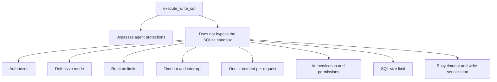

# Raw writes

> **Status: planned.** This file records target design. No code implements it yet.
> Current state is in [../../summary.md](../../summary.md). Sequence is in [../mvp-roadmap.md](../mvp-roadmap.md).

The `danger-raw-write` permission exposes one tool, `execute_write_sql`. It accepts a
caller-supplied DML statement. Some operators need normal SQL write semantics, and this
permission separates that need from the agent-safe structured interface.

## `execute_write_sql`

```json
{
  "sql": "UPDATE jobs SET retry = retry + 1 WHERE status = $status",
  "parameters": { "$status": "failed" }
}
```

Allowed statement categories:

```text
INSERT
UPDATE
DELETE
```

Normal SQLite features of those statements are available where the authorizer permits them:
CTEs, `RETURNING`, subqueries, expressions and conflict clauses.

## What the permission bypasses

```text
the structured filter model
the mandatory structured WHERE
the caller maxRows requirement
server-generated SQL
```

Therefore this statement is valid:

```sql
DELETE FROM jobs;
```

This is intentional. An operator that enables `danger-raw-write` explicitly chooses standard
raw SQLite DML semantics. Do not add a partial safety net that makes the behavior hard to
predict.

## What the permission does not bypass

The SQLite sandbox stays intact.



Always rejected, including with `danger-raw-write`:

```text
ATTACH, DETACH
CREATE, DROP, ALTER
VACUUM INTO
load_extension
dangerous PRAGMAs
transaction-control statements
```

```text
danger-raw-write  !=  unrestricted SQLite
danger-raw-write  ==  raw INSERT / UPDATE / DELETE inside the sandbox
```

The permission allows arbitrary data manipulation. It does not allow SQLite administration
or filesystem access. Detail is in [sqlite-sandbox.md](sqlite-sandbox.md).

## Results

A plain write returns the affected row count:

```text
rowsAffected: 17
```

A statement with `RETURNING` returns TOON:

```sql
UPDATE jobs SET retry = retry + 1 WHERE id = $id RETURNING id, retry;
```

```text
rows[1]{id,retry}:
  41,2
```

The TOON result obeys the same row limit and byte limit as `query`. See
[toon-results.md](toon-results.md).

## Limits that still apply

```text
SQL size limit
query timeout
SQLite runtime limits
busy timeout
write serialization (the shared write semaphore)
authentication
deployment permissions
SQLite authorizer
```

The structured `maxRows` guarantee does not apply. Say this explicitly in `SECURITY.md`.

## Write budget accounting

Document the write-rate budget as a structured-write control. Raw writes also count toward
the global budget when the accounting stays simple, because SQLite reports the affected row
count after execution. Prefer to count them. An open point is in
[../open-questions.md](../open-questions.md).

## One statement per request

`execute_write_sql` accepts exactly one statement. A multi-statement request is
`InvalidQuery`.

```sql
-- rejected
UPDATE jobs SET retry = 1; DELETE FROM logs;
```

## No remote transaction sessions

The MVP does not support `BEGIN` and `COMMIT` across MCP calls. Every operation is
self-contained. Raw transaction-control SQL is rejected.

This matches the stateless MCP HTTP transport. A cross-call transaction would need server
session state, and it would let one caller hold a write lock against the owning application
for an unbounded time.

## Documentation requirement

`SECURITY.md` must carry this statement:

> `danger-raw-write` permits caller-supplied raw INSERT, UPDATE and DELETE statements. It
> bypasses structured-write WHERE and row-limit protections. Enable it only for clients
> trusted with direct data-modification SQL.

## Related

- [structured-writes.md](structured-writes.md)
- [sqlite-sandbox.md](sqlite-sandbox.md)
- [permission-model.md](permission-model.md)
