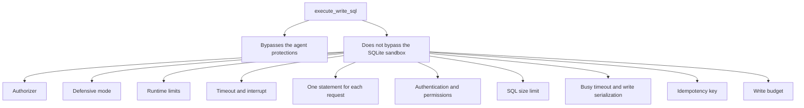

# Raw writes

> **Status: planned.** This file records target design. No code implements it yet.
> Current state is in [../../summary.md](../../summary.md). Sequence is in [../mvp-roadmap.md](../mvp-roadmap.md).

The `danger-raw-write` permission gives one tool, `execute_write_sql`. It accepts a
caller-supplied DML statement. Some operators need normal SQL write semantics, and this
permission separates that need from the agent-safe structured interface.

**Read floor.** `danger-raw-write` is only valid together with `schema` and `read`. See
[../../security/permissions.md](../../security/permissions.md).

## `execute_write_sql`

The `requestId` value is mandatory. See [write-idempotency.md](write-idempotency.md).

```json
{
  "requestId": "a3f1c5",
  "sql": "UPDATE jobs SET retry = retry + 1 WHERE status = $status",
  "parameters": { "$status": "failed" }
}
```

Permitted statement categories:

```text
INSERT
UPDATE
DELETE
```

Normal SQLite features of those statements are available where the authorizer permits them:
CTEs, `RETURNING`, subqueries, expressions and conflict clauses.

## What the permission bypasses

```text
the structured filter model
the mandatory structured WHERE
the caller maxRows requirement
the bounded pre-count
server-generated SQL
```

This statement is therefore valid:

```sql
DELETE FROM jobs;
```

This is intentional. An operator that enables `danger-raw-write` selects standard raw SQLite
DML semantics. Do not add a partial safety net that makes the behavior difficult to predict.

## What the permission does not bypass

The SQLite sandbox stays intact.



Always rejected, also with `danger-raw-write`:

```text
ATTACH, DETACH
CREATE, DROP, ALTER
VACUUM INTO
load_extension
dangerous PRAGMAs
transaction-control statements
```

```text
danger-raw-write  !=  unrestricted SQLite
danger-raw-write  ==  raw INSERT / UPDATE / DELETE in the sandbox
```

The permission permits arbitrary data manipulation. It does not permit SQLite administration
or filesystem access. Detail is in [sqlite-sandbox.md](sqlite-sandbox.md).

## Results

A plain write returns the affected row count:

```text
rowsAffected: 17
```

A statement with `RETURNING` returns TOON:

```sql
UPDATE jobs SET retry = retry + 1 WHERE id = $id RETURNING id, retry;
```

```text
rows[1]{id,retry}:
  41,2
```

The TOON result obeys the same row limit and byte limit as `query`. See
[toon-results.md](toon-results.md).

## Limits that still apply

```text
mandatory requestId
write budget
SQL size limit
query timeout
SQLite runtime limits
busy timeout
write serialization (the shared write semaphore)
authentication
deployment permissions
SQLite authorizer
```

The structured `maxRows` guarantee does not apply. State this in `SECURITY.md`.

## Write budget accounting

Raw writes count toward the write budget. SQLite reports the affected row count after
execution, thus the sidecar adds that count when the transaction commits.

**Invariant.** For a raw write, the budget throttles the next operation. It does not prevent
the current one, because the row count is not available before execution.

There is one counter for structured writes and raw writes. One counter is easier to explain
than two regimes, and the budget is a resource control on the database. `SECURITY.md` must
state the throttle behavior in these words.

## One statement for each request

`execute_write_sql` accepts exactly one statement. A request with more than one statement is
`InvalidQuery`.

```sql
-- rejected
UPDATE jobs SET retry = 1; DELETE FROM logs;
```

## No remote transaction sessions

The MVP does not support `BEGIN` and `COMMIT` across MCP calls. Each operation is
self-contained. Raw transaction-control SQL is rejected.

This agrees with the stateless MCP HTTP transport. A transaction across calls needs server
session state, and it permits one caller to hold a write lock against the owning application
for an unbounded time.

## Documentation requirement

`SECURITY.md` must carry this statement:

> `danger-raw-write` permits caller-supplied raw INSERT, UPDATE and DELETE statements. It
> bypasses structured-write WHERE and row-limit protections. Enable it only for clients
> trusted with direct data-modification SQL.

## Related

- [structured-writes.md](structured-writes.md)
- [write-idempotency.md](write-idempotency.md)
- [sqlite-sandbox.md](sqlite-sandbox.md)
- [../../security/permissions.md](../../security/permissions.md)
