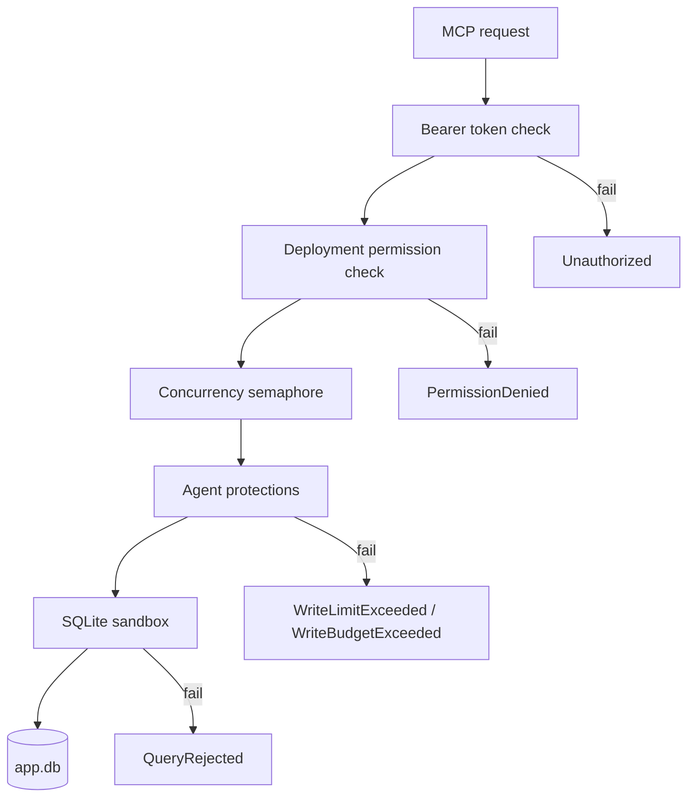

# Security summary

> **Status: planned.** This file records target design. No code implements it yet.
> Current state is in [../../summary.md](../../summary.md). Sequence is in [../mvp-roadmap.md](../mvp-roadmap.md).

The sidecar is a security boundary between an AI agent and a live application database. It
defends against two different callers: an unauthorized client, and an authorized client
that makes a mistake. The second caller is the unusual part of this product.

## Layers

Each request passes every layer in order. A layer never becomes optional.



- **Bearer token** — one token per deployment. See [authentication-and-network.md](authentication-and-network.md).
- **Permissions** — they decide which tools exist. See [permission-model.md](permission-model.md).
- **Agent protections** — structured writes, mandatory predicate, mandatory `maxRows`, server row limit, write budget, optional backup before delete. See [./structured-writes.md](./structured-writes.md).
- **SQLite sandbox** — authorizer, defensive mode, runtime limits, interrupt. See [sqlite-sandbox.md](sqlite-sandbox.md).

The agent protections layer is the only layer that `danger-raw-write` weakens. The sandbox
layer stays intact. See [./raw-writes.md](./raw-writes.md).

## Guarantees

With the default configuration, these statements are true:

- Remote access needs authentication.
- Default permissions are read-only.
- `read` does not imply `write`.
- `write` does not accept caller-supplied write SQL.
- Structured `update` and `delete` need a predicate.
- Structured `update` and `delete` have a hard row limit.
- Repeated structured writes hit a rate limit.
- Raw writes need an explicitly dangerous permission.
- Raw writes cannot run DDL, `ATTACH` or native extension loading.
- A caller cannot supply a backup filesystem path.
- Queries have a time limit, a result limit and a concurrency limit.
- The native SQLite defensive mechanisms are on.
- The database file is never served over the network.

State security claims as concrete controls. Do not imply that a network-exposed database is
absolutely safe.

## Non-guarantees

When an operator enables `danger-raw-write`, the token holder can run this statement:

```sql
DELETE FROM jobs;
```

This is expected behavior, not a defect. The permission deliberately bypasses the
structured write safeguards.

A stolen token receives exactly the capabilities of its deployment. The sidecar limits
capability and blast radius. It cannot make an intentionally granted destructive permission
harmless.

## Related

- [permission-model.md](permission-model.md)
- [authentication-and-network.md](authentication-and-network.md)
- [sqlite-sandbox.md](sqlite-sandbox.md)
- [threat-model.md](threat-model.md)
