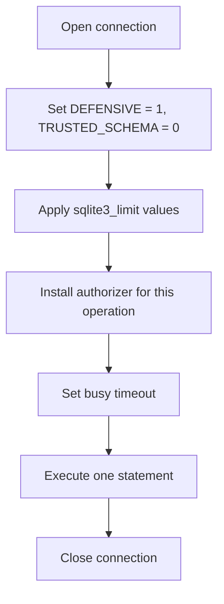

# SQLite sandbox

> **Status: planned.** This file records target design. No code implements it yet.
> Current state is in [../../summary.md](../../summary.md). Sequence is in [../mvp-roadmap.md](../mvp-roadmap.md).

The sandbox is the innermost security layer. It is always on. It is not a feature flag, and
no permission disables any part of it. `danger-raw-write` does not weaken it.

## Where the API comes from

`Microsoft.Data.Sqlite` does not expose the authorizer, the runtime limits or the database
configuration flags. It does expose the raw handle, and `SQLitePCLRaw.core` exposes the
native functions. The transitive reference is enough.

```csharp
using Microsoft.Data.Sqlite;
using SQLitePCL;

var connection = new SqliteConnection(builder.ConnectionString);
connection.Open();
sqlite3 handle = connection.Handle!;   // public property, type SQLitePCL.sqlite3
```

Verified against `Microsoft.Data.Sqlite` 10.0.12 and `SQLitePCLRaw.core` 3.0.5. Every
control that the design asks for exists:

| Control | Native call |
| --- | --- |
| Defensive mode | `raw.sqlite3_db_config(h, raw.SQLITE_DBCONFIG_DEFENSIVE, 1, out _)` |
| Trusted schema off | `raw.sqlite3_db_config(h, raw.SQLITE_DBCONFIG_TRUSTED_SCHEMA, 0, out _)` |
| Authorizer | `raw.sqlite3_set_authorizer(h, callback, state)` |
| Runtime limit | `raw.sqlite3_limit(h, id, value)` |
| Cancellation | `raw.sqlite3_interrupt(h)`, `raw.sqlite3_progress_handler(...)` |
| Backup | `SqliteConnection.BackupDatabase(destination)` |

## Baseline per connection

Every connection that untrusted input reaches applies the full baseline immediately after
`Open`.



**Invariant.** Apply the baseline after every `Open`, never once at startup. These settings
live on the connection handle, not on the process.

**Lesson.** Connection pooling reuses a handle and it keeps the handle state, including an
authorizer from an earlier operation. That is a privilege-escalation path: a read connection
could inherit a write authorizer. Either set `Pooling=False`, or install the correct
authorizer on every acquisition. Prefer `Pooling=False` for the MVP, because it removes the
whole class of residual-state defects. Record the measured cost before any change.

**Lesson.** The authorizer callback is a native callback. Keep the delegate reachable for
the whole lifetime of the connection. A collected delegate causes a hard crash, not an
exception.

## Authorizer policy

Use the native authorizer. Do not inspect SQL with regular expressions or string matching.
Regular expressions miss comments, nested constructs and alternative spellings. The
authorizer runs inside the SQLite parser and sees the resolved action.

| Action | `query` | Structured write | `execute_write_sql` |
| --- | --- | --- | --- |
| Read | allow | allow when necessary | allow when necessary |
| `INSERT` / `UPDATE` / `DELETE` | reject | allow when required | allow |
| DDL (`CREATE`, `DROP`, `ALTER`) | reject | reject | reject |
| `ATTACH` / `DETACH` | reject | reject | reject |
| Dangerous `PRAGMA` | reject | reject | reject |
| Extension loading | reject | reject | reject |
| Transaction control | reject | reject | reject |

The authorizer is per-operation. Build the policy from the tool that runs, not from the
deployment permission set.

## Runtime limits

Apply `sqlite3_limit` to constrain untrusted SQL. Field names come from `SQLitePCL.raw`.

```text
SQLITE_LIMIT_SQL_LENGTH          bound the statement text
SQLITE_LIMIT_COLUMN              bound the column count
SQLITE_LIMIT_EXPR_DEPTH          bound expression nesting
SQLITE_LIMIT_COMPOUND_SELECT     bound compound SELECT count
SQLITE_LIMIT_VARIABLE_NUMBER     bound host parameter count
SQLITE_LIMIT_LIKE_PATTERN_LENGTH bound LIKE patterns
SQLITE_LIMIT_VDBE_OP             bound total work, stops a runaway query
SQLITE_LIMIT_ATTACHED            set to 0
```

`SQLITE_LIMIT_ATTACHED = 0` is a second, independent block on `ATTACH`. Keep both it and the
authorizer rule.

## Extension loading

Extension loading is never on. No deployment permission enables it in the MVP. Extension
loading is arbitrary native code execution inside the sidecar process.

## Hard boundaries

The sidecar always rejects these actions, including with `danger-raw-write`:

```text
ATTACH, DETACH
CREATE, DROP, ALTER
VACUUM INTO
load_extension
dangerous PRAGMAs
transaction-control statements
```

`VACUUM INTO` writes a database copy to a caller-chosen path. It is a file exfiltration
primitive, so it belongs with the DDL rejections and not with the backup feature.

```text
danger-raw-write  !=  unrestricted SQLite
danger-raw-write  ==  raw INSERT / UPDATE / DELETE inside this sandbox
```

## One statement per request

`query` and `execute_write_sql` accept exactly one SQLite statement.

```sql
-- allowed
UPDATE jobs SET retry = 1 WHERE id = 41

-- rejected
UPDATE jobs SET retry = 1; DELETE FROM logs;
```

One statement per request simplifies authorization, auditing, cancellation and error
handling. Check the statement count after preparation, not by counting semicolons.

## Cancellation

A timeout must actually stop SQLite, not only abandon the caller.


Register the interrupt on the token. A progress handler that returns non-zero gives a second
stop path and it also bounds a statement that never yields.

## Related

- [summary.md](security-model.md)
- [./connection-policy.md](./connection-policy.md)
- [./raw-writes.md](./raw-writes.md)
- Required tests: [../mvp-roadmap.md](../mvp-roadmap.md)
