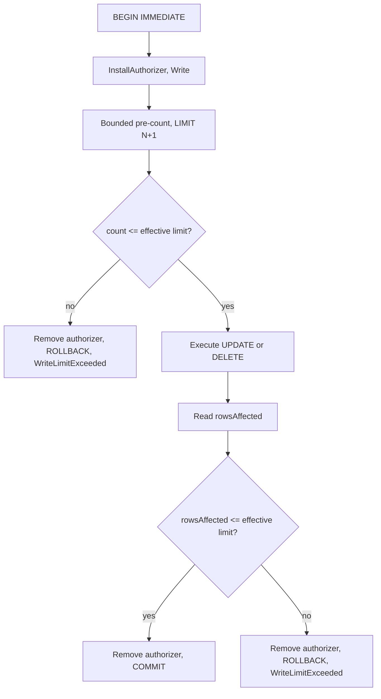

# Structured writes: what Phase 4b owes

> **Status: partly implemented.** `insert`, the write connection, the write authorizer policy,
> identifier validation, the budget and the idempotency cache are current state. Read
> [../../database/structured-writes.md](../../database/structured-writes.md) and
> [../../security/write-controls.md](../../security/write-controls.md) first, including the reason that
> the server builds the statement. This file records the design of `update`, `delete`, the filter model
> and the bounded pre-count, which have no code.

The `write` permission gives `insert`, `update` and `delete`. `insert` exists.

**Core contract.** The caller never supplies SQL. Caller SQL needs `danger-raw-write`, which is a
different permission. See [raw-writes.md](raw-writes.md).

For `update` and `delete` the bounded pre-count is the load-bearing reason for the whole structured
layer. It is constructible only because the server authored the filter.

## `update`

Requires `write`. The values `where`, `maxRows` and `requestId` are mandatory.

```json
{
  "requestId": "a3f1c3",
  "table": "jobs",
  "values": { "retry": 1 },
  "where": [ { "column": "id", "operator": "eq", "value": 41 } ],
  "maxRows": 1
}
```

## `delete`

Requires `write`. The values `where`, `maxRows` and `requestId` are mandatory.

```json
{
  "requestId": "a3f1c4",
  "table": "jobs",
  "where": [ { "column": "status", "operator": "eq", "value": "obsolete" } ],
  "maxRows": 20
}
```

**Invariant.** There is no structured equivalent of `DELETE FROM jobs;`. An absent `where`, an empty
`where` or an absent `maxRows` is `InvalidWrite`. Reject the request before any database work.

Each argument is nullable with `= null` and is validated in the method body, the same as `insert`. See
[../../mcp/tool-catalog.md](../../mcp/tool-catalog.md).

## Results

`rowsAffected: 3`, as plain text. There is no `RETURNING` on a structured write. See
[../out-of-scope.md](../out-of-scope.md).

## Filter model

The filter model is deliberately small. Do not implement a general SQL expression language.

```text
eq   ne
lt   lte
gt   gte
is-null   is-not-null
```

`is-null` and `is-not-null` take no value and they bind no parameter.

The filter is a **flat list** and not a tree. One `combine` value joins each condition, and the default
is `and`.

```json
{
  "where": [
    { "column": "status", "operator": "eq", "value": "failed" },
    { "column": "created_at", "operator": "lt", "value": "2026-01-01" }
  ],
  "combine": "and"
}
```

A flat list needs no recursive type, no self-referencing JSON schema and no depth limit. A nested
`and`/`or` tree is not available. See [../out-of-scope.md](../out-of-scope.md).

The C# shape is one record, and the SDK then publishes the operator set in the JSON schema:

```csharp
public sealed record WriteCondition(string Column, string Operator, JsonElement? Value);
```

Identifier validation, the canonical-name rule, parameterization, quoting and the 90-parameter cap are
already current state and apply unchanged to a condition column. See
[../../database/structured-writes.md](../../database/structured-writes.md).

## Bounded writes

Each structured `update` and `delete` carries `maxRows`. The deployment sets an absolute cap.

```text
effective limit = min(client maxRows, SQLITE_SIDECAR_MAX_WRITE_ROWS)
```

The operation uses two independent checks in one transaction.



The pre-count uses a bounded subquery, thus it stops after `N + 1` rows:

```sql
SELECT COUNT(*) FROM (SELECT 1 FROM "jobs" WHERE status = $p0 LIMIT 101);
```

The authorizer ordering, `BEGIN IMMEDIATE` and the rollback path are already current state on the
insert path. Reuse them.

**Invariant.** Both checks are necessary and they protect different things:

| Check | Protects | Failure mode without it |
| --- | --- | --- |
| Pre-count | Availability of the owning application | A broad filter writes millions of rows, holds the write lock and inflates the WAL, before the rollback reverts it. |
| Post-execution count | Data integrity | The row count changes between the pre-count and the write, because the owning application also writes. |

A `LIMIT` clause on the write statement is not a substitute. A `LIMIT` writes a partial result
silently, which is worse for an agent than a clean rejection.

## Rejection message

Both checks return `WriteLimitExceeded`. The exact count is not available, because the pre-count stops
at `N + 1`.

```text
WriteLimitExceeded: the filter matched more than 100 rows. Narrow the filter.
```

The log records which check rejected the operation, in a `check=pre|post` field. The agent does not
receive that detail, because the correct next action is the same in both cases.

**The post-execution check cannot be forced deterministically** from a test. See
[../required-tests.md](../required-tests.md).

## Related

- [../../database/structured-writes.md](../../database/structured-writes.md) — current state
- [../../security/write-controls.md](../../security/write-controls.md) — the budget and the cache
- [raw-writes.md](raw-writes.md)
- [connection-policy.md](connection-policy.md)
- [../../mcp/error-model.md](../../mcp/error-model.md)
