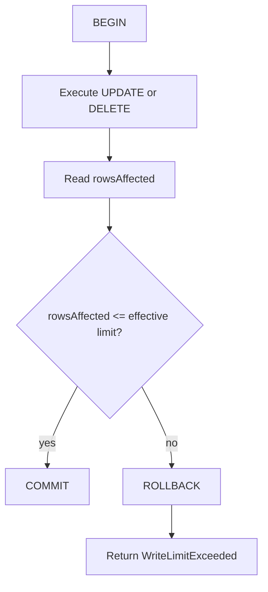
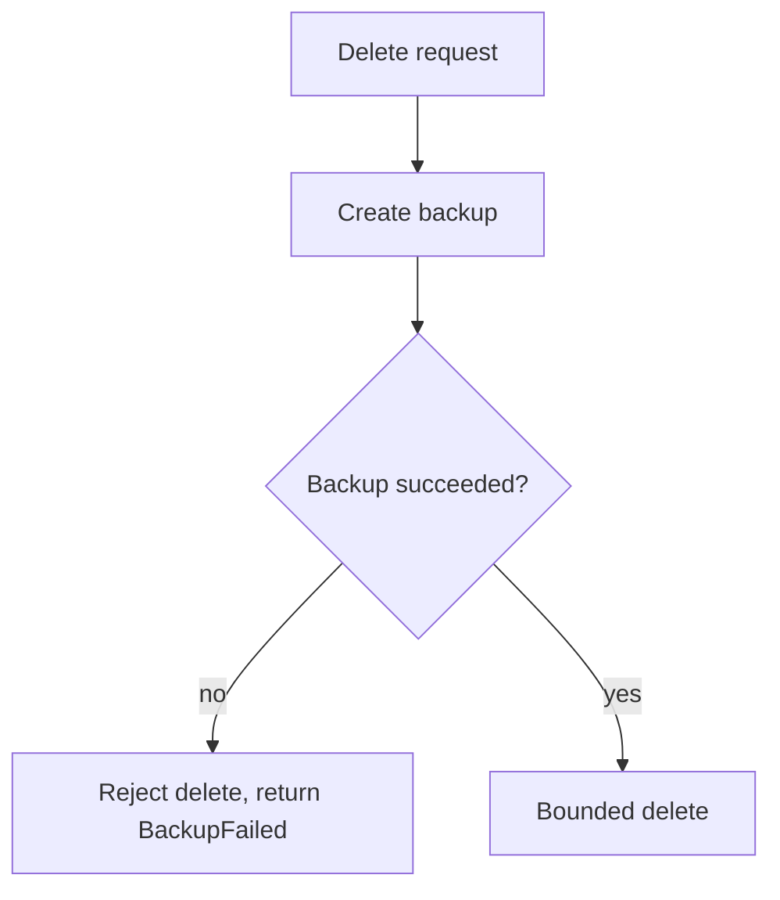

# Structured writes

> **Status: planned.** This file records target design. No code implements it yet.
> Current state is in [../../summary.md](../../summary.md). Sequence is in [../mvp-roadmap.md](../mvp-roadmap.md).

The `write` permission exposes `insert`, `update` and `delete`. This is the normal
agent-facing write interface.

**Core contract.** The caller never supplies SQL. The server builds a parameterized statement
from a table name, a value map and a filter. Caller SQL needs `danger-raw-write`, which is a
different permission. See [raw-writes.md](raw-writes.md).

## `insert`

Requires `write`.

```json
{
  "table": "jobs",
  "values": { "status": "pending", "retry": 0 }
}
```

The server generates the statement:

```sql
INSERT INTO "jobs" ("status", "retry") VALUES ($p0, $p1);
```

The MVP inserts one row per call.

```text
rowsAffected: 1
```

`insert` needs no filter and no `maxRows`, because one call adds exactly one row. SQLite
`RETURNING` is available where it is useful.

## `update`

Requires `write`. Both `where` and `maxRows` are mandatory.

```json
{
  "table": "jobs",
  "values": { "retry": 1 },
  "where": { "column": "id", "operator": "eq", "value": 41 },
  "maxRows": 1
}
```

## `delete`

Requires `write`. Both `where` and `maxRows` are mandatory.

```json
{
  "table": "jobs",
  "where": { "column": "status", "operator": "eq", "value": "obsolete" },
  "maxRows": 20
}
```

**Invariant.** There is no structured equivalent of `DELETE FROM jobs;`. A missing `where`
or a missing `maxRows` is `InvalidWrite`. Reject the request before any database work.

## Filter model

The filter model is deliberately small. Do not implement a general SQL expression language.

Operators:

```text
eq   ne
lt   lte
gt   gte
is-null   is-not-null
```

Logical composition: `and`, `or`.

```json
{
  "and": [
    { "column": "status", "operator": "eq", "value": "failed" },
    { "column": "created_at", "operator": "lt", "value": "2026-01-01" }
  ]
}
```

Rules:

- Validate every table name and every column name against the live SQLite schema. A name that the schema does not contain is `InvalidWrite`.
- Parameterize every value. Never concatenate a value into SQL.
- Quote identifiers after validation. Validation is the security control, and quoting is the correctness control.

Schema validation is the reason a structured write cannot reach an unexpected object. The
authorizer is the second layer. See [sqlite-sandbox.md](sqlite-sandbox.md).

## Bounded writes

Every structured `update` and `delete` carries `maxRows`. The deployment sets an absolute
cap.

```text
SQLITE_SIDECAR_MAX_WRITE_ROWS=100
```

```text
effective limit = min(client maxRows, SQLITE_SIDECAR_MAX_WRITE_ROWS)
```

The operation runs inside a short internal transaction.



**Invariant.** The check runs after execution and before commit. A `LIMIT` clause on the
statement would silently write a partial result, which is worse for an agent than a clean
rejection. The rollback is the protection against an unexpectedly broad filter.

This transaction exists only for row-limit enforcement. It is not a caller-visible session.
See [raw-writes.md](raw-writes.md) for the no-remote-transaction rule.

## Write-rate budget

A broad filter is one failure mode. Many individually valid small writes are another.

```text
SQLITE_SIDECAR_MAX_WRITE_ROWS_PER_MINUTE=500
```

An in-memory counter over a rolling window is sufficient. On exhaustion return
`WriteBudgetExceeded`.

The budget is per process. It resets on restart, and it is not shared between replicas. That
is acceptable for the MVP, because one sidecar serves one database.

Count committed rows, not attempted rows. A rolled-back write changed nothing.

## Backup before delete

An optional deployment policy.

```text
SQLITE_SIDECAR_BACKUP_BEFORE_DELETE=false
```



**Invariant.** A failed backup rejects the delete. The policy is worthless when the delete
proceeds anyway.

The policy needs the backup directory, so validate at startup that
`SQLITE_SIDECAR_BACKUP_BEFORE_DELETE=true` comes with a usable
`SQLITE_SIDECAR_BACKUP_DIR`. Fail startup otherwise.

Apply the policy to raw `DELETE` through `execute_write_sql` as well, when the
implementation stays straightforward. See [../open-questions.md](../open-questions.md).

## Related

- [raw-writes.md](raw-writes.md)
- [connection-policy.md](connection-policy.md)
- [error-model.md](error-model.md)
- [threat-model.md](threat-model.md)
