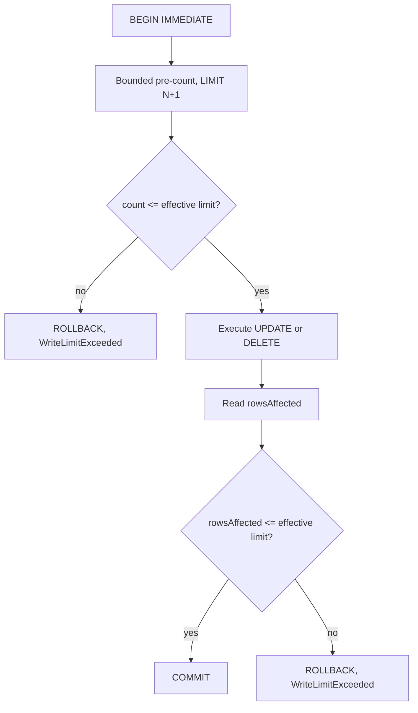

# Structured writes

> **Status: planned.** This file records target design. No code implements it yet.
> Current state is in [../../summary.md](../../summary.md). Sequence is in [../mvp-roadmap.md](../mvp-roadmap.md).

The `write` permission gives the tools `insert`, `update` and `delete`. This is the normal
agent-facing write interface.

**Core contract.** The caller never supplies SQL. The server builds a parameterized statement
from a table name, a value map and a filter. Caller SQL needs `danger-raw-write`, which is a
different permission. See [raw-writes.md](raw-writes.md).

**Read floor.** The `write` permission is only valid together with `schema` and `read`. The
sidecar validates identifiers against the live schema, thus an agent that cannot read the
schema cannot use these tools correctly. See [../../security/permissions.md](../../security/permissions.md).

**Scope.** The `write` permission applies to all tables in the database. There is no table
allowlist. The README must show this in the permission risk table.

## `insert`

Requires `write`. The `requestId` value is mandatory. See
[write-idempotency.md](write-idempotency.md).

```json
{
  "requestId": "a3f1c2",
  "table": "jobs",
  "values": { "status": "pending", "retry": 0 }
}
```

The server generates the statement:

```sql
INSERT INTO "jobs" ("status", "retry") VALUES ($p0, $p1);
```

The MVP inserts one row for each call.

```text
rowsAffected: 1
```

`insert` needs no filter and no `maxRows`, because one call adds exactly one row. SQLite
`RETURNING` is available where it is useful.

## `update`

Requires `write`. The values `where`, `maxRows` and `requestId` are mandatory.

```json
{
  "requestId": "a3f1c3",
  "table": "jobs",
  "values": { "retry": 1 },
  "where": { "column": "id", "operator": "eq", "value": 41 },
  "maxRows": 1
}
```

## `delete`

Requires `write`. The values `where`, `maxRows` and `requestId` are mandatory.

```json
{
  "requestId": "a3f1c4",
  "table": "jobs",
  "where": { "column": "status", "operator": "eq", "value": "obsolete" },
  "maxRows": 20
}
```

**Invariant.** There is no structured equivalent of `DELETE FROM jobs;`. A missing `where` or
a missing `maxRows` is `InvalidWrite`. Reject the request before any database work.

**Invariant.** A committed delete is permanent. The MVP has no restore tool and no automatic
backup. See [../../decisions/0001-no-undo-in-mvp.md](../../decisions/0001-no-undo-in-mvp.md).

## Filter model

The filter model is deliberately small. Do not implement a general SQL expression language.

Operators:

```text
eq   ne
lt   lte
gt   gte
is-null   is-not-null
```

Logical composition: `and`, `or`.

```json
{
  "and": [
    { "column": "status", "operator": "eq", "value": "failed" },
    { "column": "created_at", "operator": "lt", "value": "2026-01-01" }
  ]
}
```

Rules:

- Validate each table name and each column name against the live SQLite schema. A name that the schema does not contain is `InvalidWrite`.
- Parameterize each value. Never put a value into the SQL text.
- Quote identifiers after validation. Validation is the security control. Quoting is the correctness control.

Schema validation is the reason that a structured write cannot reach an unexpected object.
The authorizer is the second layer. See [sqlite-sandbox.md](../../database/sqlite-sandbox.md).

## Bounded writes

Each structured `update` and `delete` carries `maxRows`. The deployment sets an absolute cap.

```text
effective limit = min(client maxRows, SQLITE_SIDECAR_MAX_WRITE_ROWS)
```

The operation uses two independent checks in one transaction.



The pre-count uses a bounded subquery, thus it stops after `N + 1` rows:

```sql
SELECT COUNT(*) FROM (SELECT 1 FROM "jobs" WHERE status = $p0 LIMIT 101);
```

**Invariant.** The transaction starts with `BEGIN IMMEDIATE`, not with `BEGIN`. A deferred
transaction takes a read lock for the pre-count, and the write must then upgrade that lock.
SQLite does not call the busy handler for a lock upgrade, thus the busy timeout has no effect
and the operation fails immediately when the owning application commits first. `BEGIN
IMMEDIATE` takes the write lock first, thus the busy timeout applies and the `DatabaseBusy`
path operates as designed.

**Invariant.** The authorizer rejects transaction control. Install it after the server runs
`BEGIN IMMEDIATE` and remove it before the server commits or rolls back, else the server
rejects its own transaction. See [sqlite-sandbox.md](../../database/sqlite-sandbox.md).

**Invariant.** Both checks are necessary and they protect different things:

| Check | Protects | Failure mode without it |
| --- | --- | --- |
| Pre-count | Availability of the owning application | A broad filter writes millions of rows, holds the write lock and inflates the WAL, before the rollback reverts it. |
| Post-execution count | Data integrity | The row count changes between the pre-count and the write, because the owning application also writes. |

A `LIMIT` clause on the write statement is not a substitute. A `LIMIT` writes a partial
result silently, which is worse for an agent than a clean rejection.

## Rejection message

Both checks return the same code, `WriteLimitExceeded`. The message tells the agent that the
filter matched more than the effective limit. The exact count is not available, because the
pre-count stops at `N + 1`.

```text
WriteLimitExceeded: the filter matched more than 100 rows. Narrow the filter.
```

The log records which check rejected the operation. The agent does not receive that detail,
because the correct next action is the same in both cases. See
[error-model.md](../../mcp/error-model.md).

## Write-rate budget

A broad filter is one failure mode. Many small valid writes are another.

```text
SQLITE_SIDECAR_MAX_WRITE_ROWS_PER_MINUTE=500
```

An in-memory counter over a rolling window is sufficient. Return `WriteBudgetExceeded` when
the budget is empty.

**Invariant.** The budget is per sidecar process. It resets at restart, and two processes
against one database have two independent budgets. The deployment documentation must state
that one sidecar serves one database.

Count committed rows, not attempted rows. A write that rolled back changed nothing. Raw
writes also count. See [raw-writes.md](raw-writes.md).

## Related

- [write-idempotency.md](write-idempotency.md)
- [raw-writes.md](raw-writes.md)
- [connection-policy.md](connection-policy.md)
- [error-model.md](../../mcp/error-model.md)
