# Threat model

> **Status: planned.** This file records target design. No code implements it yet.
> Current state is in [../../summary.md](../../summary.md). Sequence is in [../mvp-roadmap.md](../mvp-roadmap.md).

The sidecar defends against two callers. The second one is unusual and it drives most of the
product design.

1. An **unauthorized client**. The bearer token stops it.
2. An **authorized but mistaken agent**. The agent protections stop it.

## Agent mistakes

An agent holds a valid token and it intends no harm. It still makes these mistakes:

```text
wrong table
wrong WHERE clause
unexpectedly broad update
unexpectedly broad delete
repeated destructive operations
expensive recursive query
huge result request
attempted schema change
```

## Mitigation map

```mermaid
flowchart TD
    m1[Wrong or broad WHERE] --> c1[Mandatory predicate]
    m1 --> c2[Mandatory maxRows]
    m1 --> c3[Server maxWriteRows]
    m1 --> c4[Row-limit rollback]
    m2[Repeated small destruction] --> c5[Write-rate budget]
    m2 --> c6[Backup before delete]
    m3[Expensive query] --> c7[VDBE op limit]
    m3 --> c8[Query timeout and interrupt]
    m3 --> c9[Concurrency semaphore]
    m4[Huge result] --> c10[Row limit]
    m4 --> c11[Result byte limit]
    m5[Schema change] --> c12[Authorizer rejects DDL]
    m5 --> c13[Defensive mode]
    m6[Caller-written SQL] --> c14[Structured writes only]
```



The `write` permission mitigates all of the above. `danger-raw-write` deliberately removes
the first four controls: structured writes, the mandatory predicate, the mandatory
`maxRows`, and the server-generated SQL. That difference must be obvious in the README and
in `SECURITY.md`.

## Attacker goals and blocks

| Goal | Block |
| --- | --- |
| Read the database file over the network | The sidecar never serves the file. |
| Copy the database to a chosen path | No caller path for backup. `VACUUM INTO` is rejected. |
| Reach another file on disk | `ATTACH` is rejected. `SQLITE_LIMIT_ATTACHED` is 0. |
| Execute native code | Extension loading is never on. |
| Corrupt the schema | Defensive mode, trusted schema off, DDL rejected. |
| Break the owning application | No `journal_mode` change. No `locking_mode` change. No DDL. |
| Exhaust the host | Row, byte, time, VDBE and concurrency limits. |
| Hold a lock forever | Finite busy timeout. `DatabaseBusy` instead of an indefinite wait. |
| Escalate a read session to write | Read connections open `ReadOnly` with `query_only=ON`. |

## Logging as a leak surface

Logs are a real exfiltration path. An agent can drive content into the logs.

Never log these values:

```text
bearer tokens
returned database contents
parameter values
```

Raw SQL text is off by default, because the SQL text embeds literal values. Log a hash
instead.

Log fields per operation:

| Operation | Fields |
| --- | --- |
| Read | `requestId`, `operation`, `duration`, `rowsReturned`, `resultBytes`, `outcome` |
| Structured write | `requestId`, `operation`, `table`, `rowsAffected`, `duration`, `outcome` |
| Raw write | `requestId`, `operation=execute_write_sql`, `sqlHash`, `rowsAffected`, `duration`, `outcome` |
| Backup | `requestId`, `backupName`, `size`, `duration`, `outcome` |

The raw-write log has no table field, because one raw statement can touch several tables.
The `sqlHash` value correlates repeated statements without a record of the data.

## Error responses as a leak surface

Return a code from the small error model. Do not return a stack trace, a secret, a
filesystem path or a SQLite internal message that names a file. See
[./error-model.md](./error-model.md).

## Out of scope

The sidecar does not defend against these threats:

- A compromised host or a compromised owning application.
- A deliberate destructive action by a token holder that has `danger-raw-write`.
- Traffic interception when an operator exposes plaintext HTTP to an untrusted network.
- A network-mounted database file. NFS and SMB are outside the supported deployment model, because SQLite locking is unreliable there.

## Related

- [summary.md](security-model.md)
- [sqlite-sandbox.md](sqlite-sandbox.md)
- [./structured-writes.md](./structured-writes.md)
