# Threat model

> **Status: partly implemented.** The read-path mitigations have code: the sandbox, the row and byte
> limits, the timeout with the interrupt, the concurrency semaphore and the disclosure rules. See
> [../../database/sqlite-sandbox.md](../../database/sqlite-sandbox.md) and
> [../../mcp/query-results.md](../../mcp/query-results.md). Each write mitigation is still target
> design. Sequence is in [../mvp-roadmap.md](../mvp-roadmap.md).

The sidecar defends against two callers. The second one is unusual and it drives most of the
product design.

1. An **unauthorized client**. The bearer token stops it. The endpoint can be public, thus this
   caller can also be an unknown internet client that sends many requests. The request budget bounds
   it. See [../../security/public-endpoint.md](../../security/public-endpoint.md).
2. An **authorized but mistaken agent**. The agent protections stop it.

## Agent mistakes

An agent holds a valid token and it intends no harm. It still makes these mistakes:

```text
wrong table
wrong WHERE clause
unexpectedly broad update
unexpectedly broad delete
repeated destructive operations
a retry of a write that already committed
expensive recursive query
huge result request
attempted schema change
```

## Mitigation map

```mermaid
flowchart TD
    m1[Wrong or broad WHERE] --> c1[Mandatory predicate]
    m1 --> c2[Mandatory maxRows]
    m1 --> c3[Server maxWriteRows]
    m1 --> c4[Bounded pre-count]
    m1 --> c5[Row-limit rollback]
    m1b[Delete that cascades or fires a trigger] --> c5b[maxRows counts total changes]
    m1b --> c5
    m2[Repeated small destruction] --> c6[Write-rate budget]
    m3[Retry after a lost response] --> c7[Mandatory requestId]
    m4[Expensive query] --> c8[Query timeout and sqlite3_interrupt]
    m4 --> c9[Progress handler, the second stop path]
    m4 --> c10[Concurrency semaphore]
    m4 --> c8b[VDBE op limit: statement complexity only]
    m5[Huge result] --> c11[Row limit]
    m5 --> c12[Result byte limit]
    m6[Schema change] --> c13[Authorizer rejects DDL]
    m6 --> c14[Defensive mode]
    m7[Caller-written SQL] --> c15[Structured writes only]
```



A delete that cascades is the case where the obvious implementation fails: the rows of the target
table stay inside `maxRows` while an unbounded subtree disappears. `maxRows` therefore counts every
row the statement changes. See
[../../decisions/0004-maxrows-bounds-total-changes.md](../../decisions/0004-maxrows-bounds-total-changes.md).

The `write` permission has all of the controls above. `danger-raw-write` deliberately removes
six of them: structured writes, the mandatory predicate, the mandatory `maxRows`, the
bounded pre-count, the total-changes bound and the server-generated SQL. It keeps the idempotency key
and the write budget. That difference must be obvious in the README and in `SECURITY.md`.

## The mistake that the MVP does not mitigate

A `delete` that matches fewer rows than the effective limit is correct for the sidecar and
wrong for the user. It commits, and the rows are gone.

```text
delete, maxRows 100, filter matches the wrong 50 rows  ->  committed, permanent
```

The transaction protects against **breadth**. It does not protect against **wrongness**. The
MVP has no restore tool, no scheduled backup and no automatic backup before a delete.
`SECURITY.md` and the README must state this. See
[../../decisions/0001-no-undo-in-mvp.md](../../decisions/0001-no-undo-in-mvp.md).

## Attacker goals and blocks

| Goal | Block |
| --- | --- |
| Read the database file over the network | The sidecar never sends the file. |
| Copy the database to a selected path | No caller path for a backup. `VACUUM INTO` is rejected. |
| Reach another file on disk | `ATTACH` is rejected. `SQLITE_LIMIT_ATTACHED` is 0. |
| Execute native code | Extension loading is never on. |
| Damage the schema | Defensive mode, trusted schema off, DDL rejected. |
| Break the owning application | No `journal_mode` change. No `locking_mode` change. No DDL. |
| Empty the host resources | Row, byte, time and concurrency limits. The VDBE limit bounds statement complexity and not runtime, thus the timeout and the interrupt stop a runaway query. |
| Fill the disk with backups | One backup at a time. The runaway cap stops a long copy. |
| Empty the process memory | The idempotency cache has a bounded entry count and a bounded key length. |
| Hold a lock forever | Finite busy timeout. `DatabaseBusy` and no unlimited wait. |
| Send many requests from the internet | The request budget, `MAX_REQUESTS_PER_MINUTE`, one window for the process. |
| Fill the log with rejected tokens | The budget runs before authentication, thus a rejected request also uses a permit. |
| Guess the token | 32 bytes at least from `RandomNumberGenerator`, and a constant-time comparison. The budget also bounds the attempt rate. |
| Make a read session into a write session | Read connections open `ReadOnly` with `query_only=ON`. |

## Logging as a leak surface

Logs are a real exfiltration path. An agent can put content into the logs.

Never log these values:

```text
bearer tokens
returned database contents
parameter values
```

Raw SQL text is off by default, because the SQL text has literal values in it. Log a hash
instead.

Log fields for each operation:

| Operation | Fields |
| --- | --- |
| Read | `requestId`, `operation`, `duration`, `rowsReturned`, `resultBytes`, `outcome` |
| Structured write | `requestId`, `operation`, `table`, `rowsAffected`, `duration`, `outcome`, `limitCheck` |
| Replayed write | `requestId`, `operation`, `outcome=replayed` |
| Raw write | `requestId`, `operation=execute_write_sql`, `sqlHash`, `rowsAffected`, `duration`, `outcome` |
| Backup | `backupName`, `size`, `duration`, `outcome` |

The `limitCheck` field states which check rejected a write, `precount` or `postexecution`.
The agent does not receive that detail. See [error-model.md](../../mcp/error-model.md).

The raw-write log has no table field, because one raw statement can touch several tables. The
`sqlHash` value correlates repeated statements and it keeps no record of the data.

The backup log has no request identifier for the copy itself, because the copy runs after the
response. Use the backup name to correlate.

## Error responses as a leak surface

Return a code from the small error model. Do not return a stack trace, a secret, a filesystem
path or a SQLite internal message that names a file. See [error-model.md](../../mcp/error-model.md).

## Out of scope

The sidecar does not defend against these threats:

- A compromised host or a compromised owning application.
- A deliberate destructive action by a token holder that has `danger-raw-write`.
- A correct but unwanted write or delete inside the configured limits. The MVP has no undo.
- A second sidecar process against the same database. The write budget and the idempotency cache are per process, and nothing enforces one process.
- Traffic interception when an operator sends plaintext HTTP to an untrusted network.
- A network-volume attack. The request budget protects the database and the log, not the link. A
  volume attack needs a defence in front of the proxy.
- One agent that uses the whole request budget and stops another agent. The budget has no partition,
  because the deployment has one identity. See [../out-of-scope.md](../out-of-scope.md).
- A stolen token. There is no expiry and no revocation list. A rotation is a secret change and a
  restart. See [platform-deployment.md](platform-deployment.md).
- A network-mounted database file. NFS and SMB are outside the supported deployment model, because SQLite locking is unreliable there.

## Related

- [security-model.md](security-model.md)
- [sqlite-sandbox.md](../../database/sqlite-sandbox.md)
- [../../database/structured-writes.md](../../database/structured-writes.md)
