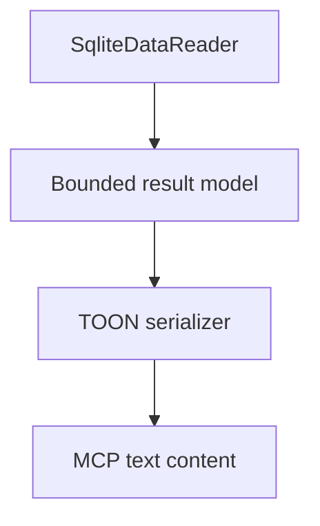
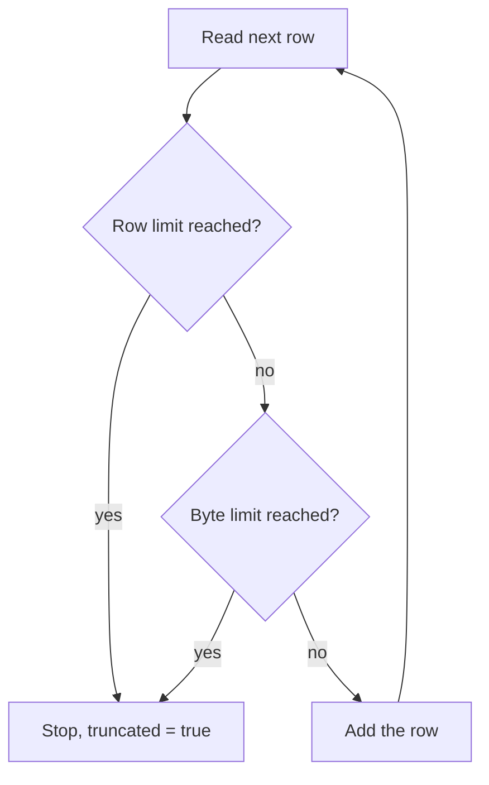

# TOON results and limits

> **Status: planned.** This file records target design. No code implements it yet.
> Current state is in [../../summary.md](../../summary.md). Sequence is in [../mvp-roadmap.md](../mvp-roadmap.md).

Tabular results go to the agent as TOON. TOON is compact, so it costs fewer tokens than JSON
for row data.

## Pipeline



The result size is bounded, so the sidecar buffers the limited result before serialization.
Buffering is acceptable exactly because the bound exists first. Apply the limits while
reading rows, not after.

## Serializer

The project uses the `Toon.DotNet` package, version 4.1.1. The namespace is `ToonFormat`, not
`Toon.DotNet`.

```csharp
using ToonFormat;

string text = Toon.Encode(rows, new EncodeOptions());
```

`Toon.Encode` has a `DataTable` overload and an `object` overload. Prefer a shape that avoids
reflection over arbitrary types, because the reflection path is a NativeAOT risk. See
[../open-questions.md](../open-questions.md).

Do not write a custom TOON serializer. Replace the package only when it proves unsuitable,
and record the reason here.

## Output format

```text
rows[2]{id,status}:
  41,failed
  52,failed

truncated: false
```

The header states the row count and the column names. The `truncated` flag is always present,
so an agent never has to infer completeness.

A `RETURNING` clause on a raw write produces the same shape. See
[raw-writes.md](raw-writes.md).

## Limits

Suggested defaults:

```text
max SQL size:             32 KB
query timeout:            10 seconds
max returned rows:        1,000
max result size:          4 MB
max concurrent requests:  4
busy timeout:             3 seconds
```

**Invariant.** Client SQL never overrides a server-side limit. A `LIMIT` clause in caller SQL
is the caller preference, and the server limit is the ceiling.

The server counts two quantities independently while it reads:

```text
rows
serialized bytes
```

Two counters are necessary, because one wide row can exceed the byte budget while the row
count stays low.



On the row limit, return the rows with `truncated: true`. A partial answer with an honest flag
is more useful to an agent than an error.

On the byte limit, prefer the same truncation behavior. Reserve `ResultTooLarge` for a case
where the sidecar cannot produce a useful partial result, for example when one single row
exceeds the byte budget.

Unlimited result streaming into an agent context is not allowed. An unbounded result exhausts
the agent context window and the sidecar memory at the same time.

## Cancellation

The query timeout must interrupt SQLite, not only abandon the caller. See
[sqlite-sandbox.md](sqlite-sandbox.md).

On a timeout return `QueryTimedOut`. Do not return a partial result for a timeout, because a
partial result would look like normal truncation.

## Related

- [mcp-tool-catalog.md](mcp-tool-catalog.md)
- [error-model.md](error-model.md)
- [configuration.md](configuration.md)
