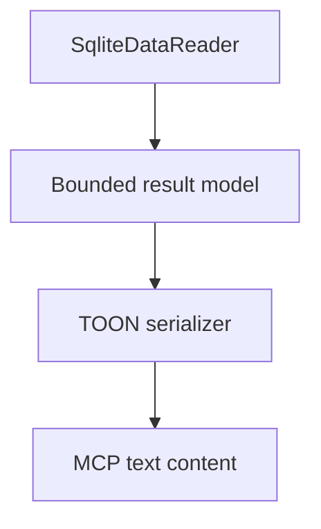
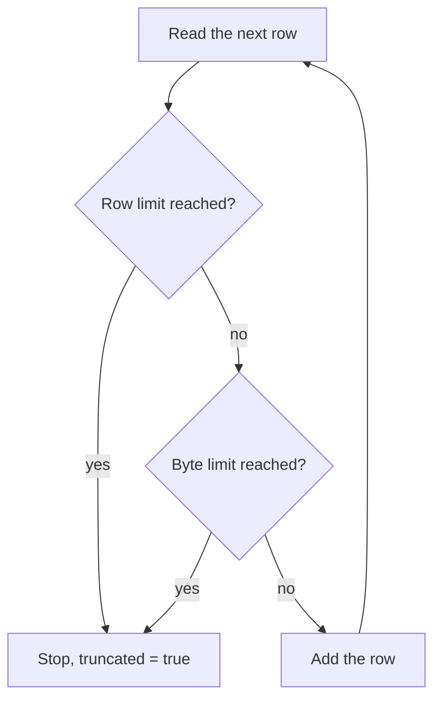

# TOON results and limits

> **Status: planned.** This file records target design. No code implements it yet.
> Current state is in [../../summary.md](../../summary.md). Sequence is in [../mvp-roadmap.md](../mvp-roadmap.md).

Row data goes to the agent as TOON. TOON is compact, thus it costs fewer tokens than JSON for
row data.

**TOON is for row data only.** The `schema` tool returns DDL text and no TOON. See
[mcp-tool-catalog.md](mcp-tool-catalog.md).

## Pipeline



The result size is bounded, thus the sidecar buffers the limited result before serialization.
Buffering is acceptable exactly because the bound exists first. Apply the limits during the
read of the rows, not after it.

## Serializer

The project uses the `Toon.DotNet` package, version 4.1.1. The namespace is `ToonFormat`, not
`Toon.DotNet`.

```csharp
using ToonFormat;

string text = Toon.Encode(rows, new EncodeOptions());
```

`Toon.Encode` has a `DataTable` overload and an `object` overload. Prefer a shape that does
not use reflection over arbitrary types, because the reflection path is a NativeAOT risk. See
[../open-questions.md](../open-questions.md).

Do not write a custom TOON serializer. Replace the package only when it proves unsuitable, and
record the reason here.

## Output format

```text
rows[2]{id,status}:
  41,failed
  52,failed

truncated: false
```

The header states the row count and the column names. The `truncated` flag is always present,
thus an agent never has to calculate completeness.

A `RETURNING` clause on a raw write gives the same shape. See [raw-writes.md](raw-writes.md).

## Limits

Defaults:

```text
max SQL size:             32 KB
query timeout:            10 seconds
max returned rows:        1,000
max result size:          4 MB
max concurrent requests:  4
busy timeout:             3 seconds
```

**Invariant.** Client SQL never overrides a server-side limit. A `LIMIT` clause in caller SQL
is the caller preference, and the server limit is the ceiling.

The server counts two quantities independently during the read:

```text
rows
serialized bytes
```

Two counters are necessary, because one wide row can pass the byte budget while the row count
stays low.



**Invariant.** The row limit and the byte limit both truncate. Return the rows that fit and
set `truncated: true`. A partial answer with an honest flag is more useful to an agent than an
error.

`ResultTooLarge` has exactly one cause: one single row is larger than the byte budget. In that
case there is no useful partial result, because the sidecar cannot send a part of a row. The
agent must then select fewer columns.

Unlimited result streaming into an agent context is not permitted. An unbounded result empties
the agent context window and the sidecar memory at the same time.

## Cancellation

The query timeout must interrupt SQLite, not only leave the caller. See
[sqlite-sandbox.md](sqlite-sandbox.md).

Return `QueryTimedOut` for a timeout. Do not return a partial result for a timeout, because a
partial result looks the same as normal truncation.

## Related

- [mcp-tool-catalog.md](mcp-tool-catalog.md)
- [error-model.md](error-model.md)
- [configuration.md](configuration.md)
