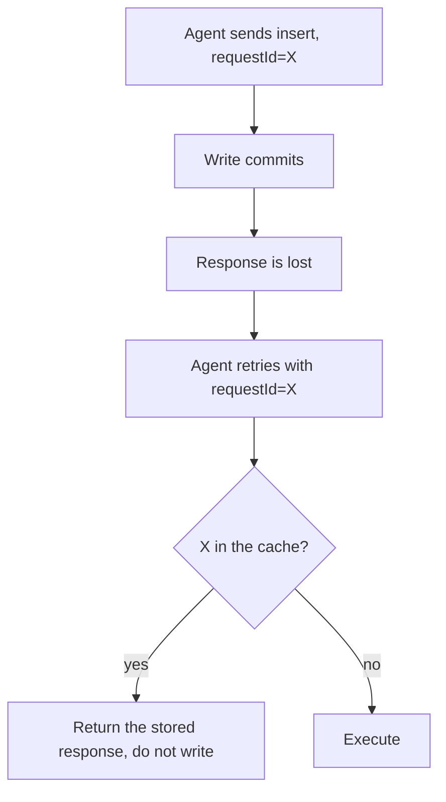

# Write idempotency

> **Status: planned.** This file records target design. No code implements it yet.
> Current state is in [../../summary.md](../../summary.md). Sequence is in [../mvp-roadmap.md](../mvp-roadmap.md).

Each write tool takes a mandatory `requestId`. The sidecar applies a write one time, even
when the caller sends the request two times.

## Why the control exists

The MCP HTTP transport is stateless, and the query timeout is 10 seconds. A write can commit
at 9.5 seconds and then lose its response. An MCP client retries such a call. Without a
deduplication control, the retry applies the write a second time.

This is the most frequent way that a correct agent damages a database. `maxRows` bounds one
call. It does not bound the same call twice.



## Scope

| Tool | `requestId` |
| --- | --- |
| `insert`, `update`, `delete` | mandatory |
| `execute_write_sql` | mandatory |
| `query`, `schema`, `diagnostics` | not used |
| `backup`, `backup_status` | not used |

Reads need no deduplication, because a repeated read changes nothing. `backup` needs none,
because the filename carries a timestamp and a repeated backup costs disk space only. See
[backups.md](backups.md).

## Rules

**Mandatory.** An absent `requestId` is `InvalidWrite`. A value longer than 128 characters is
`InvalidWrite`.

**Cache committed outcomes only.** The sidecar stores an entry only when the transaction
committed. Each other result executes again on a retry.

| First outcome | Second call with the same `requestId` |
| --- | --- |
| Committed write | Return the stored response. Do not write. |
| `WriteLimitExceeded` | Execute again. |
| `WriteBudgetExceeded` | Execute again. |
| `DatabaseBusy` | Execute again. |
| `InvalidWrite` | Execute again. |
| `DatabaseError` | Execute again. |

**Invariant.** Do not cache a failure. `DatabaseBusy` and `WriteBudgetExceeded` tell the agent
to retry later. A cached failure makes that retry impossible for the full window, thus the
error model would give false instructions. See [error-model.md](../../mcp/error-model.md).

**Detect a different payload.** Store a hash of the normalized request together with the
response. A repeated `requestId` with a different hash is `InvalidWrite`. Do not return the
stored response, because the caller asked for different work.

## Bounds

A dictionary with caller-supplied keys is a memory-exhaustion primitive. Bound it.

```text
window:       5 minutes
entries:      1000, LRU eviction
key length:   128 characters
```

The cache is in process memory. It resets at restart, and two sidecar processes do not share
it. This has the same limit as the write budget, and the deployment documentation states the
same rule: one sidecar serves one database.

```csharp
// Security/WriteDeduplication.cs
private readonly record struct Entry(string PayloadHash, string Response, DateTimeOffset At);
```

## Order of the controls

The deduplication check runs before the write budget check. A replayed response consumes no
budget, because it writes no rows.


## Related

- [structured-writes.md](structured-writes.md)
- [raw-writes.md](raw-writes.md)
- [error-model.md](../../mcp/error-model.md)
- [../../decisions/0003-mandatory-idempotency-key.md](../../decisions/0003-mandatory-idempotency-key.md)
