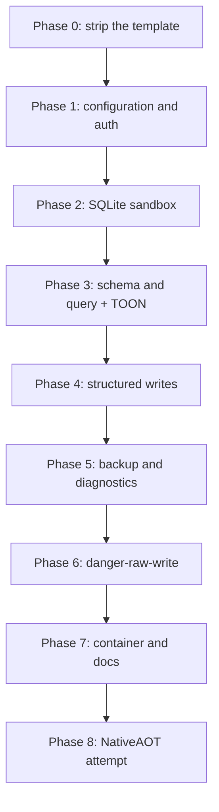

# MVP roadmap

The sequenced plan from the stock template to the MVP. The target design for each item is in
[design/](design/). Scope exclusions are in [out-of-scope.md](out-of-scope.md). Unresolved
decisions are in [open-questions.md](open-questions.md).

## Current state

The repository holds the Visual Studio ASP.NET Core Web API template.
`src/Xakpc.SQLiteMCPSidecar/Program.cs` still serves the `WeatherForecast` sample. `test/` is
empty. No sidecar code exists.

## Sequence



The order is deliberate. The sandbox lands before any tool that runs caller SQL, so no phase
ever ships an unprotected query path. `danger-raw-write` lands last, so the safe interface is
complete and proven first.

### Phase 0 — strip the template

- Remove the `WeatherForecast` endpoint and record from `Program.cs`.
- Remove the `Microsoft.AspNetCore.OpenApi` reference. The sidecar has no OpenAPI surface.
- Remove `app.UseHttpsRedirection()`. The reverse proxy terminates TLS.
- Create the folders `Configuration/`, `Database/`, `Mcp/`, `Security/`.
- Add the three packages from [../practices.md](../practices.md).
- Add a test project under `test/`.

### Phase 1 — configuration and authentication

- `Configuration/SidecarOptions.cs` binds the `SQLITE_SIDECAR_` variables.
- Startup validation. See [design/configuration.md](design/configuration.md).
- `Security/TokenAuthentication.cs` with a constant-time comparison.
- `GET /health` that touches no database.
- Permission parsing, and a permission set type.

Done when: a wrong token returns `Unauthorized`, and an absent token or database fails
startup.

### Phase 2 — SQLite sandbox

This is the foundation phase. See [design/sqlite-sandbox.md](design/sqlite-sandbox.md).

- `Database/SqliteSecurity.cs` applies the baseline after every `Open`: defensive mode, trusted schema off, runtime limits, busy timeout.
- Per-operation authorizer policies.
- `sqlite3_interrupt` on the cancellation token.
- Read-only and read-write connection factories. See [design/connection-policy.md](design/connection-policy.md).
- The three semaphores.

Done when: the whole hard-boundary test list below fails remotely, with no tool registered
yet beyond a test harness.

### Phase 3 — schema and query

- `schema` tool over a read-only connection.
- `query` tool, one statement, read-only connection plus `PRAGMA query_only=ON`.
- TOON serialization with the row counter and the byte counter. See [design/toon-results.md](design/toon-results.md).
- The error model. See [design/error-model.md](design/error-model.md).
- Read logging, with no parameter values and no SQL text.

Done when: an agent inspects the schema and runs a query while the owning application writes.

### Phase 4 — structured writes

- `Database/StructuredWriteBuilder.cs` builds parameterized SQL.
- Identifier validation against the live schema.
- The filter model. See [design/structured-writes.md](design/structured-writes.md).
- `insert`, `update`, `delete`, with mandatory `where` and `maxRows`.
- The row-limit rollback transaction.
- `Security/WriteBudget.cs`, an in-memory rolling window.

Done when: an over-limit write rolls back and returns `WriteLimitExceeded`.

### Phase 5 — backup and diagnostics

- `Database/BackupService.cs` on the Online Backup API.
- Label sanitization and path containment. See [design/backups.md](design/backups.md).
- `diagnostics` with the fixed value set and `PRAGMA quick_check`.
- The optional backup-before-delete policy.

Done when: a backup succeeds while the owning application runs, and a caller cannot influence
the destination path.

### Phase 6 — danger-raw-write

- `execute_write_sql` behind the permission. See [design/raw-writes.md](design/raw-writes.md).
- The DML authorizer policy.
- `RETURNING` results through the same TOON path.
- `sqlHash` logging.

Done when: raw DML succeeds with the permission, it is absent without it, and every hard
boundary still fails.

### Phase 7 — container and documentation

- Rework the Dockerfile. See [design/container-and-deployment.md](design/container-and-deployment.md).
- `README.md` with the permission risk table.
- `SECURITY.md` with the required `danger-raw-write` statement.
- `LICENSE`, Apache-2.0.

### Phase 8 — NativeAOT

- Attempt `PublishAot=true`. See [open-questions.md](open-questions.md).
- Fall back to a self-contained .NET 10 Linux image if the cost is disproportionate.

## Required security tests

These are mandatory. Every statement must fail remotely, **including** with
`danger-raw-write`.

```sql
ATTACH DATABASE '/tmp/x.db' AS x;
DETACH DATABASE x;

CREATE TABLE hacked(id);
DROP TABLE jobs;

PRAGMA writable_schema = ON;
PRAGMA journal_mode = OFF;

SELECT load_extension('/tmp/malicious.so');

VACUUM INTO '/tmp/copy.db';
```

Structured write tests:

```text
UPDATE without WHERE          -> InvalidWrite
DELETE without WHERE          -> InvalidWrite
update over maxRows           -> rollback, WriteLimitExceeded
delete over maxRows           -> rollback, WriteLimitExceeded
many small writes over budget -> WriteBudgetExceeded
```

Raw write tests:

```text
raw INSERT succeeds with danger-raw-write
raw UPDATE succeeds with danger-raw-write
raw DELETE succeeds with danger-raw-write

raw write rejected without danger-raw-write

raw DROP rejected
raw ATTACH rejected
raw PRAGMA mutation rejected
raw transaction control rejected
```

## Required functional tests

```text
schema discovery
TOON query output
read while the application writes

structured insert
structured update
structured delete
rollback after a structured maxRows violation

raw INSERT
raw UPDATE
raw DELETE
raw UPDATE RETURNING

backup while the application runs

read-only deployment
structured-write deployment
danger-raw-write deployment

WAL database
rollback-journal database

SQLITE_BUSY behavior
query timeout
concurrency limiting
```

Run the functional suite against the published Linux artifact. The sandbox depends on the
native SQLite build, so a Windows developer run does not prove the shipped behavior.

## Definition of done

An MCP agent can inspect the schema, run arbitrary read queries, perform bounded structured
writes, create safe backups and run basic diagnostics. With explicit permission it can also
run raw `INSERT`, `UPDATE` and `DELETE`. The owning application continues to operate normally
throughout.

The sidecar provides TOON results, deployment permissions, strong authentication, structured
bounded writes, optional `danger-raw-write`, the SQLite authorizer, defensive mode, runtime
limits, query cancellation, write-rate protection, safe backup handling and container
isolation.

## Related

- [design/](design/) — the target design per topic
- [out-of-scope.md](out-of-scope.md)
- [open-questions.md](open-questions.md)
