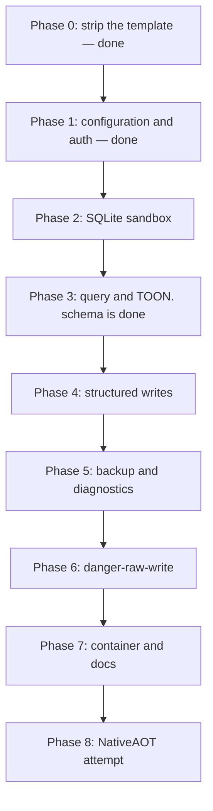

# MVP roadmap

The sequence from the stock template to the MVP. The target design for each item is in
[design/](design/). Scope exclusions are in [out-of-scope.md](out-of-scope.md). Unresolved
decisions are in [open-questions.md](open-questions.md).

## Current state

Phase 0 and Phase 1 are done, and the `schema` tool of Phase 3 came with them. See
[../summary.md](../summary.md) for the status table.

## Sequence



The order is deliberate. The sandbox lands before each tool that runs caller SQL, thus no
phase ships an unprotected query path. `danger-raw-write` lands last, thus the safe interface
is complete and proven first.

`schema` moved ahead of the sandbox for one reason only: it runs a server-authored statement and it
takes no caller input. The rule stays unbroken.

### Phase 0 — strip the template. Done

The template sample, the OpenAPI reference and the HTTPS redirection are gone. The three packages of
[../practices.md](../practices.md) are in place, the folders are `Configuration/`, `Database/`,
`Mcp/` and `Security/`, and `test/` holds one project.

### Phase 1 — configuration and authentication. Done

Current state: [../configuration/options.md](../configuration/options.md),
[../security/authentication.md](../security/authentication.md),
[../security/permissions.md](../security/permissions.md).

A wrong token returns `401`, an absent token or database fails startup, and a write permission
without the read floor fails startup with a message that names the missing permission. The startup
test list below runs in `StartupTests`.

The phase also landed the MCP endpoint, the `schema` tool and the test harness. See
[../mcp/tool-catalog.md](../mcp/tool-catalog.md) and
[../testing/e2e-harness.md](../testing/e2e-harness.md).

### Phase 2 — SQLite sandbox

This is the foundation phase. See [design/sqlite-sandbox.md](design/sqlite-sandbox.md).

- `Database/SqliteSecurity.cs` applies the baseline after each `Open`: defensive mode, trusted schema off, runtime limits, busy timeout.
- Per-operation authorizer policies.
- `sqlite3_interrupt` on the cancellation token.
- The read-write connection factory. The read-only one exists: see [../database/connections.md](../database/connections.md) and [design/connection-policy.md](design/connection-policy.md).
- The write semaphore and the backup semaphore. The request semaphore exists.

Done when: each item of the hard-boundary test list below fails remotely, with no tool
registered except a test harness.

### Phase 3 — query and TOON

- `schema` is done. See [../mcp/tool-catalog.md](../mcp/tool-catalog.md).
- `query` tool, one statement, read-only connection plus `PRAGMA query_only=ON`.
- TOON serialization with the row counter and the byte counter. See [design/toon-results.md](design/toon-results.md).
- The error model. See [design/error-model.md](design/error-model.md).
- Read logging, with no parameter values and no SQL text.

Done when: an agent inspects the schema and runs a query while the owning application writes.

### Phase 4 — structured writes

- `Database/StructuredWriteBuilder.cs` builds parameterized SQL.
- Identifier validation against the live schema.
- The filter model. See [design/structured-writes.md](design/structured-writes.md).
- `insert`, `update`, `delete`, with mandatory `where`, `maxRows` and `requestId`.
- `BEGIN IMMEDIATE`, the bounded pre-count and the row-limit rollback.
- `Security/WriteBudget.cs`, an in-memory rolling window.
- `Security/WriteDeduplication.cs`. See [design/write-idempotency.md](design/write-idempotency.md).

Done when: a broad filter is rejected before the write starts, an over-limit write rolls back,
both return `WriteLimitExceeded`, and the same `requestId` applies a write one time only.

### Phase 5 — backup and diagnostics

- `Database/BackupService.cs` on the Online Backup API, with a read-only source connection.
- The background copy, the partial file and the rename after success.
- The startup sweep of stale partial files.
- The runaway cap, and the interrupt test. See [design/backups.md](design/backups.md).
- `backup` and `backup_status`.
- Label sanitization and path containment.
- `diagnostics` with the fixed value set and `PRAGMA quick_check`.

Done when: a backup succeeds while the owning application runs, a caller cannot influence the
destination path, and a stopped backup leaves no file without the partial suffix.

### Phase 6 — danger-raw-write

- `execute_write_sql` behind the permission. See [design/raw-writes.md](design/raw-writes.md).
- The DML authorizer policy.
- Mandatory `requestId`, and write budget accounting after execution.
- `RETURNING` results through the same TOON path.
- `sqlHash` logging.

Done when: raw DML succeeds with the permission, it is absent without it, and each hard
boundary still fails.

### Phase 7 — container and documentation

- Rework the Dockerfile. See [design/container-and-deployment.md](design/container-and-deployment.md).
- `README.md` with the permission risk table, the whole-database write statement and the one-sidecar rule.
- `SECURITY.md` with the required `danger-raw-write` statement, the no-undo statement and the budget-throttle statement.
- `LICENSE`, Apache-2.0.

### Phase 8 — NativeAOT

- Attempt `PublishAot=true`. See [open-questions.md](open-questions.md).
- Fall back to a self-contained .NET 10 Linux image if the cost is too high.

## Required security tests

These are mandatory. Each statement must fail remotely, **also** with `danger-raw-write`.

```sql
ATTACH DATABASE '/tmp/x.db' AS x;
DETACH DATABASE x;

CREATE TABLE hacked(id);
DROP TABLE jobs;

PRAGMA writable_schema = ON;
PRAGMA journal_mode = OFF;

SELECT load_extension('/tmp/malicious.so');

VACUUM INTO '/tmp/copy.db';
```

Startup tests. These run in `StartupTests`, and the list is complete:

```text
permissions=write                    -> startup fails, the message names schema and read
permissions=danger-raw-write         -> startup fails
permissions=reed                     -> startup fails
non-WAL database + write permission  -> starts, logs the warning
```

Structured write tests:

```text
UPDATE without WHERE            -> InvalidWrite
DELETE without WHERE            -> InvalidWrite
write without requestId         -> InvalidWrite
broad filter, pre-count fails   -> WriteLimitExceeded, no rows written
over maxRows after execution    -> rollback, WriteLimitExceeded
many small writes over budget   -> WriteBudgetExceeded
```

Idempotency tests:

```text
same requestId twice            -> one write, the same response two times
same requestId, new payload     -> InvalidWrite
requestId after DatabaseBusy    -> the retry executes
requestId over 128 characters   -> InvalidWrite
```

Raw write tests:

```text
raw INSERT succeeds with danger-raw-write
raw UPDATE succeeds with danger-raw-write
raw DELETE succeeds with danger-raw-write

raw write rejected without danger-raw-write
raw write without requestId rejected
raw write rows count toward the budget

raw DROP rejected
raw ATTACH rejected
raw PRAGMA mutation rejected
raw transaction control rejected
```

## Required functional tests

```text
schema discovery returns usable DDL
TOON query output
read while the application writes

structured insert
structured update
structured delete
rollback after a structured maxRows violation

raw INSERT
raw UPDATE
raw DELETE
raw UPDATE RETURNING

backup returns before the copy completes
backup_status reports success
backup_status reports failure
a second backup during a backup -> BackupFailed
a stopped backup leaves only a partial file
startup deletes a stale partial file

read-only deployment
structured-write deployment
danger-raw-write deployment

WAL database
rollback-journal database

SQLITE_BUSY behavior
query timeout
concurrency limiting
```

Run the functional suite against the published Linux artifact. The sandbox depends on the
native SQLite build, thus a Windows developer run does not prove the shipped behavior.

## Definition of done

An MCP agent can inspect the schema, run arbitrary read queries, make bounded structured
writes, start safe backups and run basic diagnostics. With explicit permission it can also run
raw `INSERT`, `UPDATE` and `DELETE`. The owning application continues to operate normally.

The sidecar gives TOON results, deployment permissions, strong authentication, structured
bounded writes, write idempotency, optional `danger-raw-write`, the SQLite authorizer,
defensive mode, runtime limits, query cancellation, write-rate protection, safe backup
handling and container isolation.

## Related

- [design/](design/) — the target design for each topic
- [out-of-scope.md](out-of-scope.md)
- [open-questions.md](open-questions.md)
- [../decisions/](../decisions/)
