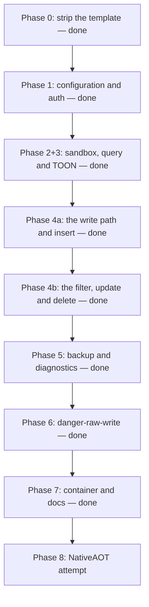

# MVP roadmap

The sequence from the stock template to the MVP. Each phase names the lode files that hold its
current state. Scope exclusions are in [out-of-scope.md](out-of-scope.md). Unresolved decisions are
in [open-questions.md](open-questions.md).

## Current state

Phase 0 to Phase 7 are done. Phase 2 and Phase 3 shipped together. The product ships as a published
multi-architecture image with operator documentation, thus only the NativeAOT attempt is left. See
[../summary.md](../summary.md) for the status table.

## Sequence

The order is deliberate. The sandbox lands before each tool that runs caller SQL, thus no
phase ships an unprotected query path. `danger-raw-write` lands last, thus the safe interface
is complete and proven first.

`schema` is outside that order and it does not break the rule: it runs a server-authored statement
and it takes no caller input.

**Lesson.** Phase 2 and Phase 3 could not ship apart. Phase 2 asked that each hard boundary fail
remotely, and every test goes through `SidecarHarness`, thus proving a boundary needs a tool that
takes caller SQL. The alternatives were a throwaway raw-SQL tool in the production binary, or unit
tests that the external target never runs. Both were worse than one larger phase.

### Phase 0 — strip the template. Done

The template sample, the OpenAPI reference and the HTTPS redirection are gone. The three packages of
[../practices.md](../practices.md) are in place, the folders are `Configuration/`, `Database/`,
`Mcp/` and `Security/`, and `test/` holds one project.

### Phase 1 — configuration and authentication. Done

Current state: [../configuration/options.md](../configuration/options.md),
[../security/authentication.md](../security/authentication.md),
[../security/permissions.md](../security/permissions.md),
[../security/public-endpoint.md](../security/public-endpoint.md).

A wrong token returns `401`, an absent token or database fails startup, and a write permission
without the read floor fails startup with a message that names the missing permission. The startup
case list in [required-tests.md](required-tests.md) runs in `StartupTests`.

The phase also landed the MCP endpoint, the `schema` tool and the test harness. See
[../mcp/tool-catalog.md](../mcp/tool-catalog.md) and
[../testing/e2e-harness.md](../testing/e2e-harness.md).

The endpoint is ready for a public proxy: the path is the whole public path, the request budget is
active, and the sidecar does no host filtering. `RateLimitTests` proves the budget.

### Phase 2 and Phase 3 — sandbox, `query` and TOON. Done

Current state: [../database/sqlite-sandbox.md](../database/sqlite-sandbox.md),
[../mcp/query-results.md](../mcp/query-results.md),
[../mcp/error-model.md](../mcp/error-model.md),
[../mcp/tool-catalog.md](../mcp/tool-catalog.md).

`Database/SqliteSecurity.cs` holds the baseline, an allowlist authorizer, the runtime limits, the
interrupt and the one-statement check. `Database/QueryResult.cs` holds the bounded read and the TOON
encoding. The `query` tool runs one caller statement inside that sandbox.

Each statement of the hard-boundary list in [required-tests.md](required-tests.md) fails remotely
through `query`, an agent reads the schema and queries while the owning application writes, and a
runaway query stops at the timeout.

Scope stayed on the read path. These items moved to the phase that gives them a caller, thus the
codebase holds no uncalled code:

| Item | Phase |
| --- | --- |
| The read-write connection factory | 4a |
| The write semaphore | 4a |
| The backup semaphore | 5, done |
| The write and DML authorizer policies | 4a and 6 |

Every one of them is current state now: the connections and the semaphores in
[../database/connections.md](../database/connections.md), and the three authorizer policies in
[../database/sqlite-sandbox.md](../database/sqlite-sandbox.md).

### Phase 4a — the write path and `insert`. Done

- The read-write connection, with `ForeignKeys = true`. See [../database/connections.md](../database/connections.md).
- The write semaphore, with a wait that the busy timeout bounds.
- `AuthorizerPolicy.Write`, a second value in `Database/SqliteSecurity.cs`.
- `Database/StructuredWriteBuilder.cs`: identifier validation against the live schema, and parameterized SQL.
- `Security/WriteBudget.cs`, an in-memory rolling window.
- `Security/WriteDeduplication.cs`. See [../security/write-controls.md](../security/write-controls.md).
- `insert`, with a mandatory `requestId`. Three arguments, no filter and no `maxRows`.

An `insert` adds one row, the same `requestId` applies it one time only, and many small writes return
`WriteBudgetExceeded`. Current state:
[../database/structured-writes.md](../database/structured-writes.md),
[../security/write-controls.md](../security/write-controls.md).

### Phase 4b — the filter model, `update` and `delete`. Done

Current state: [../database/structured-writes.md](../database/structured-writes.md),
[../mcp/tool-catalog.md](../mcp/tool-catalog.md),
[../decisions/0004-maxrows-bounds-total-changes.md](../decisions/0004-maxrows-bounds-total-changes.md),
[../decisions/0005-and-only-filter.md](../decisions/0005-and-only-filter.md).

`StructuredWriteBuilder` holds the flat filter model, the three builders and the bounded pre-count.
`SqliteService.MutateAsync` holds `BEGIN IMMEDIATE`, the two checks and the row-limit rollback.
`SqliteTools.RunWriteAsync` holds the order of the controls for every write tool.

A broad filter is rejected before the write starts, an over-limit write rolls back, both return
`WriteLimitExceeded`, and the rows are unchanged after each rejection.

**Why the split was here.** The boundary is the filter. `insert` needs no filter, no `maxRows` and no
pre-count, thus 4a built each control that `insert` calls and nothing more. The filter model, the
pre-count and the rollback got their first caller in 4b. This kept the Phase 2+3 rule: the
codebase holds no uncalled code.

**Lesson.** The obvious row count is the wrong one. `ExecuteNonQuery` reports the target table alone,
thus a `delete` with `maxRows = 1` would pass both checks and still destroy a whole cascade subtree.
The limit counts `sqlite3_total_changes`, and that also made the post-execution branch testable.

### Phase 5 — backup and diagnostics. Done

Current state: [../database/backups.md](../database/backups.md),
[../database/diagnostics.md](../database/diagnostics.md),
[../decisions/0006-backup-restart-cap.md](../decisions/0006-backup-restart-cap.md),
[../decisions/0007-tasks-over-a-status-tool.md](../decisions/0007-tasks-over-a-status-tool.md).

`Database/BackupService.cs` holds the step loop, the restart cap, the partial file and the label
rules. `backup` is task-mode, `diagnostics` reports the fixed value set, and `SidecarStartup` sweeps
stale partials.

A backup succeeds while the owning application writes, a caller cannot influence the destination
path, and every abandon path removes the partial file.

**Two decisions changed the drafted plan**, and both came from primary sources rather than from
preference:

- `SqliteConnection.BackupDatabase` is one `sqlite3_backup_step(backup, -1)` call, and a step holds a shared lock on the source for its whole duration. It would block the owning application for the length of the copy, so the copy is an incremental loop instead.
- `sqlite3_backup_step` does not document `SQLITE_INTERRUPT`, thus the drafted interrupt test was unwritable. The loop checks a token between steps, which needs no test to justify.

**The cap counts restarts, not the drafted 10 minutes.** A deadline cannot tell a livelock from a
large database. See [../decisions/0006-backup-restart-cap.md](../decisions/0006-backup-restart-cap.md).

**There is no `backup_status`.** MCP Tasks carries the outcome, so the catalog is eight tools. See
[../decisions/0007-tasks-over-a-status-tool.md](../decisions/0007-tasks-over-a-status-tool.md).

**Lesson, and it was a silent one.** `Fixtures/sample-db.sql` sets `PRAGMA journal_mode = WAL` and the
fixture applied the requested mode *before* running the script, thus the `journalMode` argument did
nothing and every rollback-journal test ran against a WAL database. `DiagnosticsToolTests` exposed it,
because it is the first test that asserts the reported mode. The fixture now applies the mode after
the script and throws when SQLite reports a different one. A test that asserts nothing observable can
pass for years.

### Phase 6 — danger-raw-write. Done

Current state: [../database/raw-writes.md](../database/raw-writes.md),
[../database/sqlite-sandbox.md](../database/sqlite-sandbox.md),
[../mcp/tool-catalog.md](../mcp/tool-catalog.md),
[../decisions/0008-a-committed-raw-write-never-fails-on-result-size.md](../decisions/0008-a-committed-raw-write-never-fails-on-result-size.md).

`AuthorizerPolicy.Dml` is the third policy value, `SqliteService.ExecuteWriteSqlAsync` runs the
statement, and the tool shares `RunWriteAsync` with the three structured tools, thus one method still
owns the order of the controls. `SandboxBoundaryTests` runs the hard-boundary list a second time
through `execute_write_sql`.

Raw DML succeeds with the permission, the tool is absent without it, and each hard boundary still
fails.

**Two decisions changed the drafted plan.**

- **The tool takes no `parameters` map.** The design drafted one. A caller that holds this permission already writes the whole statement, thus a parameter map adds an argument, a validation path and a second value model with no security gain. `query` already asks for literal values in the text, and the two caller-SQL tools now have the same shape.
- **The DML policy rejects a write to an `sqlite_%` object.** Without that rule the policy would be a copy of `AuthorizerPolicy.Write`, and `UPDATE sqlite_sequence` would change the autoincrement behaviour of the owning application. `StructuredWriteBuilder` already refuses such a target by name, thus the raw path now has the same boundary one layer lower. `events` in `sample-db.sql` carries `AUTOINCREMENT` so that `sqlite_sequence` exists for the test to aim at.

**Lesson, and it is the kind that no error would report.** A `RETURNING` clause produces its rows while
the write progresses, thus the bounded result read must not stop the reader: the remaining rows would
never be written and `rowsAffected` would still look plausible. The execution drains the reader before
the commit, and the result size therefore never fails a committed raw write. See
[../decisions/0008-a-committed-raw-write-never-fails-on-result-size.md](../decisions/0008-a-committed-raw-write-never-fails-on-result-size.md).

**`VACUUM` is not stopped by the authorizer.** SQLite runs no authorizer callback for it. On this path
`BEGIN IMMEDIATE` is what rejects it, with `cannot VACUUM from within a transaction`, thus the code is
`DatabaseError` and the test asserts the fact that matters: no file appears.

### Phase 7 — container, distribution and documentation. Done

Current state: [../deployment/summary.md](../deployment/summary.md),
[../deployment/container.md](../deployment/container.md),
[../deployment/platforms.md](../deployment/platforms.md),
[../deployment/distribution.md](../deployment/distribution.md),
[../testing/e2e-harness.md](../testing/e2e-harness.md),
[../decisions/0009-a-locked-database-is-not-a-caller-mistake.md](../decisions/0009-a-locked-database-is-not-a-caller-mistake.md).

The image is non-root, single-port, hardened and multi-architecture, `compose.yaml` runs it over the
dev database, CI runs the suite against it, tagged builds publish to
`ghcr.io/xakpc/sqlite-mcp-sidecar`, and `README.md`, `SECURITY.md` and `LICENSE` exist.

The README is **self-contained**: every recipe, every variable and every security statement is
inline, and it links to no other file in the repository. `SECURITY.md` repeats the security half,
because GitHub reads that file and not the README for a vulnerability report. Both are copies of
[../security/model.md](../security/model.md) and
[../security/threat-model.md](../security/threat-model.md), which is why those two moved out of
`plans/design/` into `security/`.

**The build context moved to the repository root**, and that was not cosmetic. The `.dockerignore`
sat at the root while the context was `src/`, thus Docker never read it, and `global.json` and
`Directory.Build.props` were outside the context as well. Two of the three were invisible failures:
nothing reported them.

**The container run is a matrix of two permission sets, not of all eight.** `PermissionsMatch` is an
exact-set match, thus one run covers only the tests that ask for exactly that set. `schema,read` and
`schema,read,danger-raw-write` carry the hard-boundary list twice, which is what the native build
puts at risk.

**Lesson, and it is the reason this phase existed.** The container run found a defect that no
in-process test could reach. The in-process harness gives each test its own database file, thus two
clients never hold one file and `SQLITE_BUSY` never happens. On one shared database a correct
`SELECT` came back as `InvalidQuery: The statement did not compile`, because every prepare failure
that was not `SQLITE_AUTH` became `Invalid` — and the configured busy timeout never applied to the
read path at all, because `ValidateSingleStatement` calls `sqlite3_prepare_v2` directly and the
retry loop of `Microsoft.Data.Sqlite` never saw it. A query against a locked database failed in 20
milliseconds with a 3-second timeout set. See
[../decisions/0009-a-locked-database-is-not-a-caller-mistake.md](../decisions/0009-a-locked-database-is-not-a-caller-mistake.md).

**Lesson about the harness.** A skip rule that belongs to the harness must live in the harness.
`journalMode` had no external-target guard, thus one test guarded itself by hand and another one did
not and would have failed against any WAL container.

### Phase 8 — NativeAOT

- Attempt `PublishAot=true`. See [open-questions.md](open-questions.md).
- Fall back to a self-contained .NET 10 Linux image if the cost is too high.

## Required tests

The mandatory lists live in [required-tests.md](required-tests.md): the hard-boundary statements, the
startup cases, the structured write cases, the idempotency cases, the raw write cases and the
functional cases. Security tests are mandatory, not optional.

Every mandatory list is complete. The hard-boundary list runs two times, through `query` and through
`execute_write_sql`. What remains in that file belongs to Phase 7: the functional suite must also run
against the published Linux artifact.

## Definition of done

An MCP agent can inspect the schema, run arbitrary read queries, make bounded structured
writes, start safe backups and run basic diagnostics. With explicit permission it can also run
raw `INSERT`, `UPDATE` and `DELETE`. The owning application continues to operate normally.

The sidecar gives TOON results, deployment permissions, strong authentication, structured
bounded writes, write idempotency, optional `danger-raw-write`, the SQLite authorizer,
defensive mode, runtime limits, query cancellation, write-rate protection, safe backup
handling and container isolation.

## Related

- [required-tests.md](required-tests.md) — the mandatory test lists
- [../deployment/summary.md](../deployment/summary.md) — the image and the recipes
- [out-of-scope.md](out-of-scope.md)
- [open-questions.md](open-questions.md)
- [../decisions/](../decisions/)
