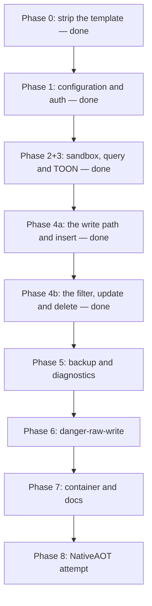

# MVP roadmap

The sequence from the stock template to the MVP. The target design for each item is in
[design/](design/). Scope exclusions are in [out-of-scope.md](out-of-scope.md). Unresolved
decisions are in [open-questions.md](open-questions.md).

## Current state

Phase 0 to Phase 4b are done. Phase 2 and Phase 3 shipped together. See
[../summary.md](../summary.md) for the status table.

## Sequence

The order is deliberate. The sandbox lands before each tool that runs caller SQL, thus no
phase ships an unprotected query path. `danger-raw-write` lands last, thus the safe interface
is complete and proven first.

`schema` is outside that order and it does not break the rule: it runs a server-authored statement
and it takes no caller input.

**Lesson.** Phase 2 and Phase 3 could not ship apart. Phase 2 asked that each hard boundary fail
remotely, and every test goes through `SidecarHarness`, thus proving a boundary needs a tool that
takes caller SQL. The alternatives were a throwaway raw-SQL tool in the production binary, or unit
tests that the external target never runs. Both were worse than one larger phase.

### Phase 0 — strip the template. Done

The template sample, the OpenAPI reference and the HTTPS redirection are gone. The three packages of
[../practices.md](../practices.md) are in place, the folders are `Configuration/`, `Database/`,
`Mcp/` and `Security/`, and `test/` holds one project.

### Phase 1 — configuration and authentication. Done

Current state: [../configuration/options.md](../configuration/options.md),
[../security/authentication.md](../security/authentication.md),
[../security/permissions.md](../security/permissions.md),
[../security/public-endpoint.md](../security/public-endpoint.md).

A wrong token returns `401`, an absent token or database fails startup, and a write permission
without the read floor fails startup with a message that names the missing permission. The startup
case list in [required-tests.md](required-tests.md) runs in `StartupTests`.

The phase also landed the MCP endpoint, the `schema` tool and the test harness. See
[../mcp/tool-catalog.md](../mcp/tool-catalog.md) and
[../testing/e2e-harness.md](../testing/e2e-harness.md).

The endpoint is ready for a public proxy: the path is the whole public path, the request budget is
active, and the sidecar does no host filtering. `RateLimitTests` proves the budget.

### Phase 2 and Phase 3 — sandbox, `query` and TOON. Done

Current state: [../database/sqlite-sandbox.md](../database/sqlite-sandbox.md),
[../mcp/query-results.md](../mcp/query-results.md),
[../mcp/error-model.md](../mcp/error-model.md),
[../mcp/tool-catalog.md](../mcp/tool-catalog.md).

`Database/SqliteSecurity.cs` holds the baseline, an allowlist authorizer, the runtime limits, the
interrupt and the one-statement check. `Database/QueryResult.cs` holds the bounded read and the TOON
encoding. The `query` tool runs one caller statement inside that sandbox.

Each statement of the hard-boundary list in [required-tests.md](required-tests.md) fails remotely
through `query`, an agent reads the schema and queries while the owning application writes, and a
runaway query stops at the timeout.

Scope stayed on the read path. These items moved to the phase that gives them a caller, thus the
codebase holds no uncalled code:

| Item | Phase |
| --- | --- |
| The read-write connection factory | 4a |
| The write semaphore | 4a |
| The backup semaphore | 5 |
| The write and DML authorizer policies | 4a and 6 |

Their design stays in [design/connection-policy.md](design/connection-policy.md).

### Phase 4a — the write path and `insert`. Done

- The read-write connection, with `ForeignKeys = true`. See [design/connection-policy.md](design/connection-policy.md).
- The write semaphore, with a wait that the busy timeout bounds.
- `AuthorizerPolicy.Write`, a second value in `Database/SqliteSecurity.cs`.
- `Database/StructuredWriteBuilder.cs`: identifier validation against the live schema, and parameterized SQL.
- `Security/WriteBudget.cs`, an in-memory rolling window.
- `Security/WriteDeduplication.cs`. See [design/write-idempotency.md](design/write-idempotency.md).
- `insert`, with a mandatory `requestId`. Three arguments, no filter and no `maxRows`.

An `insert` adds one row, the same `requestId` applies it one time only, and many small writes return
`WriteBudgetExceeded`. Current state:
[../database/structured-writes.md](../database/structured-writes.md),
[../security/write-controls.md](../security/write-controls.md).

### Phase 4b — the filter model, `update` and `delete`. Done

Current state: [../database/structured-writes.md](../database/structured-writes.md),
[../mcp/tool-catalog.md](../mcp/tool-catalog.md),
[../decisions/0004-maxrows-bounds-total-changes.md](../decisions/0004-maxrows-bounds-total-changes.md),
[../decisions/0005-and-only-filter.md](../decisions/0005-and-only-filter.md).

`StructuredWriteBuilder` holds the flat filter model, the three builders and the bounded pre-count.
`SqliteService.MutateAsync` holds `BEGIN IMMEDIATE`, the two checks and the row-limit rollback.
`SqliteTools.RunStructuredWriteAsync` holds the order of the controls for all three write tools.

A broad filter is rejected before the write starts, an over-limit write rolls back, both return
`WriteLimitExceeded`, and the rows are unchanged after each rejection.

**Why the split was here.** The boundary is the filter. `insert` needs no filter, no `maxRows` and no
pre-count, thus 4a built each control that `insert` calls and nothing more. The filter model, the
pre-count and the rollback got their first caller in 4b. This kept the Phase 2+3 rule: the
codebase holds no uncalled code.

**Lesson.** The obvious row count is the wrong one. `ExecuteNonQuery` reports the target table alone,
thus a `delete` with `maxRows = 1` would pass both checks and still destroy a whole cascade subtree.
The limit counts `sqlite3_total_changes`, and that also made the post-execution branch testable.

### Phase 5 — backup and diagnostics

- `Database/BackupService.cs` on the Online Backup API, with a read-only source connection.
- The background copy, the partial file and the rename after success.
- The startup sweep of stale partial files.
- The runaway cap, and the interrupt test. See [design/backups.md](design/backups.md).
- `backup` and `backup_status`.
- Label sanitization and path containment.
- `diagnostics` with the fixed value set and `PRAGMA quick_check`.

Done when: a backup succeeds while the owning application runs, a caller cannot influence the
destination path, and a stopped backup leaves no file without the partial suffix.

### Phase 6 — danger-raw-write

- `execute_write_sql` behind the permission. See [design/raw-writes.md](design/raw-writes.md).
- The DML authorizer policy in `Database/SqliteSecurity.cs`, as a second `AuthorizerPolicy` value.
- Run the `SandboxBoundaryTests` list again through `execute_write_sql`. Each hard boundary must still fail.
- Mandatory `requestId`, and write budget accounting after execution.
- `RETURNING` results through the same TOON path.
- `sqlHash` logging.

Done when: raw DML succeeds with the permission, it is absent without it, and each hard
boundary still fails.

### Phase 7 — container and documentation

- Rework the Dockerfile. See [design/container-and-deployment.md](design/container-and-deployment.md).
- Write the Kamal and Coolify recipes, and state the path contract in the README: the proxy must **not** strip the `/db` prefix. See [design/platform-deployment.md](design/platform-deployment.md).
- Add the container launch configuration back: a `compose.yaml` and a container launch profile. The template profile is gone, because it mounts no database and it opens an HTTPS port. See [design/container-and-deployment.md](design/container-and-deployment.md).
- Point the e2e suite at the container and add that run to CI. This satisfies the rule that the functional suite runs against the published Linux artifact. See [../testing/e2e-harness.md](../testing/e2e-harness.md).
- `README.md` with the permission risk table, the whole-database write statement and the one-sidecar rule.
- `SECURITY.md` with the required `danger-raw-write` statement, the no-undo statement, the budget-throttle statement, the one-token rotation limit and the rule that the container port never faces the internet. See [../security/public-endpoint.md](../security/public-endpoint.md).
- `LICENSE`, Apache-2.0.

Done when: the image runs as non-root over a mounted database, `docker compose up` gives a working
sidecar, and `SIDECAR_E2E_URL` pointed at it passes the whole suite.

### Phase 8 — NativeAOT

- Attempt `PublishAot=true`. See [open-questions.md](open-questions.md).
- Fall back to a self-contained .NET 10 Linux image if the cost is too high.

## Required tests

The mandatory lists live in [required-tests.md](required-tests.md): the hard-boundary statements, the
startup cases, the structured write cases, the idempotency cases, the raw write cases and the
functional cases. Security tests are mandatory, not optional.

The startup list and the hard-boundary list are complete, in `StartupTests` and in
`SandboxBoundaryTests`. Each remaining list belongs to the phase
that builds its feature.

## Definition of done

An MCP agent can inspect the schema, run arbitrary read queries, make bounded structured
writes, start safe backups and run basic diagnostics. With explicit permission it can also run
raw `INSERT`, `UPDATE` and `DELETE`. The owning application continues to operate normally.

The sidecar gives TOON results, deployment permissions, strong authentication, structured
bounded writes, write idempotency, optional `danger-raw-write`, the SQLite authorizer,
defensive mode, runtime limits, query cancellation, write-rate protection, safe backup
handling and container isolation.

## Related

- [required-tests.md](required-tests.md) — the mandatory test lists
- [design/](design/) — the target design for each topic
- [out-of-scope.md](out-of-scope.md)
- [open-questions.md](open-questions.md)
- [../decisions/](../decisions/)
