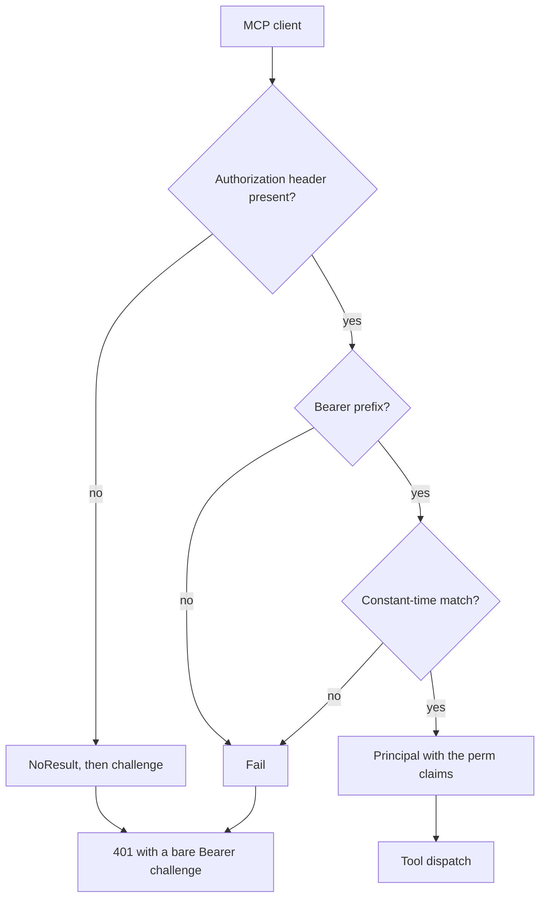
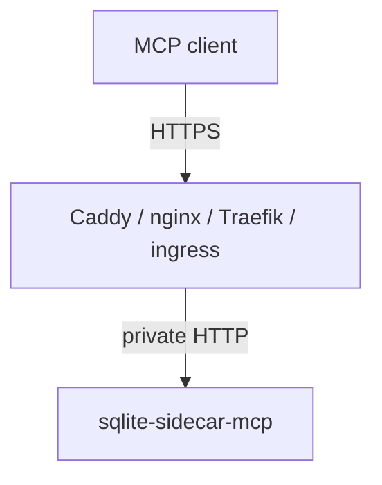

# Authentication and network

One deployment has one high-entropy bearer token. The sidecar is an ASP.NET Core authentication
scheme, thus the framework produces the `401` and the MCP endpoint needs one
`RequireAuthorization()` call.

Code: `src/Xakpc.SQLiteMCPSidecar/Security/DeploymentTokenAuthenticationHandler.cs`.

## Token contract

```text
SQLITE_SIDECAR_TOKEN=<secret>
Authorization: Bearer <secret>
```

- Deployment infrastructure supplies the token.
- The sidecar never generates, persists, returns or logs the token.
- Startup fails when the token is absent.

The comparison is constant time. A plain string comparison leaks length and prefix information
through timing.

```csharp
if (!CryptographicOperations.FixedTimeEquals(presented, _expectedToken))
{
    return Task.FromResult(Reject());
}
```

## The handler issues the permission claims

The handler is the one place that turns the deployment permission set into a `ClaimsPrincipal`.
Each permission becomes one `perm` claim, thus an authorization policy can require it.

```csharp
var identity = new ClaimsIdentity(DeploymentTokenDefaults.Scheme, ClaimTypes.Name, PermissionSet.ClaimType);
identity.AddClaim(new Claim(ClaimTypes.Name, "deployment"));
foreach (var permission in sidecarOptions.Permissions.ToNames())
{
    identity.AddClaim(new Claim(PermissionSet.ClaimType, permission));
}
```

This is what connects the configuration to the `[Authorize]` attribute on each tool. See
[permissions.md](permissions.md).

## Request flow



**Invariant.** An absent header and a wrong token give the identical answer: status `401`, an empty
body, and the header `WWW-Authenticate: Bearer` with no error description. The response never
states which check failed. `AuthTests` compares the two responses field by field.

`HandleChallengeAsync` writes the bare challenge itself. The MVP has one static token, thus there
is no OAuth resource-metadata challenge.

A rejection logs the path and the remote address at warning level. It never logs the presented
value.

## Health endpoint

```text
GET /health      ->  200 {"status":"ok"}
```

It needs no token and it touches no database. A probe runs often, and an expensive probe becomes a
denial-of-service vector against the owning application. `/health` is mapped without
`RequireAuthorization()`; `/mcp` is mapped with it.

The endpoint uses the `RequestDelegate` overload of `MapGet`. The `Delegate` overload reflects over
the delegate signature, which the AOT analyzers report as IL2026 and IL3050.

## Network model



The sidecar does not manage certificates and it has no HTTPS redirection. A reverse proxy
terminates TLS.

- Do not expose the sidecar directly to an untrusted network over plaintext HTTP.
- CORS is off. Browser access is not a product goal.
- Host validation uses the ASP.NET Core host filtering middleware. `AllowedHosts` is `localhost`
  and a deployment must set it.

## Related

- [permissions.md](permissions.md)
- [../configuration/options.md](../configuration/options.md)
- [../plans/design/security-model.md](../plans/design/security-model.md)
