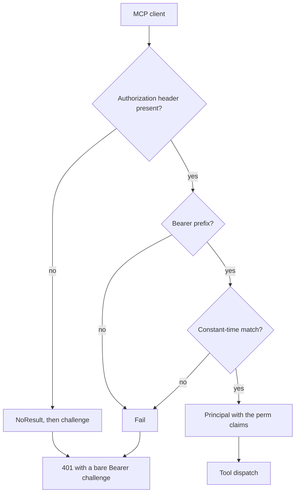
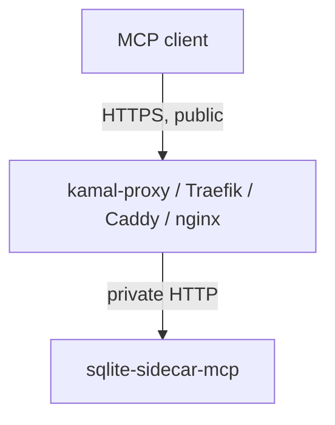

# Authentication and network

One deployment has one high-entropy bearer token. The sidecar is an ASP.NET Core authentication
scheme, thus the framework produces the `401` and the MCP endpoint needs one
`RequireAuthorization()` call.

Code: `src/Xakpc.SQLiteMCPSidecar/Security/DeploymentTokenAuthenticationHandler.cs`.

## Token contract

```text
SQLITE_SIDECAR_TOKEN=<secret>
Authorization: Bearer <secret>
```

- Deployment infrastructure supplies the token.
- The sidecar never generates, persists, returns or logs the token.
- Startup fails when the token is absent.

### Mint a token

`scripts/token.cs` is a file-based app with prompts. It asks for the deployment shape, makes one
token and prints the matching `SQLITE_SIDECAR_` block for a `.env` file, PowerShell, bash or docker
compose.

```powershell
dotnet run scripts/token.cs
```

- The token is Base64Url text over 32, 48 or 64 bytes from `RandomNumberGenerator`. Base64Url has
  no character that a shell, YAML or an HTTP header must quote, thus the value that the operator
  sees is the value that the handler compares.
- The tool repeats two startup rules, thus its output starts the sidecar: it repairs the read floor
  and it asks for a backup directory only with the `backup` permission.
- The tool is beside the sidecar and not inside it. The sidecar process still generates no token.
- The optional output file goes under `build/`, which git ignores. The tool warns about each other
  path and it sets owner-only permissions on a non-Windows host.

The comparison is constant time. A plain string comparison leaks length and prefix information
through timing.

```csharp
if (!CryptographicOperations.FixedTimeEquals(presented, _expectedToken))
{
    return Task.FromResult(Reject());
}
```

## The handler issues the permission claims

The handler is the one place that turns the deployment permission set into a `ClaimsPrincipal`.
Each permission becomes one `perm` claim, thus an authorization policy can require it.

```csharp
var identity = new ClaimsIdentity(DeploymentTokenDefaults.Scheme, ClaimTypes.Name, PermissionSet.ClaimType);
identity.AddClaim(new Claim(ClaimTypes.Name, "deployment"));
foreach (var permission in sidecarOptions.Permissions.ToNames())
{
    identity.AddClaim(new Claim(PermissionSet.ClaimType, permission));
}
```

This is what connects the configuration to the `[Authorize]` attribute on each tool. See
[permissions.md](permissions.md).

## Request flow



**Invariant.** An absent header and a wrong token give the identical answer: status `401`, an empty
body, and the header `WWW-Authenticate: Bearer` with no error description. The response never
states which check failed. `AuthTests` compares the two responses field by field.

`HandleChallengeAsync` writes the bare challenge itself. The MVP has one static token, thus there
is no OAuth resource-metadata challenge.

A rejection logs the path, the connection address and the claimed `X-Forwarded-For` value at warning
level. It never logs the presented token. The request budget runs before this handler, thus a flood
cannot fill the log. See [public-endpoint.md](public-endpoint.md).

## Health endpoint

The framework health endpoint gives the path:

```csharp
builder.Services.AddHealthChecks();   // no check is registered
app.MapHealthChecks(SidecarEndpoints.Health);
```

```text
GET /health      ->  200 Healthy      (text/plain)
                     503 Unhealthy
```

**Invariant.** No health check touches the database. The check set is empty, thus the endpoint
reports the liveness of the process and nothing else. A probe runs every few seconds, and an
expensive probe becomes a denial-of-service vector against the owning application. The checks that do
need the database file run once, at startup. See
[../configuration/options.md](../configuration/options.md).

`/health` is mapped without `RequireAuthorization()` and without a rate-limit policy; `/db/mcp` is
mapped with both. The framework endpoint builds no IL warning with the AOT analyzers on.

A later phase may add a check, for example the backup worker of Phase 5. A new check must stay cheap
and must not open a connection to the database.

## Network model



The proxy may serve the public internet. The token is then the only gate between an unknown caller
and a live database, thus the request budget and the identical `401` are both necessary.

The sidecar does not manage certificates and it has no HTTPS redirection. The reverse proxy
terminates TLS.

- Never publish the container port to an untrusted network. The proxy is the only path in.
- CORS is off. Browser access is not a product goal.
- The sidecar does **no** host filtering. The proxy matches `Host` to route the request and it is
  the host gate. See [public-endpoint.md](public-endpoint.md).

## Related

- [public-endpoint.md](public-endpoint.md)
- [permissions.md](permissions.md)
- [../configuration/options.md](../configuration/options.md)
- [../plans/design/security-model.md](../plans/design/security-model.md)
